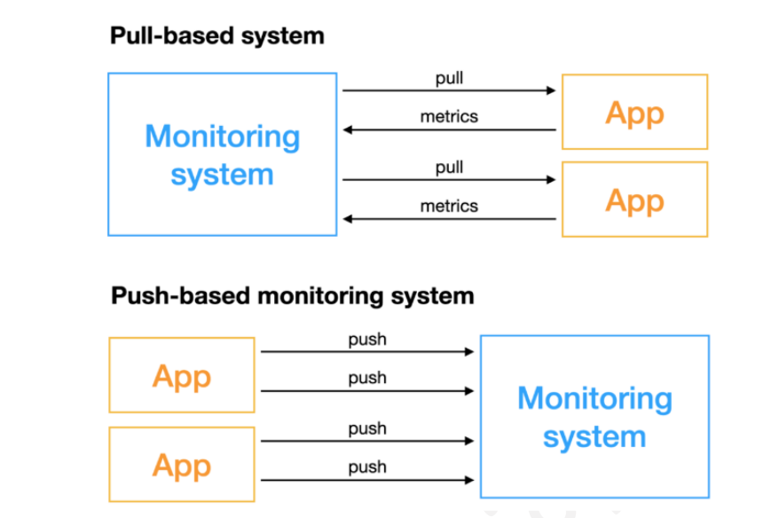
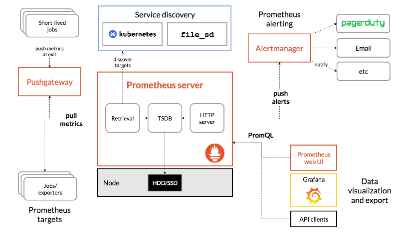
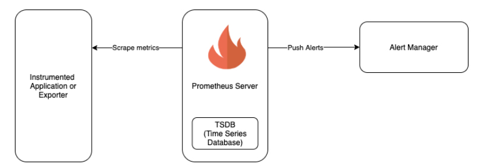

-------------

## تفاوت مدل‌های Push و Pull در سیستم‌های جمع‌آوری داده

در دنیای سیستم‌های جمع‌آوری داده، به خصوص در حوزه مانیتورینگ، دو مدل اصلی برای انتقال داده‌ها وجود دارد: **Push** و **Pull**. هر کدام از این مدل‌ها مزایا و معایب خاص خود را دارند و انتخاب بین آن‌ها به عوامل مختلفی مانند نوع داده، حجم داده، الزامات زمانی و معماری سیستم بستگی دارد.

---



---

### مدل Push 

- **مفهوم:** در این مدل، داده‌ها به صورت فعال از منبع داده به سمت یک جمع‌آوری‌کننده یا مخزن مرکزی ارسال می‌شوند.
- **نحوه کار:** منبع داده (مثلاً یک دستگاه، اپلیکیشن یا سرویس) به صورت دوره‌ای یا بر اساس رخدادهای خاص، داده‌ها را به یک نقطه مرکزی ارسال می‌کند.
---
- **مزایا:**
    - **سادگی:** پیاده‌سازی آن ساده‌تر است، زیرا منبع داده تنها نیاز به ارسال داده‌ها دارد.
    - **کنترل بیشتر در منبع داده:** منبع داده می‌تواند بر زمان ارسال داده‌ها و حجم آن‌ها کنترل بیشتری داشته باشد.
---
- **معایب:**
    - **بارگذاری روی منبع داده:** اگر حجم داده زیاد باشد، ارسال مداوم داده‌ها می‌تواند به منبع داده فشار وارد کند.
    - **وابستگی به شبکه:** اگر ارتباط شبکه‌ای بین منبع داده و جمع‌آوری‌کننده قطع شود، داده‌ها از دست می‌روند.
    - **مدیریت پیچیده در سیستم‌های بزرگ:** با افزایش تعداد منابع داده، مدیریت ارسال داده‌ها پیچیده‌تر می‌شود.
---
### مدل Pull 

- **مفهوم:** در این مدل، یک جمع‌آوری‌کننده به صورت دوره‌ای به منابع داده متصل شده و داده‌های مورد نیاز را از آن‌ها دریافت می‌کند.
- **نحوه کار:** جمع‌آوری‌کننده با استفاده از یک پروتکل مشخص (مثلاً HTTP) به منابع داده درخواست داده می‌دهد و منابع داده پاسخ درخواست را ارسال می‌کنند.
---
- **مزایا:**
    - **کنترل مرکزی:** تمام عملیات جمع‌آوری داده در یک نقطه مرکزی مدیریت می‌شود.
    - **انعطاف‌پذیری بیشتر:** می‌توان به راحتی منابع داده جدیدی را اضافه یا حذف کرد.
    - **کاهش بار روی منابع داده:** منابع داده تنها زمانی که درخواست داده می‌شوند، نیاز به پردازش دارند.
---
- **معایب:**
    - **تأخیر:** ممکن است بین زمانی که داده‌ای تولید می‌شود و زمانی که توسط جمع‌آوری‌کننده دریافت می‌شود، تأخیر وجود داشته باشد.
    - **وابستگی به دسترس‌پذیری جمع‌آوری‌کننده:** اگر جمع‌آوری‌کننده از دسترس خارج شود، داده‌ها جمع‌آوری نمی‌شوند.

---
### مقایسه مدل‌های Push و Pull

| ویژگی                      | مدل Push           | مدل Pull                |
| -------------------------- | ------------------ | ----------------------- |
| **فعالیت**                 | منبع داده فعال است | جمع‌آوری‌کننده فعال است |
| **کنترل**                  | منبع داده          | جمع‌آوری‌کننده          |
| **پیچیدگی پیاده‌سازی**     | ساده‌تر            | پیچیده‌تر               |
| **بارگذاری روی منبع داده** | بیشتر              | کمتر                    |
| **وابستگی به شبکه**        | بیشتر              | کمتر                    |
| **انعطاف‌پذیری**           | کمتر               | بیشتر                   |
| **تأخیر**                  | کمتر               | بیشتر                   |

---

### انتخاب مدل مناسب

انتخاب بین مدل Push و Pull به عوامل مختلفی بستگی دارد، از جمله:
- **نوع داده:** برای داده‌های با حجم کم و نیاز به زمان پاسخگویی کم، مدل Push مناسب‌تر است. برای داده‌های با حجم زیاد و نیاز به کنترل مرکزی، مدل Pull مناسب‌تر است.
- **فرکانس جمع‌آوری داده:** اگر نیاز به جمع‌آوری داده‌ها با فرکانس بالا باشد، مدل Push ممکن است مناسب‌تر باشد.
---
- **تعداد منابع داده:** برای تعداد زیاد منابع داده، مدل Pull به دلیل مدیریت مرکزی ساده‌تر است.
- **نیازمندی‌های زمانی:** اگر نیاز به دریافت داده‌ها به صورت بلادرنگ باشد، مدل Push مناسب‌تر است.
**در پرومتئوس** به طور پیش‌فرض از مدل Pull استفاده می‌شود. این بدان معنی است که پرومتئوس سرور به صورت دوره‌ای به منابع داده متصل شده و داده‌ها را جمع‌آوری می‌کند. با این حال، پرومتئوس از طریق یک کامپوننت به نام Pushgateway نیز از مدل Push پشتیبانی می‌کند.
---


**Prometheus architecture**



---

### معماری پرومتئوس

پرومتئوس از یک معماری ساده اما قدرتمند برخوردار است:
- **سرور پرومتئوس:** قلب سیستم پرومتئوس است که داده‌ها را جمع‌آوری کرده و ذخیره می‌کند.
- ‏**Exporterها:** اجزایی هستند که داده‌های متریک را از منابع مختلف (مانند سیستم عامل، پایگاه داده، اپلیکیشن‌ها) جمع‌آوری کرده و به سرور پرومتئوس ارسال می‌کنند.
- **قوانین هشدار:** برای تعریف شرایطی که در صورت وقوع آن‌ها باید هشدار ارسال شود.
- **داشبوردها:** برای نمایش بصری داده‌های جمع‌آوری شده و ایجاد نمودارها و گراف‌ها.
## پرومتئوس سرور: مفهوم retrieval و  TSDB و HTTP Server

پرومتئوس سرور یک ابزار قدرتمند برای مانیتورینگ سیستم‌ها است که بر پایه جمع‌آوری داده‌های متریک و ذخیره‌سازی آن‌ها در یک پایگاه داده سری زمانی (Time Series Database) کار می‌کند. برای درک بهتر کارکرد پرومتئوس، لازم است با مفاهیم کلیدی زیر آشنا شویم:

---
### ‏Retrieval (بازیابی) در پرومتئوس

* **مفهوم:** فرایند بازیابی داده‌های متریک ذخیره شده در پایگاه داده پرومتئوس بر اساس پرس‌و‌جوهای تعریف شده توسط کاربر.
* **نحوه عملکرد:**
    * ‏**PromQL:** زبان پرس‌و‌جوی قدرتمندی که برای استخراج داده‌ها از پرومتئوس استفاده می‌شود. این زبان به شما اجازه می‌دهد تا داده‌ها را بر اساس Label‌ها، بازه‌های زمانی و عملیات‌های ریاضی فیلتر و تجزیه و تحلیل کنید.
---
    * ‏**API:** پرومتئوس یک API HTTP ارائه می‌دهد که به شما امکان می‌دهد تا از طریق درخواست‌های HTTP پرس‌و‌جوهای PromQL را ارسال کرده و نتایج را دریافت کنید.
* **کاربردها:**
    * ایجاد داشبوردهای گرافیکی برای نمایش داده‌های متریک در طول زمان
    * ایجاد هشدارها برای اطلاع از رخدادهای مهم
    * تحلیل ریشه ای مشکلات و بهینه‌سازی عملکرد سیستم
---

### ‏TSDB (Time Series Database) در پرومتئوس

* **مفهوم:** یک پایگاه داده تخصصی که برای ذخیره و بازیابی داده‌های متریک در قالب سری‌های زمانی طراحی شده است.
* **ویژگی‌های کلیدی:**
    * **ذخیره داده‌های متریک با Label:** هر داده متریک با یک مجموعه Label همراه است که اطلاعات بیشتری درباره آن داده ارائه می‌دهد (مثلاً نام سرور، نوع متریک و ...).
    * **پرس‌و‌جوهای سریع و کارآمد:** TSDB پرومتئوس به شما اجازه می‌دهد تا پرس‌و‌جوهای پیچیده را بر روی داده‌های متریک با سرعت بالا انجام دهید.
---
    * **فشرده‌سازی داده‌ها:** TSDB از الگوریتم‌های فشرده‌سازی برای کاهش حجم داده‌های ذخیره شده استفاده می‌کند.
* **اهمیت در پرومتئوس:** TSDB هسته اصلی پرومتئوس است و نقش کلیدی در جمع‌آوری، ذخیره و بازیابی داده‌های متریک ایفا می‌کند.
---

### ‏HTTP Server در پرومتئوس

* **مفهوم:** یک سرور وب که برای ارائه service HTTP به کاربران و ابزارهای دیگر استفاده می‌شود.
* **نقش در پرومتئوس:**
    * ‏**API:** پرومتئوس یک API HTTP ارائه می‌دهد که به شما امکان می‌دهد تا با استفاده از درخواست‌های HTTP با سرور پرومتئوس ارتباط برقرار کرده و داده‌های متریک را بازیابی کنید.
    * ‏**UI:** پرومتئوس یک رابط کاربری ساده مبتنی بر وب ارائه می‌دهد که به شما امکان می‌دهد تا به صورت گرافیکی با پرومتئوس تعامل داشته باشید.
---

* **کاربردها:**
    * **دسترسی به داده‌های متریک:** ابزارهای مانیتورینگ مانند Grafana از طریق API HTTP پرومتئوس به داده‌های متریک دسترسی پیدا می‌کنند.
    * **مدیریت پرومتئوس:** شما می‌توانید از طریق API HTTP تنظیمات پرومتئوس را تغییر داده و وضعیت آن را بررسی کنید.
---
### ارتباط بین این مفاهیم

* ‏**Client ها:** ابزارها و برنامه‌هایی که داده‌های متریک را به پرومتئوس ارسال می‌کنند (مثلاً یک اکسپورتور نود اکسپورت).
* ‏**Prometheus Server:** داده‌های متریک را از Client ها دریافت کرده، در TSDB ذخیره می‌کند و یک HTTP Server برای ارائه خدمات به کاربران و ابزارهای دیگر راه‌اندازی می‌کند.
* ‏**PromQL:** زبانی که برای پرس‌و‌جو از داده‌های ذخیره شده در TSDB استفاده می‌شود.
* ‏**Users/Tools:** از طریق API HTTP پرومتئوس و با استفاده از PromQL، داده‌های متریک را بازیابی کرده و برای ایجاد داشبورد، هشدار و ... استفاده می‌کنند.

---

**به طور خلاصه:** پرومتئوس سرور با جمع‌آوری داده‌های متریک از سیستم‌های مختلف، ذخیره آن‌ها در یک TSDB و ارائه یک API HTTP برای دسترسی به این داده‌ها، یک پلتفرم قدرتمند برای مانیتورینگ و تحلیل داده‌های سری زمانی فراهم می‌کند.

---


## ‏Exporter ها در پرومتئوس: پل ارتباطی بین سیستم و مانیتورینگ

‏**Exporter**ها در دنیای پرومتئوس، برنامه‌های نرم‌افزاری هستند که داده‌های متریک (Metrics) را از سیستم‌های مختلف جمع‌آوری کرده و به فرمتی که پرومتئوس بتواند درک کند، تبدیل می‌کنند. این داده‌ها می‌توانند شامل اطلاعاتی در مورد مصرف CPU، میزان حافظه استفاده شده، وضعیت دیسک، پاسخگویی سرویس‌ها و هر متریک دیگری که برای مانیتورینگ سیستم شما مهم باشد، باشند.

---



---
**چرا Exporterها مهم هستند؟**
- **تنوع سیستم‌ها:** هر سیستم (اعم از سرورهای لینوکس، دیتابیس‌ها، اپلیکیشن‌های کانتینری، و ...) پروتکل‌ها و فرمت‌های مختلفی برای ارائه اطلاعات دارد. Exporterها این تفاوت‌ها را برطرف کرده و داده‌ها را به یک فرمت استاندارد برای پرومتئوس تبدیل می‌کنند.
- **تخصیص منابع:** با استفاده از Exporterها، می‌توانید منابع سیستم خود را برای جمع‌آوری داده‌های مورد نیاز بهینه‌سازی کنید.
- **انعطاف‌پذیری:** پرومتئوس به لطف وجود Exporterهای متنوع، قابلیت مانیتورینگ طیف گسترده‌ای از سیستم‌ها و سرویس‌ها را دارد.

---
**انواع مختلف Exporterها:**
- ‏**Exporterهای سیستم‌عامل:** این Exporterها داده‌های متریک پایه مانند مصرف CPU، حافظه، دیسک و شبکه را از سیستم‌عامل جمع‌آوری می‌کنند. نمونه‌هایی از این Exporterها عبارتند از:
    - ‏Node Exporter: برای سیستم‌های لینوکس
    - ‏Windows Exporter: برای سیستم‌های ویندوز
---
- ‏**Exporterهای نرم‌افزار:** این Exporterها داده‌های متریک مربوط به نرم‌افزارهای خاصی را جمع‌آوری می‌کنند. به عنوان مثال:
    - ‏MySQL Exporter: برای دیتابیس MySQL
    - ‏Prometheus Exporter: برای خود پرومتئوس
- ‏**Exporterهای سفارشی:** شما می‌توانید Exporterهای سفارشی برای جمع‌آوری داده‌های متریک از سیستم‌ها یا نرم‌افزارهای خاص ایجاد کنید.
---
**نحوه کار Exporterها:**

1. **جمع‌آوری داده‌ها:** Exporterها با استفاده از APIها، پروتکل‌های سیستم و یا روش‌های دیگر، داده‌های متریک را از سیستم جمع‌آوری می‌کنند.
2. **تبدیل داده‌ها:** داده‌های جمع‌آوری شده به فرمت متریک پرومتئوس (که بر اساس مدل زمانی و Label‌ها تعریف شده است) تبدیل می‌شوند.
3. **ارسال داده‌ها:** داده‌های تبدیل شده به پرومتئوس سرور ارسال می‌شوند تا ذخیره و پردازش شوند.

---

**مثالی از یک متریک پرومتئوس:**

```
node_cpu_seconds_total{mode="idle",instance="localhost"} 12345.67
```

در این مثال، متریک `node_cpu_seconds_total` مقدار کل ثانیه‌هایی که CPU در حالت بیکار بوده است را نشان می‌دهد. Label `mode="idle"` نشان می‌دهد که این داده مربوط به حالت بیکار CPU است و Label `instance="localhost"` نشان می‌دهد که این داده از سرور محلی جمع‌آوری شده است.

---
**جمع‌بندی:**
‏Exporterها نقش بسیار مهمی در اکوسیستم پرومتئوس ایفا می‌کنند. با استفاده از Exporterها، شما می‌توانید هر سیستم یا نرم‌افزاری را به پرومتئوس متصل کرده و داده‌های متریک آن را جمع‌آوری و تحلیل کنید. این امر به شما کمک می‌کند تا عملکرد سیستم‌های خود را به صورت دقیق مانیتور کرده و مشکلات احتمالی را به سرعت شناسایی کنید.

---
## ‏Pushgateway در پرومتئوس: ارسال داده‌ها به روشی متفاوت

‏**Pushgateway** یک مؤلفه جانبی در سیستم مانیتورینگ پرومتئوس است که به شما امکان می‌دهد تا داده‌های متریک را به روشی متفاوت از مدل معمول Pull که در پرومتئوس استفاده می‌شود، به سرور پرومتئوس ارسال کنید.

---

### چرا به Pushgateway نیاز داریم؟

- **سیستم‌های کوتاه‌مدت:** برای سیستم‌هایی که به صورت کوتاه‌مدت اجرا می‌شوند و پس از اتمام کار خاموش می‌شوند، مانند job‌های batch یا تست‌های یکبار مصرف، استفاده از Pushgateway بسیار مناسب است. این سیستم‌ها ممکن است به پرومتئوس سرور دسترسی نداشته باشند یا اتصال آنها به صورت مداوم برقرار نباشد.
---

- **سیستم‌های بدون دسترسی مستقیم به شبکه:** برخی سیستم‌ها ممکن است به دلیل محدودیت‌های شبکه‌ای نتوانند به صورت مستقیم به پرومتئوس سرور متصل شوند. Pushgateway می‌تواند به عنوان یک واسط عمل کرده و داده‌ها را از این سیستم‌ها دریافت کرده و به پرومتئوس ارسال کند.
- **داده‌های دوره ای:** برای ارسال داده‌هایی که به صورت دوره ای تولید می‌شوند و نیاز به ذخیره شدن برای مدت کوتاهی دارند، Pushgateway می‌تواند مفید باشد.
---
### نحوه کار Pushgateway

1. **دریافت داده‌ها:** Pushgateway داده‌های متریک را از منابع مختلف دریافت می‌کند. این منابع می‌توانند شامل برنامه‌ها، اسکریپت‌ها یا هر سیستم دیگری که داده‌های متریک تولید می‌کند، باشند.
2. **ذخیره موقت:** داده‌های دریافتی به صورت موقت در حافظه یا دیسک Pushgateway ذخیره می‌شوند.
3. **ارسال به پرومتئوس سرور:** Pushgateway به صورت دوره‌ای یا بر اساس یک تایمر، داده‌های ذخیره شده را به پرومتئوس سرور ارسال می‌کند.

---
### مزایای استفاده از Pushgateway

- **انعطاف‌پذیری:** Pushgateway به شما امکان می‌دهد تا داده‌های متریک را از منابع مختلف و به روش‌های مختلف جمع‌آوری و به پرومتئوس ارسال کنید.
- **سیستم‌های کوتاه‌مدت:** برای سیستم‌هایی که به صورت کوتاه‌مدت اجرا می‌شوند، Pushgateway یک راه حل مناسب است.
- **سیستم‌های بدون دسترسی مستقیم به شبکه:** Pushgateway می‌تواند به عنوان یک واسط برای این سیستم‌ها عمل کند.
- **داده‌های دوره ای:** برای ارسال داده‌های دوره ای، Pushgateway یک گزینه مناسب است.
---

### محدودیت‌های Pushgateway

- **افزایش پیچیدگی:** اضافه کردن Pushgateway به سیستم مانیتورینگ، پیچیدگی آن را افزایش می‌دهد.
- **نقطه تک شکست:** اگر Pushgateway از کار بیفتد، داده‌ها به پرومتئوس ارسال نمی‌شوند.

---
### چه زمانی از Pushgateway استفاده کنیم؟

- زمانی که سیستم‌های شما به صورت کوتاه‌مدت اجرا می‌شوند.
- زمانی که سیستم‌های شما به پرومتئوس سرور دسترسی مستقیم ندارند.
- زمانی که نیاز به ارسال داده‌های دوره ای دارید.
- زمانی که می‌خواهید انعطاف‌پذیری بیشتری در جمع‌آوری داده‌های متریک داشته باشید.
- ---


