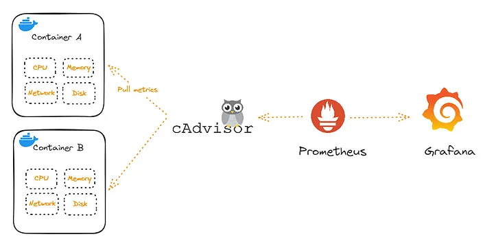

https://prometheus.io/docs/guides/cadvisor/
https://github.com/google/cadvisor
https://grafana.com/grafana/dashboards/19792-cadvisor-dashboard/
https://grafana.com/grafana/dashboards/14282-cadvisor-exporter/
https://abhiraj2001.medium.com/monitoring-docker-containers-with-grafana-loki-and-promtail-4302a9417c0d
https://www.elastic.co/beats/filebeat
https://docs.docker.com/engine/logging/drivers/local/

‏cAdvisor (مخفف Container Advisor) یک ابزار متن‌باز است که توسط گوگل توسعه داده شده و برای نظارت و تجزیه و تحلیل عملکرد و استفاده از منابع کانتینرها (مانند داکر و کوبرنتیز) به کار می‌رود. این ابزار یک daemon در حال اجرا است که اطلاعات مربوط به کانتینرهای در حال اجرا را جمع‌آوری، تجمیع، پردازش و صادر می‌کند.



**ویژگی‌های اصلی cAdvisor:**

- **جمع‌آوری متریک:** cAdvisor به طور خودکار متریک‌های مختلفی را از کانتینرها جمع‌آوری می‌کند، از جمله:
    - مصرف CPU (مانند میزان استفاده، بار متوسط)
    - مصرف حافظه (مانند میزان استفاده، میزان کش)
    - استفاده از شبکه (مانند میزان ترافیک ورودی و خروجی)
    - استفاده از سیستم فایل (مانند میزان خواندن و نوشتن)
    - آمار مربوط به دیسک
    - اطلاعات مربوط به محدودیت‌های منابع (مانند cgroup ها)
- **تجمیع و پردازش داده‌ها:** داده‌های جمع‌آوری شده توسط cAdvisor تجمیع و پردازش می‌شوند تا دیدگاه جامعی از عملکرد هر کانتینر و همچنین کل ماشین ارائه شود.
- **نمایش داده‌ها:** cAdvisor یک رابط کاربری وب ساده ارائه می‌دهد که از طریق آن می‌توان метریک‌های جمع‌آوری شده را به صورت real-time مشاهده کرد. این رابط کاربری به کاربران اجازه می‌دهد تا عملکرد کانتینرهای خود را به راحتی بررسی کنند.
- ‏**API:** cAdvisor یک API مبتنی بر HTTP نیز ارائه می‌دهد که به سایر ابزارها و سیستم‌های مانیتورینگ اجازه می‌دهد تا داده‌های آن را جمع‌آوری و استفاده کنند.
- **پشتیبانی از فرمت‌های مختلف خروجی:** cAdvisor می‌تواند داده‌های خود را در فرمت‌های مختلفی مانند Prometheus، InfluxDB و غیره صادر کند، که این امر ادغام آن با سیستم‌های مانیتورینگ موجود را آسان می‌کند.
- **پشتیبانی از انواع کانتینر:** cAdvisor به طور بومی از کانتینرهای داکر پشتیبانی می‌کند و تلاش می‌کند تا از سایر انواع کانتینرها نیز پشتیبانی کند.
- **ادغام با Kubelet:** در محیط‌های کوبرنتیز، cAdvisor به طور مستقیم با Kubelet ادغام شده و به صورت خودکار بر روی هر نود اجرا می‌شود.

**کاربردهای cAdvisor:**

- **مانیتورینگ عملکرد کانتینرها:** پیگیری مصرف منابع و عملکرد کانتینرها برای اطمینان از عملکرد بهینه آن‌ها.
- **عیب‌یابی مشکلات عملکرد:** شناسایی گلوگاه‌های عملکرد و مشکلات مربوط به مصرف منابع در کانتینرها.
- **تحلیل روند مصرف منابع:** بررسی الگوهای مصرف منابع در طول زمان برای برنامه‌ریزی بهتر ظرفیت و بهینه‌سازی تخصیص منابع.
- **ادغام با سیستم‌های مانیتورینگ:** استفاده از داده‌های cAdvisor در سیستم‌های مانیتورینگ جامع‌تر مانند Prometheus و Grafana برای ایجاد داشبوردهای سفارشی و تنظیم هشدارها.

به طور خلاصه، cAdvisor یک ابزار قدرتمند و ضروری برای هر کسی است که از کانتینرها استفاده می‌کند و نیاز به درک و نظارت بر عملکرد آن‌ها دارد.


---


بسیار خب، راه اندازی cAdvisor نسبتاً ساده است. در اینجا روش‌های رایج و توصیه‌های لازم برای استفاده از آن آورده شده است:

**روش‌های راه اندازی cAdvisor:**

1. **اجرا به عنوان یک کانتینر داکر:** این رایج‌ترین و ساده‌ترین روش است.
    
    - **اجرای ساده:** دستور زیر را در ترمینال خود اجرا کنید:
        
```
VERSION=v0.49.1 # use the latest release version from https://github.com/google/cadvisor/releases
sudo docker run \
  --volume=/:/rootfs:ro \
  --volume=/var/run:/var/run:ro \
  --volume=/sys:/sys:ro \
  --volume=/var/lib/docker/:/var/lib/docker:ro \
  --volume=/dev/disk/:/dev/disk:ro \
  --publish=8080:8080 \
  --detach=true \
  --name=cadvisor \
  --privileged \
  --device=/dev/kmsg \
  gcr.io/cadvisor/cadvisor
```


	- ‏`--volume`: این آپشن‌ها دایرکتوری‌های لازم از سیستم میزبان را به کانتینر cAdvisor mount می‌کنند تا بتواند اطلاعات مربوط به کانتینرها و سیستم را جمع‌آوری کند.
        - ‏`/var/run`: برای ارتباط با داکر daemon.
        - `/`: برای دسترسی به فایل‌سیستم ریشه.
        - ‏`/var/lib/docker`: برای دسترسی به اطلاعات کانتینرها.
        - ‏`/sys`: برای دسترسی به اطلاعات کرنل و cgroup ها.
        - ‏`/dev/disk`: برای دسترسی به اطلاعات مربوط به دیسک.
        - ‏`--publish=8080:8080`: پورت 8080 کانتینر را به پورت 8080 سیستم میزبان نگاشت می‌کند.
        - ‏`--detach=true`: کانتینر را در پس‌زمینه اجرا می‌کند.
        - ‏`--name=cadvisor`: یک نام برای کانتینر تعیین می‌کند.
        - ‏`gcr.io/cadvisor/cadvisor:latest`: ایمیج داکر cAdvisor از Google Container Registry.
    - **دسترسی به رابط کاربری:** پس از اجرای دستور، می‌توانید با باز کردن آدرس `http://localhost:8080` در مرورگر خود به رابط کاربری cAdvisor دسترسی پیدا کنید. در این رابط می‌توانید метریک‌های مربوط به کانتینرها و سیستم میزبان را مشاهده کنید.
        
2. **اجرا در محیط کوبرنتیز:** در محیط‌های کوبرنتیز، معمولاً cAdvisor به عنوان بخشی از `kubelet` روی هر نود اجرا می‌شود. شما نیازی به نصب جداگانه آن ندارید. Kubelet مسئول جمع‌آوری متریک‌های از کانتینرها و ارائه آن‌ها از طریق API خود است. سیستم‌های مانیتورینگ مانند Prometheus می‌توانند این متریک‌ها را از Kubelet جمع‌آوری کنند.
    

**توصیه‌های لازم برای استفاده از cAdvisor:**

- **امنیت:**
    - **محدود کردن دسترسی:** اگر cAdvisor را به صورت مستقیم روی یک پورت در معرض قرار می‌دهید، حتماً دسترسی به آن را با فایروال یا مکانیزم‌های امنیتی دیگر محدود کنید. رابط کاربری cAdvisor اطلاعات حساسی در مورد عملکرد سیستم و کانتینرها ارائه می‌دهد.
    - **عدم تغییر تنظیمات:** به طور پیش‌فرض، cAdvisor فقط اطلاعات را جمع‌آوری می‌کند و تغییری در سیستم ایجاد نمی‌کند. با این حال، مراقب هرگونه تنظیمات اضافی باشید که ممکن است خطرات امنیتی ایجاد کند.
- **مدیریت منابع:**
    - **مصرف منابع cAdvisor:** به یاد داشته باشید که cAdvisor خود نیز یک پروسه است و مقداری از منابع سیستم (CPU، حافظه) را مصرف می‌کند. در محیط‌های با تعداد زیادی کانتینر، ممکن است نیاز به تخصیص منابع مناسب به کانتینر cAdvisor داشته باشید.
- **ذخیره‌سازی داده‌ها:**
    - **نگهداری موقت:** به طور پیش‌فرض، cAdvisor داده‌ها را به صورت موقت در حافظه نگهداری می‌کند. با ری‌استارت شدن کانتینر cAdvisor، این داده‌ها از بین می‌روند.
    - **ادغام با سیستم‌های مانیتورینگ:** برای نگهداری بلندمدت و تحلیل پیشرفته‌تر داده‌ها، cAdvisor را با سیستم‌های مانیتورینگ مانند Prometheus، InfluxDB، یا Elasticsearch ادغام کنید. این سیستم‌ها امکان ذخیره‌سازی، تجسم (با Grafana) و ایجاد هشدار بر اساس متریک‌های را فراهم می‌کنند.
- **تنظیمات پیشرفته:**
    - **فیلتر کردن کانتینرها:** cAdvisor به شما اجازه می‌دهد تا با استفاده از فیلترها، جمع‌آوری метریک‌ها را برای کانتینرهای خاص محدود کنید. این می‌تواند به کاهش مصرف منابع cAdvisor در محیط‌های بزرگ کمک کند.
    - **تنظیم بازه جمع‌آوری:** می‌توانید بازه زمانی جمع‌آوری метریک‌ها را تنظیم کنید. جمع‌آوری با فواصل کوتاه‌تر، داده‌های دقیق‌تری ارائه می‌دهد اما ممکن است بار بیشتری روی سیستم تحمیل کند.
- **استفاده در کوبرنتیز:**
    - **وابستگی به Kubelet:** در کوبرنتیز، cAdvisor به عنوان بخشی از Kubelet عمل می‌کند. بنابراین، اطمینان از سلامت و عملکرد صحیح Kubelet برای دسترسی به метریک‌های کانتینرها ضروری است.
    - **استفاده از ابزارهای کوبرنتیز:** برای مانیتورینگ در کوبرنتیز، معمولاً از ابزارهای خاص این اکوسیستم مانند Prometheus Operator و kube-state-metrics در کنار cAdvisor استفاده می‌شود تا دیدگاه جامع‌تری از عملکرد کلاستر و برنامه‌ها به دست آید.
- **بروزرسانی:** cAdvisor به طور فعال توسعه داده می‌شود، بنابراین توصیه می‌شود که به طور منظم نسخه آن را به آخرین نسخه موجود بروزرسانی کنید تا از آخرین ویژگی‌ها و رفع اشکالات بهره‌مند شوید.

با رعایت این توصیه‌ها، می‌توانید cAdvisor را به طور موثر راه‌اندازی کرده و از قابلیت‌های آن برای نظارت و بهبود عملکرد کانتینرهای خود بهره ببرید. اگر سوالات بیشتری دارید، خوشحال می‌شوم پاسخ دهم.