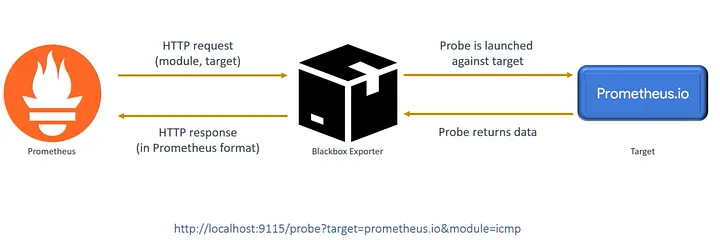
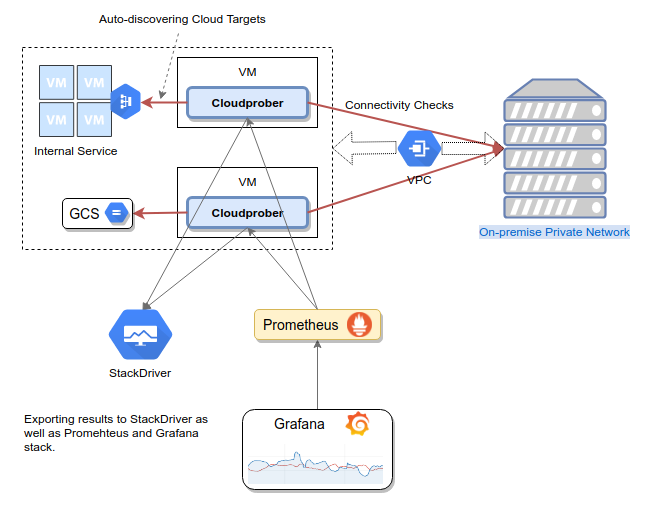
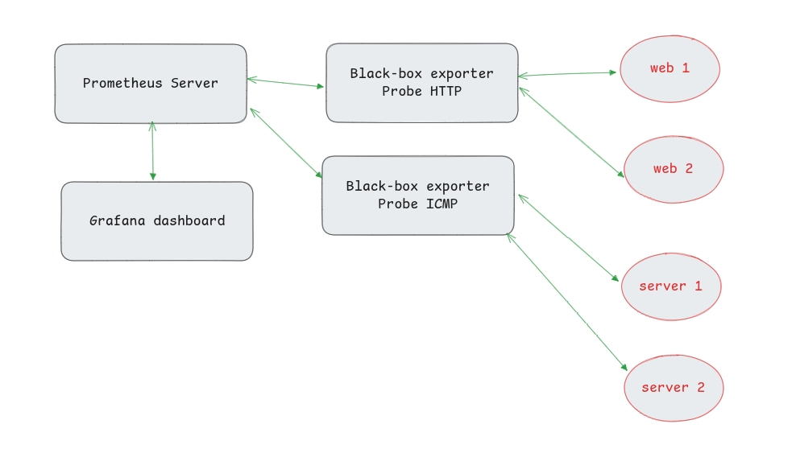

## reference
https://github.com/prometheus/blackbox_exporter
https://prometheus.io/docs/instrumenting/exporters/
https://prometheus.io/docs/guides/multi-target-exporter/
https://grafana.com/grafana/dashboards/13659-blackbox-exporter-http-prober/
https://grafana.com/grafana/dashboards/20338-blackbox-exporter-icmp/
https://learn.microsoft.com/en-us/azure/architecture/patterns/health-endpoint-monitoring
https://github.com/DannyRavi/cloud_software_farsi/blob/main/docs/Health%20Endpoint%20Monitoring%20pattern.md
### **Blackbox Exporter چیست؟**  
‏**Blackbox Exporter** یک ابزار متنباز (Open-Source) از اکوسیستم **Prometheus** است که برای **مانیتورینگ خارجی (External Monitoring)** سرویسها استفاده میشود. برخلاف **exporterهای معمولی** (مثل Node Exporter که متریکهای داخلی سیستم را جمعآوری میکند)، Blackbox Exporter از **خارج سیستم** به سرویسها **پروب (Probe)** میزند و سلامت آنها را بررسی میکند.






### **کاربرد Blackbox Exporter**  
این ابزار برای چک کردن **در دسترس بودن (Availability)** و **عملکرد (Performance)** سرویسهای مختلف از طریق پروتکلهای زیر استفاده میشود:  
1. **HTTP/HTTPS**:  
   - بررسی وضعیت وبسایتها (مثلاً آیا HTTP 200 برمیگرداند؟).  
   - بررسی SSL/TLS (تاریخ انقضا، اعتبار گواهی).  
   - اندازهگیری زمان پاسخ (Latency).  
2. **TCP**:  
   - بررسی پورتهای باز (مثلاً آیا دیتابیس MySQL روی پورت 3306 پاسخ میدهد؟).  
3. **ICMP (Ping)**:  
   - بررسی اینکه یک سرور یا دستگاه شبکه زنده است (مثل `ping` معمولی).  
4. **DNS**:  
   - بررسی پاسخ DNS (مثلاً آیا یک رکورد خاص به درستی resolve میشود؟).  
5. GRPC:
- بررسی ارتباط‌های GRPC
---

### **چرا از Blackbox Exporter استفاده کنیم؟**  
✅ **مانیتورینگ خارجی (External Health Checks)**:  
   - مثل یک کاربر واقعی از بیرون سیستم، سرویس را چک میکند (برخلاف exporterهای داخلی مثل Node Exporter).  
✅ **تشخیص مشکلات شبکه**:  
   - اگر سرویس از داخل سالم باشد، اما از بیرون در دسترس نباشد، این ابزار مشکل را شناسایی میکند.  
✅ **هشداردهی (Alerting)**:  
   - میتوان در **Prometheus + Alertmanager** قوانینی تعریف کرد که مثلاً اگر یک وبسایت down شد، اطلاع دهد.  

---

### **مثال تنظیم Blackbox Exporter**  
1. **دانلود و اجرا**:  
   ```sh
   ./blackbox_exporter --config.file=blackbox.yml
   ```
2. **تنظیم Prometheus برای scrape کردن**:  
   ```yaml
   scrape_configs:
     - job_name: 'blackbox-http'
       metrics_path: /probe
       params:
         module: [http_2xx]  # ماژول بررسی HTTP
       static_configs:
         - targets:
           - https://example.com  # وبسایتی که میخواهیم چک کنیم
       relabel_configs:
         - source_labels: [__address__]
           target_label: __param_target
         - source_labels: [__param_target]
           target_label: instance
         - target_label: __address__
           replacement: localhost:9115  # آدرس Blackbox Exporter
   ```
3. **نمایش نتایج در Grafana**:  
   - میتوانید **زمان پاسخ، وضعیت SSL و ...** را در داشبورد Grafana مشاهده کنید.  

مثال:



---

### **تفاوت Blackbox Exporter با سایر Exporters**  
| ابزار | نوع مانیتورینگ | مثال استفاده |  
|--------|----------------|----------------|  
| **Node Exporter** | داخلی (Internal) | جمعآوری CPU، Memory، Disk |  
| **Blackbox Exporter** | خارجی (External) | چک کردن HTTP، TCP، Ping |  
| **Grok Exporter** | پردازش لاگها | استخراج متریک از لاگها |  

---

### **جمع بندی**  
اگر میخواهید **وبسایتها، پورتها، DNS و ...** را از دید کاربران بیرونی مانیتور کنید، **Blackbox Exporter** بهترین گزینه است. این ابزار به شما کمک میکند مشکلاتی را که ممکن است در مانیتورینگ داخلی دیده نشوند، شناسایی کنید. 🚀  


-----------

‏ **Grok Exporter** یک ابزار متنباز (Open-Source) است که برای استخراج و تبدیل لاگهای ساختاریافته (structured logs) به **متریکهای Prometheus** استفاده میشود. این ابزار معمولاً در سیستمهای مانیتورینگ و observability برای جمعآوری و تحلیل لاگها به کار میرود.

### **کاربرد Grok Exporter:**
- **پارس کردن لاگها با الگوهای Grok**:  
 ‏ Grok یک زبان الگو (pattern matching) است که برای تجزیه و تحلیل متن لاگها استفاده میشود (مشابه regular expressions اما با قابلیتهای بیشتر).
- **تبدیل لاگها به متریکهای Prometheus**:  
  پس از استخراج دادهها از لاگها، آنها را به فرمت قابلخواندن توسط **Prometheus** تبدیل میکند.
- **یکپارچه شدن با پشته مانیتورینگ**:  
  از آنجایی که خروجی آن با **Prometheus** سازگار است، میتوان از **Grafana** برای نمایش دادهها استفاده کرد.

### **چرا از Grok Exporter استفاده کنیم؟**
- زمانی که لاگهای شما ساختاریافته نیستند و نیاز دارید دادههای خاصی را از آنها استخراج کنید.
- زمانی که میخواهید لاگها را به صورت **متریکهای زمانی (time-series)** در Prometheus ذخیره کنید.
- برای ایجاد **هشدار (alerting)** بر اساس محتوای لاگها.

### **مثال استفاده از Grok Exporter:**
فرض کنید یک لاگ دارید که شامل زمان پاسخدهی (response time) است:
```
2023-10-01 12:00:00 [INFO] Request completed in 120ms
```
با استفاده از **Grok Exporter** میتوانید یک الگو تعریف کنید تا زمان پاسخ (120ms) را استخراج کند و به Prometheus گزارش دهد.

### **نحوه اجرا:**
1. **تنظیم الگوی Grok** در فایل کانفیگ (مثلاً `config.yml`).
2. **اجرای Exporter** به صورت دیمون (Daemon) یا سرویس.
3. **تنظیم Prometheus** برای scrape کردن متریکهای Grok Exporter.

### **تفاوت با سایر Exporters:**
‏- **Promtail (Loki)**: برای ارسال لاگها به **Loki** استفاده میشود.
‏- **Fluentd/Fluent Bit**: برای جمعآوری و پردازش لاگها به صورت عمومیتر.
‏- **Grok Exporter**: مخصوص تبدیل لاگها به **متریکهای Prometheus** است.

اگر نیاز به تحلیل لاگها و تبدیل آنها به متریک دارید، **Grok Exporter** یک انتخاب مناسب است. 

------------

### **ICMP RTT چیست؟**  
ءء**ICMP RTT** (مخفف **Round-Trip Time**) مدت زمانی است که طول میکشد تا یک بسته **ICMP** (مثل Ping) از مبدأ به مقصد برود و پاسخ آن برگردد. این معیار برای اندازهگیری **تأخیر شبکه (Network Latency)** و سلامت اتصال استفاده میشود.

---

### **جزئیات فنی ICMP RTT**
1. **نحوه محاسبه**:  
   - دستگاه مبدأ یک بسته **ICMP Echo Request** (Ping) میفرستد.  
   - مقصد پس از دریافت، **ICMP Echo Reply** ارسال میکند.  
   - **RTT = زمان ارسال Request - زمان دریافت Reply**.  

2. **واحد اندازهگیری**:  
   - معمولاً بر حسب **میلیثانیه (ms)** گزارش میشود.  
   - مثال:  
     ```
     $ ping google.com
     PING google.com (142.250.190.46): 56 data bytes
     64 bytes from 142.250.190.46: icmp_seq=0 ttl=116 time=12.345 ms  <-- این RTT است!
     ```

3. **عوامل مؤثر بر RTT**:  
   - فاصله جغرافیایی بین مبدأ و مقصد.  
   - ازدحام شبکه (Traffic Congestion).  
   - کیفیت زیرساخت شبکه (مثل روترها، کابلها).  
   - بار پردازشی روی سرور مقصد.  

---

### **کاربردهای ICMP RTT**
- **تشخیص مشکلات شبکه**:  
  - اگر RTT بهطور غیرعادی بالا باشد (**مثلاً >500ms**)، نشاندهنده مشکل در شبکه است.  
- **مانیتورینگ کیفیت سرویس**:  
  - در ابزارهایی مثل **Prometheus + Blackbox Exporter**، RTT برای مانیتورینگ ICMP استفاده میشود.  
- **بهینهسازی مسیریابی**:  
  - مقایسه RTT بین مسیرهای مختلف برای انتخاب بهترین Route.  

---

### **نمونه استفاده در Blackbox Exporter**
اگر میخواهید **RTT دستگاههای شبکه** را با Prometheus مانیتور کنید، در فایل کانفیگ Blackbox اینگونه تنظیم میشود:  
```yaml
modules:
  icmp_check:
    prober: icmp
    timeout: 5s
    icmp:
      preferred_ip_protocol: "ipv4"
```
سپس در Prometheus:  
```yaml
scrape_configs:
  - job_name: 'blackbox-icmp'
    metrics_path: /probe
    params:
      module: [icmp_check]
    static_configs:
      - targets:
        - 8.8.8.8  # هدف مورد نظر (مثل DNS گوگل)
    relabel_configs:
      - source_labels: [__address__]
        target_label: __param_target
      - source_labels: [__param_target]
        target_label: instance
      - target_label: __address__
        replacement: localhost:9115  # آدرس Blackbox Exporter
```

---

### **متریکهای مرتبط در Prometheus**
پس از راهاندازی، این متریکها قابل مشاهدهاند:  
- `probe_icmp_duration_seconds`: زمان RTT بر حسب ثانیه.  
- `probe_success`: وضعیت دسترسی (1 = موفق، 0 = خطا).  

---

### **تفاوت RTT با TTL**
- ءء**RTT**: زمان رفت و برگشت بسته.  
- ءء**TTL** (Time To Live): حداکثر تعداد hopهایی که بسته میتواند طی کند قبل از حذف شدن.  

مثال خروجی Ping:  
```
64 bytes from 8.8.8.8: icmp_seq=1 ttl=117 time=9.67 ms
^^^^^^^^^^^^^^^^^^^^^         ^^^^       ^^^^^^^^^^
اندازه پاسخ                   TTL        RTT
```

---

### **جمعبندی**  
- **ICMP RTT** معیاری کلیدی برای سنجش سرعت و سلامت شبکه است.  
- در مانیتورینگ با **Blackbox Exporter**، میتوانید از آن برای هشداردهی در مورد افزایش تأخیر استفاده کنید.  
- مقدار مطلوب RTT بسته به کاربرد متفاوت است (مثلاً برای گیمینگ زیر 50ms و برای وبسایت زیر 200ms مناسب است).  

اگر نیاز به تنظیم دقیقتر دارید، بپرسید! 😊


### **ICMP Packet Loss چیست؟**  
**Packet Loss** (از دست رفتن بسته‌ها) در **ICMP** به درصدی از بسته‌های **Ping** (درخواست‌های ICMP Echo Request) اشاره دارد که به مقصد نرسیده یا پاسخ آنها (**ICMP Echo Reply**) برگشت داده نشده است. این معیار یکی از شاخص‌های مهم برای سنجش **پایداری و کیفیت شبکه** است.

---

### **علل رایج Packet Loss در ICMP**
1. **مشکلات شبکه**:  
   - ازدحام ترافیک (Network Congestion)  
   - خرابی سخت‌افزار (روترها، سوئیچ‌ها، کابل‌ها)  
2. **مسدودسازی عمدی**:  
   - فایروال‌ها یا تنظیمات امنیتی که بسته‌های ICMP را **Drop** می‌کنند.  
3. **مشکلات در مسیریابی**:  
   - تنظیمات نادرست Routing Table.  
4. **مشکلات در سرور/دستگاه مقصد**:  
   - overload شدن CPU یا قطعی موقت.  

---

### **چگونه Packet Loss را اندازه‌گیری کنیم؟**
#### **1. استفاده از دستور `ping`**  
در خط فرمان (Linux/Windows/macOS):  
```bash
ping -c 10 example.com  # ارسال 10 درخواست ICMP
```
**مثال خروجی**:  
```
10 packets transmitted, 8 received, 20% packet loss, time 9014ms
```
- **20% Packet Loss** یعنی ۲ بسته از ۱۰ بسته ارسالی از دست رفته‌اند.

#### **2. استفاده از ابزارهای پیشرفته**  
- **`mtr`** (ترکیب `ping` + `traceroute`):  
  ```bash
  mtr --report example.com
  ```
- **Prometheus + Blackbox Exporter** (برای مانیتورینگ مداوم):  
  ```yaml
  - job_name: 'blackbox-icmp'
    metrics_path: /probe
    params:
      module: [icmp_check]
    static_configs:
      - targets: ['8.8.8.8']  # Google DNS
  ```
  سپس متریک `probe_success` را در **Grafana** بررسی کنید (مقدار `0` نشان‌دهنده Packet Loss است).

---

### **مقادیر قابل قبول Packet Loss**
- **۰٪**: ایده‌آل (اتصال کاملاً پایدار).  
- **۱-۲٪**: قابل تحمل برای اکثر برنامه‌ها.  
- **>۵٪**: نیاز به بررسی فوری (مشکل در شبکه یا سرویس).  
- **۱۰۰٪**: اتصال کاملاً قطع است یا ICMP مسدود شده.  

---

### **راه‌حل‌های کاهش Packet Loss**
1. **رفع ازدحام شبکه**:  
   - محدود کردن پهنای‌باند مصرفی.  
   - ارتقاء زیرساخت شبکه (مثل سوئیچ‌های بهتر).  
2. **تنظیم فایروال**:  
   - مطمئن شوید قوانین فایروال بسته‌های ICMP را مسدود نمی‌کنند.  
3. **بررسی مسیریابی**:  
   - استفاده از `traceroute` برای یافتن گره‌های مشکل‌دار.  
4. **بررسی سلامت سخت‌افزار**:  
   - تست کابل‌ها، روترها و سوئیچ‌ها.  

---

### **تفاوت Packet Loss با Latency (تأخیر)**
- **Packet Loss**: درصد بسته‌های گم‌شده.  
- **Latency (RTT)**: زمان رفت و برگشت بسته‌های موفق.  
ممکن است شبکه **تأخیر کمی داشته باشد اما Packet Loss بالا داشته باشد** (مثلاً در شبکه‌های بی‌سیم شلوغ).  

---

### **جمع‌بندی**  
- **ICMP Packet Loss** نشان‌دهنده عدم ثبات شبکه است.  
- با ابزارهایی مثل `ping`، `mtr` و **Blackbox Exporter** می‌توان آن را مانیتور کرد.  
- مقادیر بالای آن (بیش از ۵٪) نیاز به عیب‌یابی دارد.  

اگر نیاز به مثال عملی در تنظیم Prometheus یا Grafana دارید، خوشحال می‌شوم کمک کنم! 😊