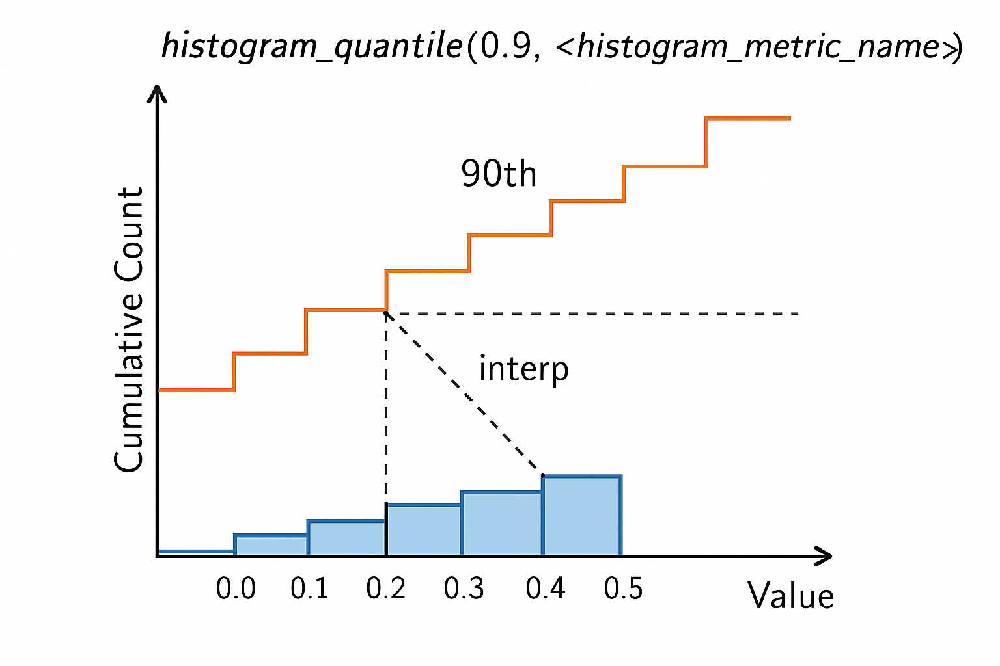

در Prometheus چندین تابع داخلی ارائه می‌دهد که می‌توانید از آنها در عبارات پرس‌وجو (PromQL) استفاده کنید. این توابع به شما امکان می‌دهند محاسبات پیچیده‌تری انجام دهید و داده‌های متریک را بهتر تحلیل کنید.
## دسته‌بندی توابع در  Prometheus


بعضی توابع آرگومان‌های پیش‌فرض دارند، مثلاً `year(v=vector(time()) instant-vector)`. این بدان معناست که یک آرگومان `v` وجود دارد که یک «وکتور لحظه‌ای» (instant-vector) است و اگر ارائه نشود، مقدار پیش‌فرض آن عبارت `vector(time())` خواهد بود.

### `abs()`
‏`abs(v instant-vector)`: وکتوری را برمی‌گرداند که حاوی تمام نمونه‌های float در وکتور ورودی است که به قدر مطلقشان تبدیل شده‌اند. نمونه‌های هیستوگرام در وکتور ورودی بی‌صدا نادیده گرفته می‌شوند.


----

#### `absent()`


‏`absent(v instant-vector)`: اگر وکتور ورودی دارای عنصری باشد (نمونه‌های float یا هیستوگرام)، یک وکتور خالی برمی‌گرداند و اگر وکتور ورودی هیچ عنصری نداشته باشد، یک وکتور تک‌عنصری با مقدار ۱ برمی‌گرداند.

این تابع برای هشدار دادن زمانی مفید است که هیچ سری زمانی برای ترکیب مشخصی از نام متریک و لیبل وجود نداشته باشد.
```
absent(nonexistent{job="myjob"})
# => {job="myjob"}

absent(nonexistent{job="myjob",instance=~".*"})
# => {job="myjob"}

absent(sum(nonexistent{job="myjob"}))
# => {}
```
در دو مثال اول، `absent()` سعی می‌کند هوشمندانه لیبل‌های وکتور خروجی تک‌عنصری را از وکتور ورودی استخراج کند.

---

### `absent_over_time()`
‏`absent_over_time(v range-vector)`: اگر «وکتور بازه‌ای» (range-vector) ورودی دارای عنصری باشد (نمونه‌های float یا هیستوگرام)، یک وکتور خالی برمی‌گرداند و اگر وکتور بازه‌ای ورودی هیچ عنصری نداشته باشد، یک وکتور تک‌عنصری با مقدار ۱ برمی‌گرداند.

این تابع برای هشدار دادن زمانی مفید است که هیچ سری زمانی برای ترکیب مشخصی از نام متریک و لیبل برای مدت زمان معینی وجود نداشته باشد.
```
absent_over_time(nonexistent{job="myjob"}[1h])
# => {job="myjob"}

absent_over_time(nonexistent{job="myjob",instance=~".*"}[1h])
# => {job="myjob"}

absent_over_time(sum(nonexistent{job="myjob"})[1h:])
# => {}
```
در دو مثال اول، `absent_over_time()` سعی می‌کند هوشمندانه لیبل‌های وکتور خروجی تک‌عنصری را از وکتور ورودی استخراج کند.

----

### `ceil()`
‏`ceil(v instant-vector)`: وکتوری را برمی‌گرداند که حاوی تمام نمونه‌های float در وکتور ورودی است که به نزدیک‌ترین عدد صحیح بزرگتر یا مساوی مقدار اصلی‌شان گرد شده‌اند. نمونه‌های هیستوگرام در وکتور ورودی بی‌صدا نادیده گرفته می‌شوند.
```
ceil(+Inf) = +Inf
ceil(±0) = ±0
ceil(1.49) = 2.0
ceil(1.78) = 2.0
```

### `changes()`
‏`changes(v range-vector)`: برای هر سری زمانی ورودی، تعداد دفعاتی که مقدار آن در بازه زمانی ارائه شده تغییر کرده است را به عنوان یک وکتور لحظه‌ای برمی‌گرداند. یک نمونه float و به دنبال آن یک نمونه هیستوگرام، یا برعکس، به عنوان یک تغییر محسوب می‌شود. یک نمونه هیستوگرام شمارنده (counter) و به دنبال آن یک نمونه هیستوگرام گِیج (gauge) با مقادیر دقیقاً یکسان (به جز نوع)، یا برعکس، به عنوان تغییر محسوب نمی‌شود.

----


### `clamp()`
‏`clamp(v instant-vector, min scalar, max scalar)`: مقادیر تمام نمونه‌های float در `v` را طوری محدود می‌کند که حد پایین `min` و حد بالای `max` داشته باشند. نمونه‌های هیستوگرام در وکتور ورودی بی‌صدا نادیده گرفته می‌شوند.

----


موارد خاص:
*   اگر `min > max` باشد، یک وکتور خالی برمی‌گرداند.
*   اگر `min` یا `max` برابر `NaN` باشد، نمونه‌های float به `NaN` محدود می‌شوند.

### `clamp_max()`
‏`clamp_max(v instant-vector, max scalar)`: مقادیر تمام نمونه‌های float در `v` را طوری محدود می‌کند که حد بالای `max` داشته باشند. نمونه‌های هیستوگرام در وکتور ورودی بی‌صدا نادیده گرفته می‌شوند.

### `clamp_min()`
‏`clamp_min(v instant-vector, min scalar)`: مقادیر تمام نمونه‌های float در `v` را طوری محدود می‌کند که حد پایین `min` داشته باشند. نمونه‌های هیستوگرام در وکتور ورودی بی‌صدا نادیده گرفته می‌شوند.

#### `day_of_month()`
‏`day_of_month(v=vector(time()) instant-vector)`: نمونه‌های float در `v` را به عنوان timestamps (تعداد ثانیه‌ها از اول ژانویه ۱۹۷۰ UTC) تفسیر کرده و روزِ ماه (در UTC) را برای هر یک از آن timestamps برمی‌گرداند. مقادیر بازگشتی بین ۱ تا ۳۱ هستند. نمونه‌های هیستوگرام در وکتور ورودی بی‌صدا نادیده گرفته می‌شوند.

#### `day_of_week()`
‏`day_of_week(v=vector(time()) instant-vector)`: نمونه‌های float در `v` را به عنوان timestamps (تعداد ثانیه‌ها از اول ژانویه ۱۹۷۰ UTC) تفسیر کرده و روزِ هفته (در UTC) را برای هر یک از آن timestamps برمی‌گرداند. مقادیر بازگشتی بین ۰ تا ۶ هستند، که ۰ به معنای یکشنبه و الی آخر است. نمونه‌های هیستوگرام در وکتور ورودی بی‌صدا نادیده گرفته می‌شوند.

### `day_of_year()`
‏`day_of_year(v=vector(time()) instant-vector)`: نمونه‌های float در `v` را به عنوان timestamps (تعداد ثانیه‌ها از اول ژانویه ۱۹۷۰ UTC) تفسیر کرده و روزِ سال (در UTC) را برای هر یک از آن timestamps برمی‌گرداند. مقادیر بازگشتی برای سال‌های غیرکبیسه بین ۱ تا ۳۶۵ و برای سال‌های کبیسه بین ۱ تا ۳۶۶ هستند. نمونه‌های هیستوگرام در وکتور ورودی بی‌صدا نادیده گرفته می‌شوند.

### `days_in_month()`
‏`days_in_month(v=vector(time()) instant-vector)`: نمونه‌های float در `v` را به عنوان timestamps (تعداد ثانیه‌ها از اول ژانویه ۱۹۷۰ UTC) تفسیر کرده و تعداد روزهای ماهِ هر یک از آن timestamps (در UTC) را برمی‌گرداند. مقادیر بازگشتی بین ۲۸ تا ۳۱ هستند. نمونه‌های هیستوگرام در وکتور ورودی بی‌صدا نادیده گرفته می‌شوند.

### `delta()`
‏`delta(v range-vector)`: تفاوت بین مقدار اول و آخر هر عنصر سری زمانی در یک وکتور بازه‌ای `v` را محاسبه کرده و یک وکتور لحظه‌ای با دلتاهای داده شده و لیبل‌های معادل برمی‌گرداند. دلتا برای پوشش کامل بازه زمانی مشخص شده در انتخابگر وکتور بازه‌ای برونیابی (extrapolate) می‌شود، بنابراین حتی اگر مقادیر نمونه‌ها همگی صحیح باشند، ممکن است نتیجه‌ای غیرصحیح بدست آید.

مثال زیر تفاوت دمای CPU بین اکنون و ۲ ساعت پیش را برمی‌گرداند:
```
delta(cpu_temp_celsius{host="zeus"}[2h])
```
‏`delta` بر روی نمونه‌های هیستوگرام با محاسبه یک هیستوگرام جدید عمل می‌کند که در آن هر جزء (مجموع و تعداد مشاهدات، باکت‌ها) تفاوت بین جزء مربوطه در اولین و آخرین هیستوگرام بومی (native histogram) در `v` است. با این حال، هر عنصری در `v` که ترکیبی از نمونه‌های float و نمونه‌های هیستوگرام در بازه داشته باشد، از وکتور نتیجه حذف شده و با یک یادداشت (annotation) سطح هشدار (warn-level) مشخص می‌شود.

‏`delta` فقط باید با گِیج‌ها (هم برای float و هم برای هیستوگرام) استفاده شود.

### `deriv()`
‏`deriv(v range-vector)`: مشتق بر حسب ثانیه هر سری زمانی float در وکتور بازه‌ای `v` را با استفاده از رگرسیون خطی ساده محاسبه می‌کند. وکتور بازه‌ای باید حداقل دو نمونه float برای انجام محاسبه داشته باشد. هنگامی که `+Inf` یا `-Inf` در وکتور بازه‌ای یافت شود، مقدار شیب و آفست محاسبه شده `NaN` خواهد بود.

‏`deriv` فقط باید با گِیج‌ها استفاده شود و فقط برای نمونه‌های float کار می‌کند. عناصری در وکتور بازه‌ای که فقط حاوی نمونه‌های هیستوگرام هستند، به طور کامل نادیده گرفته می‌شوند. برای عناصری که حاوی ترکیبی از نمونه‌های float و هیستوگرام هستند، فقط از نمونه‌های float به عنوان ورودی استفاده می‌شود که با یک یادداشت سطح اطلاعات (info-level) مشخص می‌شود.


### `double_exponential_smoothing()`

روش **Double Exponential Smoothing (هموارسازی نمایی دوگانه)** یا به فارسی **هموارسازی نمایی دوگانه**، یکی از روش‌های پیش‌بینی سری‌های زمانی است که علاوه بر **میانگین‌گیری و هموارسازی داده‌ها**، **روند (Trend)** داده را نیز در نظر می‌گیرد.

---

### 🔹 مروری بر ایده اصلی

در **هموارسازی نمایی ساده (Simple Exponential Smoothing)** فرض می‌شود که داده‌ها روند خاصی ندارند و فقط نوسانات تصادفی دارند.
اما اگر داده‌ها روند افزایشی یا کاهشی داشته باشند (مثلاً فروش ماهانه که رو به افزایش است)، مدل ساده دیگر مناسب نیست.
در این حالت از **Double Exponential Smoothing** استفاده می‌شود که می‌تواند **سطح (Level)** و **روند (Trend)** را جداگانه مدل کند.

---

### 🔹 فرمول‌ها

این روش دو مؤلفه دارد:

۱. **سطح (Level):**
$$
   [
   L_t = \alpha Y_t + (1 - \alpha)(L_{t-1} + T_{t-1})
   ]$$
   که در آن:

‏   * ( Y_t ): مقدار مشاهده‌شده در زمان ( t )
   * ‏( L_t ): سطح (میانگین هموارشده) در زمان ( t )
   * ‏( T_{t-1} ): روند برآوردشده در زمان قبلی
   ‏* ( \alpha ): ضریب هموارسازی برای سطح (بین 0 و 1)

۲. **روند (Trend):**
  که در آن:
$$
   [
   T_t = \beta (L_t - L_{t-1}) + (1 - \beta) T_{t-1}
   ]
 
$$
   * ‏( T
   
   * ‏( \beta ): ضریب هموارسازی برای روند (بین 0 و 1)


۲. **پیش‌بینی (Forecast):**

$$
   [
   \hat{Y}_{t+m} = L_t + mT_t
   ]
$$
   که در آن:
   

   * ( m ): تعداد گام‌های پیش‌بینی به جلو است (مثلاً پیش‌بینی برای ماه بعد یعنی ( m = 1 ))

---

### 🔹 تفسیر شهودی

‏* ( L_t ): مقدار "سطح" فعلی داده (مثل میانگین هموارشده)
‏* ( T_t ): نرخ تغییر (شیب یا روند رشد/کاهش)
* ضرایب ( \alpha ) و ( \beta ): کنترل میزان واکنش مدل به تغییرات جدید داده‌ها
  (اگر نزدیک 1 باشند، مدل به تغییرات جدید سریع‌تر واکنش می‌دهد)

---

### 🔹 مثال ساده

فرض کنید داده‌های فروش ماهانه به صورت زیر باشند:

| ماه | فروش (Y) |
| --- | -------- |
| 1   | 100      |
| 2   | 120      |
| 3   | 130      |
| 4   | 150      |

می‌بینیم که روند صعودی دارد → پس Double Exponential Smoothing مناسب است.

مدل با محاسبه سطح و روند در هر مرحله، فروش ماه‌های آینده را پیش‌بینی می‌کند (مثلاً ماه 5 و 6).

---

### 🔹 انواع مدل‌ها

در واقع Double Exponential Smoothing نوع خاصی از مدل‌های **Holt’s Linear Trend** است، که بعدها با اضافه کردن مؤلفه‌ی فصلی (**Seasonality**) به مدل **Triple Exponential Smoothing (Holt-Winters)** تبدیل شد.

---

### 🔹 در پایتون (مثال کوتاه با statsmodels)

```python
from statsmodels.tsa.holtwinters import ExponentialSmoothing

model = ExponentialSmoothing(data, trend='add').fit()
forecast = model.forecast(5)
print(forecast)
```

در اینجا:

‏* `trend='add'` یعنی روند خطی افزایشی.
‏* `forecast(5)` یعنی پیش‌بینی ۵ گام آینده.

---


# تابع `holt_winters()` (Double Exponential Smoothing) در PromQL

 در Prometheus از نسخه 2.0 به بعد تابع `holt_winters()` را ارائه کرده که پیاده‌سازی Double Exponential Smoothing (هموارسازی نمایی دوگانه) است.

## کاربرد اصلی

این تابع برای **پیش‌بینی مقادیر آینده** بر اساس روند تاریخی داده‌ها استفاده می‌شود و ترکیبی از:

۱. هموارسازی سطح داده (Level)
۲. هموارسازی روند (Trend)

## فرمت کلی:

```promql
holt_winters(v range-vector, sf scalar, tf scalar)
```

- `sf`: فاکتور هموارسازی (smoothing factor) برای سطح (0 < sf < 1)
- `tf`: فاکتور هموارسازی برای روند (0 < tf < 1)

## مثال کاربردی:

```promql
holt_winters(
  node_memory_MemFree_bytes[1h],  # متریک و بازه زمانی
  0.3,  # فاکتور هموارسازی سطح
  0.3   # فاکتور هموارسازی روند
)
```


```promql
holt_winters(node_memory_MemFree_bytes[1h],0.3,0.3)
```
## پارامترهای مهم:

۱. **فاکتورهای هموارسازی**:
   - مقادیر نزدیک به 0: وزن بیشتر به داده‌های تاریخی
   - مقادیر نزدیک به 1: وزن بیشتر به داده‌های اخیر

۲. **بازه زمانی**:
   - باید به اندازه‌ای باشد که الگوهای فصلی و روند را پوشش دهد

## تفاوت با `predict_linear()`:

| ویژگی        | `holt_winters()` | `predict_linear()` |
| ------------ | ---------------- | ------------------ |
| روش          | هموارسازی دوگانه | رگرسیون خطی ساده   |
| ملاحظات روند | دارد             | دارد               |
| ملاحظات فصلی | خیر              | خیر                |
| پیچیدگی      | بیشتر            | کمتر               |

## نکات مهم:

۱. فقط برای **Gauge metrics** مناسب است
۲. نیاز به تنظیم دقیق پارامترها دارد
۳. برای پیش‌بینی‌های کوتاه‌مدت بهتر عمل می‌کند
۴. در نسخه‌های جدید Prometheus ممکن است تغییر کرده باشد

مثال پیشرفته برای مانیتورینگ:

```promql
# پیش‌بینی استفاده از CPU با هموارسازی دوگانه
holt_winters(
  instance:node_cpu_utilisation:rate5m[2h],
  0.5,
  0.2
) > 0.8
```

این کوئری زمانی آلارم می‌دهد که پیش‌بینی می‌شود استفاده از CPU از 80% عبور کند.

---


این تابع باید از طریق فلگ ویژگی `--enable-feature=promql-experimental-functions` فعال شود.

‏`double_exponential_smoothing(v range-vector, sf scalar, tf scalar)`: یک مقدار هموار شده برای هر سری زمانی float در بازه `v` تولید می‌کند. هرچه ضریب smoothing یا هموارسازی `sf` کمتر باشد، اهمیت بیشتری به داده‌های قدیمی داده می‌شود. هرچه ضریب روند `tf` بالاتر باشد، trendsهای بیشتری در داده‌ها در نظر گرفته می‌شود. هر دو `sf` و `tf` باید بین ۰ و ۱ باشند. برای جزئیات بیشتر، به کتاب راهنمای آمار مهندسی NIST مراجعه کنید. در Prometheus V2 این تابع `holt_winters` نامیده می‌شد. این امر باعث سردرگمی می‌شد زیرا روش هولت-وینترز معمولاً به هموارسازی نمایی سه‌گانه اشاره دارد. هموارسازی نمایی دوگانه همانطور که در اینجا پیاده‌سازی شده است، به عنوان "Holt Linear" نیز شناخته می‌شود.

‏`double_exponential_smoothing` فقط باید با گِیج‌ها استفاده شود و فقط برای نمونه‌های float کار می‌کند. عناصری در range-vector که فقط حاوی نمونه‌های هیستوگرام هستند، به طور کامل نادیده گرفته می‌شوند. برای عناصری که حاوی ترکیبی از نمونه‌های float و هیستوگرام هستند، فقط از نمونه‌های float به عنوان ورودی استفاده می‌شود که با یک info-level مشخص می‌شود.


### `exp()`
‏`exp(v instant-vector)`: تابع نمایی را برای تمام نمونه‌های float در `v` محاسبه می‌کند. نمونه‌های هیستوگرام  نادیده گرفته می‌شوند. موارد خاص عبارتند از:
```
Exp(+Inf) = +Inf
Exp(NaN) = NaN
```


### `floor()`
‏`floor(v instant-vector)`: وکتوری را برمی‌گرداند که حاوی تمام نمونه‌های float در وکتور ورودی است که به نزدیک‌ترین عدد صحیح کوچکتر یا مساوی مقدار اصلی‌شان گرد شده‌اند. نمونه‌های هیستوگرام در وکتور ورودی بی‌صدا نادیده گرفته می‌شوند.
```
floor(+Inf) = +Inf
floor(±0) = ±0
floor(1.49) = 1.0
floor(1.78) = 1.0
```

### `histogram_avg()`

‏`histogram_avg(v instant-vector)`: میانگین حسابی مقادیر مشاهده شده ذخیره شده در هر نمونه هیستوگرام در `v` را برمی‌گرداند. نمونه‌های float نادیده گرفته شده و در وکتور بازگشتی ظاهر نمی‌شوند.

برای محاسبه میانگین مدت زمان درخواست در یک پنجره ۵ دقیقه‌ای از یک هیستوگرام بومی، از `histogram_avg` به صورت زیر استفاده کنید:
```
histogram_avg(rate(http_request_duration_seconds[5m]))
```
که معادل کوئری زیر است:
```
  histogram_sum(rate(http_request_duration_seconds[5m]))
/
  histogram_count(rate(http_request_duration_seconds[5m]))
```

### `histogram_count()` و `histogram_sum()`
‏`histogram_count(v instant-vector)`: تعداد مشاهدات ذخیره شده در هر نمونه هیستوگرام در `v` را برمی‌گرداند. نمونه‌های float نادیده گرفته شده و در وکتور بازگشتی ظاهر نمی‌شوند.

به طور مشابه، `histogram_sum(v instant-vector)` مجموع مشاهدات ذخیره شده در هر نمونه هیستوگرام را برمی‌گرداند.

برای محاسبه نرخ مشاهدات (در این مورد معادل "تعداد درخواست‌ها در ثانیه") از یک سری نمونه‌های هیستوگرام، از `histogram_count` به روش زیر استفاده کنید:
```
histogram_count(rate(http_request_duration_seconds[10m]))
```


### histogram_fraction()

## 🧩 تعریف تابع histogram_fraction

```promql
histogram_fraction(φ, sum(rate(<histogram>_bucket[range])) by (labels))
```

یا به طور کلی:

```promql
histogram_fraction(quantile, histogram_metric)
```

---

## 🎯 هدف تابع

این `histogram_fraction()` برای محاسبه **کسری از نمونه‌های histogram** که **کمتر یا مساوی یک مقدار خاص** هستند استفاده می‌شود.

> به زبان ساده: مشخص می‌کند چه سهمی از درخواست‌ها یا رویدادها، مقدارشان کمتر از یک حد معین است.

---

## 🧠 مفاهیم کلیدی

‏1. Histogram در Prometheus معمولاً شامل چند metric است:

| Metric    | توضیح                               |
| --------- | ----------------------------------- |
| `_bucket` | تعداد نمونه‌های ≤ هر حد بالایی (le) |
| `_count`  | تعداد کل نمونه‌ها                   |
| `_sum`    | جمع مقادیر نمونه‌ها                 |

‏2. `histogram_fraction(φ, ...)` کسری از نمونه‌ها که ≤ مقدار مورد نظر هستند را محاسبه می‌کند:

* φ: عدد بین 0 و 1
* φ = 0.9 → ۹۰٪ نمونه‌ها

---

## 📊 مثال کاربردی

فرض کن metric زیر داریم:

```
http_request_duration_seconds_bucket
```

و می‌خواهیم ببینیم **۹۰٪ درخواست‌ها چقدر سریع پاسخ داده شده‌اند**:

```promql
histogram_quantile(0.9, sum(rate(http_request_duration_seconds_bucket[5m])) by (le))
```

🔹 این مثال مشابه `histogram_fraction()` است.

* در واقع، `histogram_fraction()` معمولاً در محاسبات داخلی Prometheus برای بدست آوردن **percentile fractions** استفاده می‌شود.

---

### 🔹 تفاوت با `histogram_quantile()`

| تابع                   | خروجی                      | کاربرد                                             |
| ---------------------- | -------------------------- | -------------------------------------------------- |
| `histogram_fraction()` | کسری نمونه‌ها ≤ مقدار مشخص | معمولاً برای internal/low-level محاسبات percentile |
| `histogram_quantile()` | مقدار متناظر با percentile | محاسبه quantile مثل P90، P99                       |

> به عبارتی:
>
> * ‏`histogram_fraction()` می‌گوید: "چه درصدی از نمونه‌ها ≤ مقدار X هستند"
> * ‏`histogram_quantile()` می‌گوید: "مقدار Y که φ درصد نمونه‌ها ≤ Y هستند"

---

## ⚠️ نکات مهم

* این تابع **مستقیماً روی histogram_bucket** کار می‌کند.
* معمولاً برای **تحلیل دقیق توزیع داده‌ها** استفاده می‌شود.
* در بیشتر استفاده‌های معمول، **کاربر مستقیم از `histogram_fraction()` استفاده نمی‌کند** و از `histogram_quantile()` بهره می‌برد.

---

## 🧾 خلاصه

| ویژگی                       | توضیح                                                                                |
| --------------------------- | ------------------------------------------------------------------------------------ |
| تابع                        | `histogram_fraction(φ, histogram_metric)`                                            |
| ورودی                       | histogram metric (_bucket)                                                           |
| خروجی                       | کسری نمونه‌ها ≤ مقدار مشخص                                                           |
| کاربرد                      | محاسبه درصد نمونه‌ها تحت مقدار خاص، تحلیل percentile                                 |
| تفاوت با histogram_quantile | histogram_fraction → درصد نمونه‌ها، <br>histogram_quantile → مقدار متناظر percentile |

---


‏`histogram_fraction(lower scalar, upper scalar, b instant-vector)`: کسر تخمینی مشاهدات بین مقادیر پایین و بالای ارائه شده را برای هر هیستوگرام کلاسیک یا بومی موجود در `b` برمی‌گرداند. نمونه‌های float در `b` به عنوان تعداد مشاهدات در هر باکت از یک یا چند هیستوگرام کلاسیک در نظر گرفته می‌شوند، در حالی که نمونه‌های هیستوگرام بومی در `b` هر کدام به طور جداگانه به عنوان یک هیستوگرام مجزا در نظر گرفته می‌شوند. این به همان روشی عمل می‌کند که برای `histogram_quantile()` عمل می‌کند. (برای جزئیات بیشتر به آنجا مراجعه کنید.)

اگر مقادیر پایین و بالای ارائه شده با مرزهای باکت منطبق نباشند، کسر محاسبه شده یک تخمین است که از همان روش درون‌یابی `histogram_quantile()` استفاده می‌کند. (برای جزئیات بیشتر به آنجا مراجعه کنید.) به خصوص با هیستوگرام‌های کلاسیک، به راحتی می‌توان مقادیر پایین یا بالایی را انتخاب کرد که بسیار دور از هر مرز باکت باشند و منجر به حاشیه خطای زیادی شوند. به جای استفاده از `histogram_fraction()` با هیستوگرام‌های کلاسیک، اغلب رویکرد قوی‌تری این است که هنگام محاسبه کسرها مستقیماً روی سری‌های باکت عمل کنید. محاسبه امتیاز Apdex را به عنوان یک مثال معمول ببینید.

به عنوان مثال، عبارت زیر کسر درخواست‌های HTTP در طول یک ساعت گذشته را که ۲۰۰ میلی‌ثانیه یا کمتر طول کشیده‌اند، محاسبه می‌کند:
```
histogram_fraction(0, 0.2, rate(http_request_duration_seconds[1h]))
```
خطای تخمین به resolution هیستوگرام بومی زیربنایی و اینکه مرزهای ارائه شده چقدر با مرزهای باکت در هیستوگرام هم‌تراز هستند، بستگی دارد.

‏`+Inf` و `-Inf` مقادیر مرزی معتبری هستند. به عنوان مثال، اگر هیستوگرام در عبارت بالا شامل مشاهدات منفی باشد (که برای مدت زمان درخواست نباید اینطور باشد)، مرز پایین مناسب برای شامل کردن تمام مشاهدات کمتر یا مساوی ۰.۲، `-Inf` خواهد بود نه ۰.

اینکه مرزهای ارائه شده شامل یا غیرشامل (inclusive or exclusive) باشند، تنها در صورتی مرتبط است که مرزهای ارائه شده دقیقاً با مرزهای باکت در هیستوگرام بومی زیربنایی هم‌تراز باشند. در این حالت، رفتار به تعریف اسکیمای هیستوگرام بستگی دارد. (اسکیماهای نمایی استاندارد معمول همگی دارای مرزهای بالایی شامل و مرزهای پایینی غیرشامل برای مقادیر مثبت و برعکس برای مقادیر منفی هستند.) بدون هم‌ترازی دقیق مرزها، تابع از درون‌یابی برای تخمین کسر استفاده می‌کند. با عدم قطعیت حاصل، اینکه مرزها شامل یا غیرشامل باشند، بی‌ربط می‌شود.


### histogram_quantile() 

##  تابع `histogram_quantile()`

تابع `histogram_quantile(φ, buckets)` برای محاسبه‌ی **صدک (quantile)** φ از داده‌های یک **هیستوگرام (histogram)** استفاده می‌شود.

به زبان ساده:

> این تابع می‌گوید "چند ثانیه طول کشید تا X٪ از درخواست‌ها پاسخ گرفتند؟"

---

## 🧩 ساختار histogram در Prometheus

وقتی یک متریک از نوع histogram بسازی، Prometheus به‌صورت خودکار سه نوع متریک تولید می‌کند:

| متریک                     | توضیح                                  |
| ------------------------- | -------------------------------------- |
| `<metric>_bucket{le="X"}` | تعداد کل رخدادهایی که مقدارشان ≤ X است |
| `<metric>_sum`            | مجموع تمام مقادیر                      |
| `<metric>_count`          | تعداد کل رخدادها                       |

مثلاً متریک زیر را در نظر بگیر:

```
http_request_duration_seconds
```

در Prometheus داده‌هایی مثل این ذخیره می‌کند:

| le   | مقدار |
| ---- | ----- |
| 0.1  | 120   |
| 0.3  | 300   |
| 0.5  | 450   |
| 1.0  | 600   |
| +Inf | 700   |

یعنی:

* تا ۰.۱ ثانیه: ۱۲۰ درخواست
* تا ۰.۵ ثانیه: ۴۵۰ درخواست
* تا ۱ ثانیه: ۶۰۰ درخواست
* در مجموع: ۷۰۰ درخواست

---

## 🧮 فرمول مفهومی

تابع `histogram_quantile(φ, ...)` به صورت تقریبی مقدار **q-th quantile** (مثل p90، p95 یا p99) را از این bucketها محاسبه می‌کند.

یعنی برای φ = 0.9 (صدک ۹۰‌ام):

> آن مقداری از زمان پاسخ که ۹۰٪ از درخواست‌ها کمتر از آن بوده‌اند.

---

## 📜 نحوه استفاده

مثال استاندارد در PromQL:

```promql
histogram_quantile(
  0.9,
  sum(rate(http_request_duration_seconds_bucket[5m])) by (le)
)
```

توضیح:

‏* `rate(...[5m])`: نرخ افزایش هر bucket در ۵ دقیقه اخیر
‏* `sum(... by (le))`: مجموع bucketها از تمام instanceها (اما bucket `le` را نگه می‌دارد)
‏* `histogram_quantile(0.9, …)`: محاسبه صدک ۹۰ام از این توزیع

---

## 📊 مثال عددی

فرض کن توزیع bucketهای latency به شکل زیر است:

| Bucket (le) | Rate |
| ----------- | ---- |
| 0.1         | 50   |
| 0.3         | 200  |
| 0.5         | 400  |
| 1.0         | 500  |
| +Inf        | 550  |

می‌خواهیم φ = 0.9 یعنی p90 را حساب کنیم:

* جمع کل = 550
* ۹۰٪ از ۵۵۰ = ۴۹۵
* تا bucket 0.5 جمع = ۴۰۰ → هنوز کمتر از ۴۹۵
* تا bucket 1.0 جمع = ۵۰۰ → حالا از ۴۹۵ عبور کرد
  پس p90 بین 0.5 و 1.0 است.

با درون‌یابی خطی (interpolation):

```
p90 ≈ 0.5 + (1.0 - 0.5) * ((495 - 400) / (500 - 400))
    = 0.5 + 0.5 * 0.95
    = 0.975 seconds
```

یعنی p90 ≈ 0.975 ثانیه

---

## ⚠️ چند نکته مهم

1. تابع `histogram_quantile()` فقط با متریک‌هایی از نوع `_bucket` کار می‌کند.
   (نه با `_sum` یا `_count`)

2. معمولاً باید قبل از آن از `rate()` استفاده کنی تا نرخ تغییر را بگیری:

   ```promql
   rate(http_request_duration_seconds_bucket[10m])
   ```

3. و معمولاً با `sum()` گروه‌بندی می‌شود تا چندین سرور با هم ترکیب شوند:

   ```promql
   sum(rate(...)) by (le)
   ```

4. صدک‌های رایج:

   * 0.5 → p50 (میانگین)
   * 0.9 → p90
   * 0.95 → p95
   * 0.99 → p99

---

## 📈 خلاصه ساده

| پارامتر                   | معنی                                      |
| ------------------------- | ----------------------------------------- |
| `0.9`                     | درصد مورد نظر (۹۰٪)                       |
| `rate(..._bucket[10m])`   | نرخ تغییر bucketها در ۱۰ دقیقه اخیر       |
| `sum(... by (le))`        | جمع کل bucketها از همه instanceها         |
| `histogram_quantile(...)` | محاسبهٔ p90 latency از داده‌های histogram |

---




‏`histogram_quantile(φ scalar, b instant-vector)`: چندکِ φ-ام (φ بین ۰ و ۱) را از یک هیستوگرام کلاسیک یا یک هیستوگرام بومی محاسبه می‌کند. (برای توضیح دقیق چندک‌های φ-ام و استفاده از نوع متریک هیستوگرام (کلاسیک) به طور کلی، به بخش [histograms and summarie](https://prometheus.io/docs/practices/histograms/) مراجعه کنید.)

نمونه‌های float در `b` به عنوان تعداد مشاهدات در هر باکت از یک یا چند هیستوگرام کلاسیک در نظر گرفته می‌شوند. هر نمونه float باید دارای یک لیبل `le` باشد که مقدار لیبل، کران بالای شاملِ باکت را نشان می‌دهد. (نمونه‌های float بدون چنین لیبلی بی‌صدا نادیده گرفته می‌شوند.) سایر لیبل‌ها و نام متریک برای شناسایی باکت‌های متعلق به هر هیستوگرام کلاسیک استفاده می‌شوند. نوع متریک هیستوگرام به طور خودکار سری‌های زمانی با پسوند `_bucket` و لیبل‌های مناسب را ارائه می‌دهد.

نمونه‌های هیستوگرام (بومی) در `b` هر کدام به طور جداگانه به عنوان یک هیستوگرام مجزا برای محاسبه چندک از آن در نظر گرفته می‌شوند.

تا زمانی که تداخل نامی ایجاد نشود، `b` ممکن است حاوی ترکیبی از هیستوگرام‌های کلاسیک و بومی باشد.

==از تابع `rate()` برای مشخص کردن پنجره زمانی برای محاسبه چندک استفاده کنید.==

مثال: یک متریک هیستوگرام `http_request_duration_seconds` نامیده می‌شود (و بنابراین نام متریک برای باکت‌های یک هیستوگرام کلاسیک `http_request_duration_seconds_bucket` است). برای محاسبه صدک ۹۰ام مدت زمان درخواست در ۱۰ دقیقه گذشته، در صورتی که `http_request_duration_seconds` یک هیستوگرام کلاسیک باشد، از عبارت زیر استفاده کنید:
```
histogram_quantile(0.9, rate(http_request_duration_seconds_bucket[10m]))
```
برای یک هیستوگرام بومی، به جای آن از عبارت زیر استفاده کنید:
```
histogram_quantile(0.9, rate(http_request_duration_seconds[10m]))
```


چندک برای هر ترکیب لیبل در `http_request_duration_seconds` محاسبه می‌شود. برای تجمیع (aggregate)، از تجمیع‌کننده `sum()` در اطراف تابع `rate()` استفاده کنید. از آنجایی که لیبل `le` برای `histogram_quantile()` جهت مدیریت هیستوگرام‌های کلاسیک مورد نیاز است، باید در عبارت `by` گنجانده شود. عبارت زیر صدک ۹۰ام را بر اساس `job` برای هیستوگرام‌های کلاسیک تجمیع می‌کند:
```
histogram_quantile(0.9, sum by (job, le) (rate(http_request_duration_seconds_bucket[10m])))
```
هنگام تجمیع هیستوگرام‌های بومی، عبارت ساده‌تر می‌شود:
```
histogram_quantile(0.9, sum by (job) (rate(http_request_duration_seconds[10m])))
```
برای تجمیع تمام هیستوگرام‌های کلاسیک، فقط لیبل `le` را مشخص کنید:
```
histogram_quantile(0.9, sum by (le) (rate(http_request_duration_seconds_bucket[10m])))
```
با هیستوگرام‌های بومی، تجمیع همه چیز طبق معمول بدون هیچ عبارت `by` کار می‌کند:
```
histogram_quantile(0.9, sum(rate(http_request_duration_seconds[10m])))
```

این عبارت معمولاً برای محاسبه **p90 latency** (یعنی صدک ۹۰‌ام مدت زمان پاسخ HTTP) استفاده می‌شود.  
به زبان ساده:

> یعنی در ۹۰٪ درخواست‌ها، زمان پاسخ کمتر از این مقدار است.

==در حالت (رایج) که مقدار چندک با مرز باکت منطبق نباشد، تابع `histogram_quantile()` مقدار چندک را درون باکتی که مقدار چندک در آن قرار می‌گیرد، درون‌یابی می‌کند.== برای هیستوگرام‌های کلاسیک، برای هیستوگرام‌های بومی با مرزهای باکت سفارشی، و برای باکت صفرِ سایر هیستوگرام‌های بومی، توزیع یکنواخت مشاهدات درون باکت را فرض می‌کند (که به آن درون‌یابی خطی نیز گفته می‌شود). برای باکت‌های غیر صفرِ هیستوگرام‌های بومی با اسکیمای باکت‌بندی نمایی استاندارد، درون‌یابی با این فرض انجام می‌شود که نمونه‌های درون باکت به گونه‌ای توزیع شده‌اند که باکت‌ها را در یک هیستوگرام فرضی با وضوح بالاتر به طور یکنواخت پر می‌کنند. (این نیز درون‌یابی نمایی نامیده می‌شود. برای جزئیات بیشتر به مشخصات هیستوگرام بومی مراجعه کنید.)

==اگر `b` صفر مشاهده داشته باشد، `NaN` برگردانده می‌شود. برای `φ < 0`، `-Inf` برگردانده می‌شود. برای `φ > 1`، `+Inf` برگردانده می‌شود. برای `φ = NaN`، `NaN` برگردانده می‌شود.==

موارد خاص برای هیستوگرام‌های کلاسیک:
*   اگر `b` کمتر از دو باکت داشته باشد، `NaN` برگردانده می‌شود.
*   بالاترین باکت باید دارای کران بالای `+Inf` باشد. (در غیر این صورت، `NaN` برگردانده می‌شود.)
*   اگر یک چندک در بالاترین باکت قرار داشته باشد، کران بالای دومین باکتِ بالاتر برگردانده می‌شود.
*   ==حد پایین پایین‌ترین باکت، در صورتی که کران بالای آن باکت بزرگتر از ۰ باشد، ۰ فرض می‌شود. در این حالت، درون‌یابی خطی معمول درون آن باکت اعمال می‌شود. در غیر این صورت، کران بالای پایین‌ترین باکت برای چندک‌هایی که در پایین‌ترین باکت قرار دارند، برگردانده می‌شود.==

موارد خاص برای هیستوگرام‌های بومی (مربوط به درون‌یابی دقیقی که در باکت صفر اتفاق می‌افتد):
*   یک باکت صفر با عرض محدود، در صورتی که هیستوگرام مشاهداتی در باکت‌های مثبت داشته باشد اما هیچ مشاهده‌ای در باکت‌های منفی نداشته باشد، فرض می‌شود هیچ مشاهده منفی ندارد.
*   یک باکت صفر با عرض محدود، در صورتی که هیستوگرام مشاهداتی در باکت‌های منفی داشته باشد اما هیچ مشاهده‌ای در باکت‌های مثبت نداشته باشد، فرض می‌شود هیچ مشاهده مثبتی ندارد.

==می‌توانید از `histogram_quantile(0, v instant-vector)` برای بدست آوردن مقدار حداقل تخمینی ذخیره شده در یک هیستوگرام استفاده کنید.==

==می‌توانید از `histogram_quantile(1, v instant-vector)` برای بدست آوردن مقدار حداکثر تخمینی ذخیره شده در یک هیستوگرام استفاده کنید.==

باکت‌های هیستوگرام‌های کلاسیک تجمعی هستند. بنابراین، موارد زیر همیشه باید صادق باشند:
*   تعداد در باکت‌ها به طور یکنواخت صعودی است (اکیداً غیر نزولی).
*   ==فقدان مشاهدات بین حدود بالایی دو باکت متوالی منجر به تعداد مساوی در آن دو باکت می‌شود.==

با این حال، مسائل مربوط به دقت ممیز شناور (مانند اختلافات جزئی ناشی از محاسبه باکت‌ها با `sum(rate(...))`) یا داده‌های نامعتبر ممکن است این فرضیات را نقض کنند. در این حالت، `histogram_quantile` قادر به بازگرداندن نتایج معنی‌دار نخواهد بود. برای کاهش این مشکل، ==`histogram_quantile` فرض می‌کند که تفاوت‌های نسبی بسیار کوچک بین باکت‌های متوالی به دلیل خطاهای دقت ممیز شناور رخ می‌دهند و آنها را نادیده می‌گیرد. (آستانه نادیده گرفتن تفاوت بین دو باکت، یک تریلیونیم (1e-12) از مجموع هر دو باکت است.)== علاوه بر این، اگر حتی پس از این تنظیم، تعداد باکت‌های غیریکنواخت وجود داشته باشد، آنها به مقدار باکت‌های قبلی افزایش می‌یابند تا یکنواختی اعمال شود. مورد دوم شاهدی بر وجود مشکل واقعی در داده‌های ورودی است و ==بنابراین با یک info-level با متن `input to histogram_quantile needed to be fixed`== مشخص می‌شود. اگر با این یادداشت مواجه شدید، باید منبع داده‌های نامعتبر را پیدا و حذف کنید.


### `histogram_stddev()` و `histogram_stdvar()`
‏`histogram_stddev(v instant-vector)`: انحراف معیار تخمینی مشاهدات را برای هر نمونه هیستوگرام در `v` برمی‌گرداند. برای این تخمین، فرض می‌شود تمام مشاهدات در یک باکت مقدار میانگین مرزهای باکت را دارند. برای باکت صفر و برای باکت‌های با مرزهای سفارشی، از میانگین حسابی استفاده می‌شود. برای باکت‌های نمایی معمول، از میانگین هندسی استفاده می‌شود. نمونه‌های float نادیده گرفته شده و در وکتور بازگشتی ظاهر نمی‌شوند.

به طور مشابه، `histogram_stdvar(v instant-vector)` واریانس تخمینی مشاهدات را برای هر نمونه هیستوگرام در `v` برمی‌گرداند.

### `hour()` 
‏`hour(v=vector(time()) instant-vector)`: نمونه‌های float در `v` را به عنوان timestamps (تعداد ثانیه‌ها از اول ژانویه ۱۹۷۰ UTC) تفسیر کرده و ساعتِ روز (در UTC) را برای هر یک از آن timestamps برمی‌گرداند. مقادیر بازگشتی بین ۰ تا ۲۳ هستند. نمونه‌های هیستوگرام در وکتور ورودی بی‌صدا نادیده گرفته می‌شوند.


#### `idelta()`  
‏`idelta(v range-vector)`: تفاوت بین دو نمونه آخر در وکتور بازه‌ای `v` را محاسبه کرده و یک وکتور لحظه‌ای با دلتاهای داده شده و لیبل‌های معادل برمی‌گرداند. هر دو نمونه باید یا نمونه float باشند یا نمونه هیستوگرام. عناصری در `v` که یکی از دو نمونه آخر آنها نمونه float و دیگری نمونه هیستوگرام باشد، از وکتور نتیجه حذف شده و با یک warn-level مشخص می‌شوند.

‏`idelta` فقط باید با گِیج‌ها (هم برای float و هم برای هیستوگرام) استفاده شود.


## ⚙️ تعریف تابع

```promql
idelta(v range-vector)
```

---

## 🎯 هدف تابع

تابع `idelta()` اختلاف مقدار **آخرین نمونه (latest sample)** و **اولین نمونه (earliest sample)** را در بازه‌ی زمانی مشخص‌شده محاسبه می‌کند.
به زبان ساده:

> تغییر مقدار متریک بین شروع و پایان یک بازه‌ی زمانی کوتاه را برمی‌گرداند.

---

## 🔬 نحوه کار

فرض کن بازه‌ی `[5m]` را روی یک متریک قرار دهی:

```promql
idelta(metric_name[5m])
```

اگر در این ۵ دقیقه مقدار متریک از `100` به `130` تغییر کند، خروجی می‌شود:

```
130 - 120 = 10
```

---

## 🧮 مثال ساده

فرض کن داریم:

| زمان  | مقدار متریک |
| ----- | ----------- |
| 10:00 | 100         |
| 10:01 | 110         |
| 10:02 | 120         |
| 10:03 | 130         |

و عبارت زیر را اجرا می‌کنی:

```promql
idelta(metric_name[3m])
```

📤 نتیجه:

```
130 - 120 = 10
```

---

## 🧠 تفاوت `idelta()` با `delta()` و `rate()`

| تابع       | نوع داده ورودی | خروجی                         | کاربرد                                   |
| ---------- | -------------- | ----------------------------- | ---------------------------------------- |
| `idelta()` | range vector   | اختلاف لحظه‌ای (raw)          | برای متریک‌های *Gauge* یا تغییر لحظه‌ای  |
| `delta()`  | range vector   | اختلاف نرمال‌شده بر اساس زمان | برای متریک‌های *Gauge* در بازه طولانی‌تر |
| `rate()`   | range vector   | نرخ تغییر در واحد "در ثانیه"  | برای *Counter* (تجمعی)                   |
| `irate()`  | range vector   | نرخ لحظه‌ای بین دو نمونه آخر  | برای *Counter* در بازه کوتاه             |

---

## 🧩 پس یعنی:

* `idelta()` → اختلاف واقعی بین اولین و آخرین نمونه (بدون در نظر گرفتن زمان)
* `delta()` → اختلاف تقسیم بر مدت زمان بازه
* `rate()` → مخصوص متریک‌های *Counter*
* `irate()` → نرخ تغییر بین دو نقطه آخر (فوری‌تر)

---

## 📊 مثال کاربردی

فرض کن یک متریک داری به نام:

```
temperature_celsius
```

و می‌خواهی بدانی دمای سیستم در ۵ دقیقه‌ی گذشته چقدر تغییر کرده (مثلاً افزایش یا کاهش سریع دما):

```promql
idelta(temperature_celsius[5m])
```

📤 نتیجه:
اگر از 42.0 به 44.5 رسیده باشد → خروجی = 2.5°C

---

## ⚠️ نکته مهم

`idelta()` برای **Gauge**ها (مثل دما، حافظه، بار سیستم) مناسب است،
اما برای **Counter**ها (مثل تعداد درخواست‌ها) **غلط یا گمراه‌کننده** است.

چون Counter فقط افزایش می‌یابد (و ممکن است reset شود)،
و در این حالت باید از `irate()` یا `rate()` استفاده کنی.

---

## 📈 جمع‌بندی سریع

| ویژگی           | توضیح                                  |
| --------------- | -------------------------------------- |
| تابع            | `idelta(v range-vector)`               |
| ورودی           | range vector (مثلاً `[5m]`)            |
| خروجی           | اختلاف بین آخرین و اولین نمونه در بازه |
| مناسب برای      | متریک‌های Gauge                        |
| مناسب نیست برای | متریک‌های Counter                      |
| مشابه           | `delta()` ولی بدون تقسیم بر زمان       |

---

### ✳️ مثال نهایی برای فهم بهتر:

| زمان  | metric | Δ   | idelta        | delta                      |
| ----- | ------ | --- | ------------- | -------------------------- |
| 10:00 | 100    |     |               |                            |
| 10:05 | 150    | +50 | `idelta = 50` | `delta = 50 / 300 = 0.166` |


### `increase() `   ++
‏`increase(v range-vector)`: افزایش در سری زمانی در وکتور بازه‌ای را محاسبه می‌کند. وقفه‌ها در یکنواختی (مانند ریست شدن شمارنده‌ها به دلیل ری‌استارت شدن هدف‌ها) به طور خودکار تنظیم می‌شوند. افزایش برای پوشش کامل بازه زمانی مشخص شده در انتخابگر وکتور بازه‌ای برونیابی می‌شود، بنابراین حتی اگر یک شمارنده فقط با افزایش‌های صحیح افزایش یابد، ممکن است نتیجه‌ای غیرصحیح بدست آید.

مثال زیر تعداد درخواست‌های HTTP را که در ۵ دقیقه گذشته اندازه‌گیری شده‌اند، به ازای هر سری زمانی در وکتور بازه‌ای برمی‌گرداند:
```
increase(http_requests_total{job="api-server"}[5m])
```
‏`increase` بر روی نمونه‌های هیستوگرام با محاسبه یک هیستوگرام جدید عمل می‌کند که در آن هر جزء (مجموع و تعداد مشاهدات، باکت‌ها) افزایش بین جزء مربوطه در اولین و آخرین هیستوگرام بومی در `v` است. با این حال، هر عنصری در `v` که ترکیبی از نمونه‌های float و نمونه‌های هیستوگرام در بازه داشته باشد، از وکتور نتیجه حذف شده و با یک یادداشت سطح هشدار (warn-level) مشخص می‌شود.

‏`increase` فقط باید با شمارنده‌ها (هم برای float و هم برای هیستوگرام) استفاده شود. این یک syntactic sugar برای `rate(v)` ضربدر تعداد ثانیه‌ها در پنجره زمانی مشخص شده است و باید در درجه اول برای خوانایی انسان استفاده شود. از `rate` در قوانین ضبط (recording rules) استفاده کنید تا افزایش‌ها به طور مداوم بر اساس ثانیه ردیابی شوند.

## ⚙️ تعریف تابع

```promql
increase(v range-vector)
```

---

## 🎯 هدف تابع

تابع `increase()` میزان **افزایش تجمعی (total increase)** یک متریک از نوع **Counter** را در بازه‌ی زمانی مشخص‌شده محاسبه می‌کند.

یعنی:

> از آخرین مقدار منهای اولین مقدار (با در نظر گرفتن نرخ نمونه‌برداری و reset احتمالی Counter).

---

## 🧩 درک ساده

فرض کن متریک زیر رو داری:

```
http_requests_total
```

و مقدارهاش در بازه ۵ دقیقه‌ای اینطوری بودن:

| زمان  | مقدار |
| ----- | ----- |
| 10:00 | 100   |
| 10:01 | 150   |
| 10:02 | 220   |
| 10:03 | 260   |

اگر بنویسی:

```promql
increase(http_requests_total[5m])
```

📤 نتیجه = `100 - 260 = 160`

یعنی در ۵ دقیقه گذشته، **۱۶۰ درخواست جدید** انجام شده.

---

## ⚠️ نکته مهم: مخصوص Counter است

این `increase()` فقط برای **Counter**ها طراحی شده (متریک‌هایی که فقط زیاد می‌شن).
برای مثال:

✅ درست برای:

* `http_requests_total`
* `packets_sent_total`
* `errors_total`

❌ اشتباه برای:

* `temperature_celsius`
* `cpu_usage`
* `memory_free`

چون اونا Gauge هستن (کم و زیاد می‌شن).

---

## 🧠 نحوه محاسبه دقیق

`increase()` در واقع از `rate()` استفاده می‌کنه:

```promql
increase(X[5m]) ≈ rate(X[5m]) * 300
```

(عدد 300 یعنی ۵ دقیقه = ۳۰۰ ثانیه)

🔹 تفاوت: `increase()` مقدار کل افزایش در بازه را می‌دهد
🔹 اما `rate()` نرخ افزایش در ثانیه را.

---

### مثال عددی برای مقایسه

| تابع                                | خروجی   | معنی                                |
| ----------------------------------- | ------- | ----------------------------------- |
| `increase(http_requests_total[5m])` | `160`   | تعداد کل درخواست‌ها در ۵ دقیقه اخیر |
| `rate(http_requests_total[5m])`     | `0.533` | درخواست در ثانیه (≈160 ÷ 300s)      |

---

## 🧮 حالت Reset (بازنشانی Counter)

اگر مقدار Counter ریست شود (مثلاً سرور ری‌استارت شود)،
‏Prometheus این را تشخیص می‌دهد و محاسبه را اصلاح می‌کند.

مثلاً:

| زمان  | مقدار Counter |
| ----- | ------------- |
| 10:00 | 100           |
| 10:02 | 200           |
| 10:03 | 10 ← reset    |
| 10:04 | 60            |

در این حالت:

```promql
increase(metric[5m])
```

نتیجه = `(100 - 200) + (10 - 60) = 150`

پس Prometheus خودش تشخیص می‌دهد که بین 200 و 10 ریست اتفاق افتاده.

---

## 🧩 مثال واقعی

اگر بخواهی بدانی در ۱ ساعت گذشته چند درخواست موفق HTTP (`code="200"`) داشتیم:

```promql
increase(http_requests_total{code="200"}[1h])
```

📤 نتیجه: تعداد کل درخواست‌های موفق در ۱ ساعت اخیر

---

## 📈 مثال ترکیبی با `sum()`

اگر چند سرور یا پاد داری و می‌خواهی مجموع کل افزایش رو حساب کنی:

```promql
sum(increase(http_requests_total[5m])) by (job)
```

📤 نتیجه: مجموع درخواست‌ها در ۵ دقیقه گذشته برای هر job

---

## ✅ خلاصه

| ویژگی             | توضیح                             |
| ----------------- | --------------------------------- |
| تابع              | `increase(v range-vector)`        |
| ورودی             | متریک از نوع Counter              |
| خروجی             | مقدار افزایش در بازه‌ی زمانی      |
| کاربرد            | شمارش رخدادها در یک بازه          |
| رفتار با reset    | خودش اصلاح می‌کند                 |
| رابطه با `rate()` | `increase() = rate() * زمان_بازه` |

---

### 🧾 مثال نهایی برای یادگیری سریع

| متریک               | زمان  | مقدار | increase                  |
| ------------------- | ----- | ----- | ------------------------- |
| http_requests_total | 10:00 | 100   |                           |
| http_requests_total | 10:05 | 250   | `increase(...[5m]) = 150` |


### `info()`  ++
تابع `info` یک آزمایش برای بهبود تجربه کاربری (UX) در مورد گنجاندن لیبل‌ها از متریک‌های `info` است. رفتار این تابع ممکن است در نسخه‌های آینده Prometheus تغییر کند، از جمله حذف آن از PromQL. تابع `info` باید از طریق فلگ ویژگی `--enable-feature=promql-experimental-functions` فعال شود.

‏`info(v instant-vector, [data-label-selector instant-vector])`: برای هر سری زمانی در `v`، تمام سری‌های `info` با لیبل‌های شناسایی منطبق را پیدا می‌کند (در ادامه بیشتر در این مورد توضیح داده خواهد شد)، و اجتماع لیبل‌های داده‌ای (یعنی غیر شناسایی) آنها را به سری زمانی اضافه می‌کند. آرگومان دوم `data-label-selector` اختیاری است. این یک وکتور لحظه‌ای واقعی نیست، اما از زیرمجموعه‌ای از نحو آن استفاده می‌کند. باید با آکولاد شروع و تمام شود (`{ ... }`) و فقط می‌تواند شامل تطبیق‌دهنده‌های لیبل باشد. تطبیق‌دهنده‌های لیبل برای محدود کردن اینکه کدام سری‌های `info` در نظر گرفته شوند و کدام لیبل‌های داده به `v` اضافه شوند، استفاده می‌شوند.

لیبل‌های شناسایی (identifying labels) یک سری `info` زیرمجموعه‌ای از لیبل‌ها هستند که به طور منحصربه‌فرد سری `info` را مشخص می‌کنند. لیبل‌های باقیمانده لیبل‌های داده (data labels) (همچنین غیر شناسایی نامیده می‌شوند) در نظر گرفته می‌شوند. (توجه داشته باشید که مفهوم هویت سری زمانی در Prometheus همیشه شامل تمام لیبل‌ها می‌شود. به خاطر تابع `info`، ما هویت سری `info` را «منطقاً» به روشی متفاوت از دیدگاه مرسوم Prometheus تعریف می‌کنیم.) لیبل‌های شناسایی یک سری `info` برای پیوستن (join) آن به سری‌های معمولی (غیر `info`) استفاده می‌شوند، یعنی آن سری‌هایی که لیبل‌های مشابه لیبل‌های شناسایی سری `info` را دارند. لیبل‌های داده، که آنهایی هستند که توسط تابع `info` به سری‌های معمولی اضافه می‌شوند، به طور موثر جفت‌های کلید-مقدار فراداده (metadata) را رمزگذاری می‌کنند. (این بدان معناست که تغییر در لیبل‌های داده در دیدگاه مرسوم Prometheus به معنای پایان یک سری `info` و آغاز یک سری `info` جدید است، در حالی که دیدگاه «منطقی» تابع `info` این است که همان سری `info` به وجود خود ادامه می‌دهد، فقط با «داده‌های» متفاوت.)

رویکرد مرسوم افزودن لیبل‌های داده گاهی اوقات «کوئری پیوندی» (join query) نامیده می‌شود، همانطور که در مثال زیر نشان داده شده است:
```
  rate(http_server_request_duration_seconds_count[2m])
* on (job, instance) group_left (k8s_cluster_name)
  target_info
```
هسته کوئری عبارت `rate(http_server_request_duration_seconds_count[2m])` است. اما برای افزودن لیبل‌های داده از یک متریک `info`، کاربر باید از نحو پیچیده (و نه چندان واضح) برای مشخص کردن اینکه از کدام متریک `info` استفاده کند (`target_info`)، لیبل‌های شناسایی چه هستند (`on (job, instance)`)، و کدام لیبل‌های داده اضافه شوند (`group_left (k8s_cluster_name)`) استفاده کند.

---

## 🔍 کل کوئری

```promql
rate(http_server_request_duration_seconds_count[2m])
* on (job, instance) group_left (k8s_cluster_name)
target_info
```

---

## 🧩 مرحله ۱: بخش `rate(http_server_request_duration_seconds_count[2m])`

### 📘 مفهوم

تابع `rate()` نرخ افزایش یک **counter** را در بازه‌ی زمانی داده‌شده حساب می‌کند.

در اینجا:

* `http_server_request_duration_seconds_count` → تعداد کل درخواست‌های HTTP (Counter)
* `[2m]` → در بازه‌ی دو دقیقه‌ی اخیر
* `rate(...)` → میانگین نرخ درخواست‌ها در ثانیه، طی این دو دقیقه

📤 خروجی:
یک **instant vector** که چیزی شبیه زیر است:

| job | instance      | value (req/s) |
| --- | ------------- | ------------- |
| web | 10.0.0.1:8080 | 0.5           |
| web | 10.0.0.2:8080 | 0.8           |

---

## 🧩 مرحله ۲: `target_info`

متریک `target_info` یکی از **متریک‌های خود Prometheus** است که اطلاعات جانبی (metadata) درباره‌ی هر target دارد.

مثلاً:

| job | instance      | k8s_cluster_name | value |
| --- | ------------- | ---------------- | ----- |
| web | 10.0.0.1:8080 | cluster-a        | 1     |
| web | 10.0.0.2:8080 | cluster-b        | 1     |

🟢 مقدارش همیشه `1` است (به کمک `info()` ساخته می‌شود).
هدفش فقط اضافه کردن اطلاعات label است — نه عدد واقعی.

---

## 🧩 مرحله ۳: عملگر `* on (job, instance) group_left (k8s_cluster_name)`

این بخش خیلی مهمه 👇

### 🔹 `on (job, instance)`

می‌گوید join را **فقط بر اساس برچسب‌های `job` و `instance`** انجام بده.
یعنی ردیف‌هایی که این دو برچسب برابر دارند، با هم match می‌شوند.

### 🔹 `group_left (k8s_cluster_name)`

چون `target_info` ممکن است **labelهای اضافی (مثل `k8s_cluster_name`)** داشته باشد که متریک اول ندارد،
ما از `group_left()` استفاده می‌کنیم تا بتوانیم آن label را به متریک اصلی **اضافه کنیم**.

🔸 خلاصه:
می‌خواهیم نرخ درخواست‌ها (`rate`) را بگیریم و از متریک `target_info`، نام کلاستر را بهش اضافه کنیم.

---

## 🧠 مرحله ۴: ضرب (`*`)

در PromQL، وقتی دو متریک را با `*` ضرب می‌کنی، اگر labelهایشان match شوند،
مقادیرشان در هم ضرب می‌شود.

ولی چون مقدار `target_info` همیشه `1` است، حاصل ضرب **تغییری در مقدار نمی‌دهد** —
اما باعث می‌شود labelهای اضافی (`k8s_cluster_name`) به خروجی اضافه شوند ✅

---

## 📤 نتیجه نهایی

| job | instance      | k8s_cluster_name | value (req/s) |
| --- | ------------- | ---------------- | ------------- |
| web | 10.0.0.1:8080 | cluster-a        | 0.5           |
| web | 10.0.0.2:8080 | cluster-b        | 0.8           |

---

## 🧾 خلاصه نهایی

| بخش                                                    | توضیح                                                   |
| ------------------------------------------------------ | ------------------------------------------------------- |
| `rate(http_server_request_duration_seconds_count[2m])` | نرخ درخواست‌های HTTP در ۲ دقیقه اخیر                    |
| `target_info`                                          | متریک اطلاعاتی با labelهای اضافی مثل `k8s_cluster_name` |
| `on (job, instance)`                                   | join بر اساس این دو label                               |
| `group_left (k8s_cluster_name)`                        | اضافه‌کردن label جدید از سمت راست                       |
| ضرب `*`                                                | مقدار حفظ می‌شود ولی label جدید اضافه می‌گردد           |

---

## 💡 کاربرد واقعی

این الگو بسیار رایج است در محیط‌های **Kubernetes**:

وقتی Prometheus داده‌ها را از exporterها جمع می‌کند،
می‌خواهی به هر متریک اطلاعاتی مثل:

* نام کلاستر (`k8s_cluster_name`)
* namespace
* region


----


این کوئری نه تنها پرمطلب و نوشتن آن دشوار است، بلکه ممکن است با «بحران هویت» نیز مواجه شود: اگر هر یک از لیبل‌های داده `target_info` تغییر کند، Prometheus آن را به عنوان تغییر سری می‌بیند (همانطور که در بالا اشاره شد، Prometheus هیچ مفهوم بومی از لیبل‌های غیر شناسایی ندارد). اگر سری `target_info` قدیمی به درستی به عنوان منسوخ (stale) علامت‌گذاری نشود (که می‌تواند با برخی مسیرهای دریافت داده اتفاق بیفتد)، کوئری بالا تا ۵ دقیقه (دلتا بازبینی یا lookback delta) با شکست مواجه خواهد شد زیرا با هر دو نسخه قدیمی و جدید `target_info` یک تطابق متناقض پیدا می‌کند.

تابع `info` نه تنها این تضاد را به نفع سری جدیدتر حل می‌کند، بلکه نحو را نیز ساده می‌کند زیرا از سری‌های `info` موجود و اینکه لیبل‌های شناسایی آنها چیست، اطلاع دارد. کوئری مثال با تابع `info` به این صورت است:
```
info(
  rate(http_server_request_duration_seconds_count[2m]),
  {k8s_cluster_name=~".+"}
)
```
حالت رایج افزودن تمام لیبل‌های داده را می‌توان با حذف کامل آرگومان دوم تابع `info` به دست آورد، که مثال را حتی ساده‌تر می‌کند:
```
info(rate(http_server_request_duration_seconds_count[2m]))
```
در حالی که `info` معمولاً به طور خودکار تمام سری‌های `info` منطبق را پیدا می‌کند، می‌توان آنها را با ارائه یک تطبیق‌دهنده لیبل `__name__` محدود کرد، به عنوان مثال `{__name__="target_info"}`.

#### محدودیت‌ها
در تکرار فعلی، `info` به طور پیش‌فرض فقط سری‌های `info` با نام `target_info` را در نظر می‌گیرد. همچنین فرض می‌کند که لیبل‌های شناسایی سری `info`، `instance` و `job` هستند. با این حال، `info` از نام‌های دیگر سری `info` از طریق تطبیق‌دهنده‌های لیبل `__name__` پشتیبانی می‌کند. به عنوان مثال، می‌توان به صراحت گفت که هم `target_info` و هم `build_info` را به صورت زیر در نظر بگیرد: `{__name__=~"(target|build)_info"}`. با این حال، لیبل‌های شناسایی همیشه باید `instance` و `job` باشند.

این محدودیت‌ها تا حدی هدف تابع `info` را تضعیف می‌کنند. در مرحله فعلی، این یک آزمایش برای پی بردن به میزان مفید بودن این رویکرد در عمل است. نسخه نهایی تابع `info` در واقع تمام سری‌های `info` منطبق را با لیبل‌های شناسایی مناسب آنها در نظر خواهد گرفت.


## 🧩 تعریف تابع

```promql
info(v instant-vector)
```

---

## 🎯 هدف تابع

تابع `info()` برای **تولید یک نسخه‌ی "informational" (اطلاعاتی)** از یک متریک استفاده می‌شود.
به عبارت ساده:

> `info()` همه‌ی برچسب‌ها (labels) و مقادیر نمونه‌ها را حفظ می‌کند،
> ولی مقدار عددی همه‌ی آن‌ها را به `1` تغییر می‌دهد.

---

## 📊 یعنی چی؟

فرض کن داری:

```promql
up
```

📤 خروجی:

| instance     | job  | value |
| ------------ | ---- | ----- |
| server1:9100 | node | 1     |
| server2:9100 | node | 0     |

اگر بنویسی:

```promql
info(up)
```

📤 خروجی:

| instance     | job  | value |
| ------------ | ---- | ----- |
| server1:9100 | node | 1     |
| server2:9100 | node | 1     |

یعنی همه‌ی مقادیر `1` شدن (صرف‌نظر از مقدار اصلی).

---

## 🧠 هدف واقعی استفاده از `info()`

تابع `info()` در Prometheus 2.40 به بعد معرفی شد تا کمک کنه:

* داده‌های **اطلاعاتی / متادیتا** را از متریک‌ها استخراج کنی؛
* یا از **metricهای gauge یا counter** فقط برای نگه‌داشتن *labelها* استفاده کنی، نه مقدارشان.

---

## 📍 کاربردهای واقعی

### ✅ ۱. شمارش تعداد سری داده‌ها

می‌خواهی بدونی چند سری داده برای یک متریک وجود دارد:

```promql
count(info(http_requests_total))
```

📤 مثلاً:

```
20
```

(یعنی ۲۰ سری مختلف از `http_requests_total` موجود است.)

---

### ✅ ۲. بررسی لیست labelهای موجود

اگر بنویسی:

```promql
info(node_exporter_build_info)
```

خروجی چیزی مثل این می‌شود:

| version | instance     | job  | value |
| ------- | ------------ | ---- | ----- |
| 1.7.0   | server1:9100 | node | 1     |
| 1.8.0   | server2:9100 | node | 1     |

🔹 اینجا از `node_exporter_build_info` فقط اطلاعات نسخه و برچسب‌ها نگه داشته شده.

---

### ✅ ۳. فیلتر داده‌ها بدون درگیر شدن با مقدار

گاهی متریک‌هایی داری که فقط label مهم است، نه مقدار.
مثلاً می‌خواهی فهرست تمام containerهای موجود را ببینی، فارغ از state:

```promql
info(container_last_seen)
```

---

## ⚙️ نکته فنی

* تابع `info()` مقدار عددی هر sample را به 1 تغییر می‌دهد.
* تمام labelها و timestampها را حفظ می‌کند.
* این تابع فقط روی **instant vector** کار می‌کند (نه range vector).
* مقدار خروجی برای **aggregation** یا **counting** مناسب است، نه محاسبات ریاضی.

---

## 🧾 خلاصه نهایی

| ویژگی            | توضیح                                           |
| ---------------- | ----------------------------------------------- |
| تابع             | `info(v instant-vector)`                        |
| ورودی            | هر متریک لحظه‌ای                                |
| خروجی            | همان متریک با مقدار ۱ برای همه‌ی نمونه‌ها       |
| هدف              | استخراج اطلاعات، شمارش یا فهرست labelها         |
| مناسب برای       | metadata metrics مثل `*_info` یا `*_build_info` |
| پشتیبانی از نسخه | Prometheus 2.40+                                |

---

## 💡 مثال ترکیبی

```promql
count by (version) (info(node_exporter_build_info))
```

📤 نتیجه:

| version | count |
| ------- | ----- |
| 1.7.0   | 3     |
| 1.8.0   | 5     |

> یعنی ۳ نود با نسخه‌ی 1.7.0 و ۵ نود با نسخه‌ی 1.8.0 کار می‌کنند.


### `irate()`
‏`irate(v range-vector)`: نرخ لحظه‌ای افزایش بر حسب ثانیه سری زمانی در وکتور بازه‌ای را محاسبه می‌کند. این بر اساس دو نقطه داده آخر است. وقفه‌ها در یکنواختی (مانند ریست شدن شمارنده‌ها به دلیل ری‌استارت شدن هدف‌ها) به طور خودکار تنظیم می‌شوند. هر دو نمونه باید یا نمونه float باشند یا نمونه هیستوگرام. عناصری در `v` که یکی از دو نمونه آخر آنها نمونه float و دیگری نمونه هیستوگرام باشد، از وکتور نتیجه حذف شده و با یک یادداشت سطح هشدار (warn-level) مشخص می‌شوند.

‏`irate` فقط باید با شمارنده‌ها (هم برای float و هم برای هیستوگرام) استفاده شود.

مثال زیر نرخ بر حسب ثانیه درخواست‌های HTTP را با نگاه به ۵ دقیقه قبل برای دو نقطه داده اخیر، به ازای هر سری زمانی در وکتور بازه‌ای برمی‌گرداند:
```
irate(http_requests_total{job="api-server"}[5m])
```
‏`irate` فقط باید هنگام رسم نمودار شمارنده‌های فرار و سریع‌التغییر استفاده شود. از `rate` برای هشدارها و شمارنده‌های کند تغییر استفاده کنید، زیرا تغییرات مختصر در نرخ می‌تواند عبارت `FOR` را ریست کند و نمودارهایی که کاملاً از جهش‌های نادر تشکیل شده‌اند، خواندنشان دشوار است.

توجه داشته باشید که هنگام ترکیب `irate()` با یک عملگر تجمیع (مثلاً `sum()`) یا تابعی که در طول زمان تجمیع می‌کند (هر تابعی که به `_over_time` ختم می‌شود)، همیشه ابتدا `irate()` را بگیرید، سپس تجمیع کنید. در غیر این صورت `irate()` نمی‌تواند ریست شدن شمارنده‌ها را هنگام ری‌استارت شدن هدف شما تشخیص دهد.


## 🧩 تعریف تابع irate

```promql
irate(v range-vector)
```

---

## 🎯 هدف

تابع `irate()` (مخفف **instant rate**)
برای محاسبه‌ی **نرخ لحظه‌ای (تقریباً لحظه‌به‌لحظه)** تغییرات یک **Counter** در Prometheus استفاده می‌شود.

به زبان ساده:

>یک `irate()` مقدار **سرعت تغییر** متریک را در **آخرین بازه‌ی زمانی** داده‌شده محاسبه می‌کند.
> یعنی از *آخرین دو نمونه* در بازه استفاده می‌کند.

---

## ⚙️ نحوه‌ی کارکرد

فرض کن متریک زیر داری:

| زمان  | مقدار `http_requests_total` |
| ----- | --------------------------- |
| 12:00 | 100                         |
| 12:10 | 120                         |
| 12:20 | 180                         |

اگر بنویسی:

```promql
irate(http_requests_total[20m])
```

🔹 Prometheus فقط **آخرین دو نقطه** را نگاه می‌کند:

* 12:10 → 120
* 12:20 → 180

و نرخ را محاسبه می‌کند:

```
(180 - 120) / (12:20 - 12:10) = 60 / 600 = 0.1 req/sec
```

📤 خروجی:

```
0.1
```

---

## 🆚 تفاوت `irate()` و `rate()`

| ویژگی                        | `rate()`                   | `irate()`                                       |
| ---------------------------- | -------------------------- | ----------------------------------------------- |
| نوع نرخ                      | **میانگین نرخ** در کل بازه | **نرخ لحظه‌ای** از آخرین دو نمونه               |
| حساسیت به تغییرات ناگهانی    | کمتر (smooth)              | زیاد (تغییرات سریع را نشان می‌دهد)              |
| مناسب برای                   | نمودارهای کلی و Alertها    | مانیتور لحظه‌ای (مثلاً داشبورد زنده در Grafana) |
| نمونه‌هایی که استفاده می‌کند | تمام نقاط بازه             | فقط دو نمونه آخر                                |

---

### 🔹 مثال مقایسه‌ای

فرض کن در ۵ دقیقه اخیر، `http_requests_total` از 100 → 200 → 400 → 800 رفته.

```promql
rate(http_requests_total[5m])
```

→ مقدار میانگین رشد در ۵ دقیقه اخیر را می‌دهد.
(نرم‌تر و پایدارتر است)

```promql
irate(http_requests_total[5m])
```

→ فقط از دو نقطه‌ی آخر استفاده می‌کند (سریع‌تر و نوسانی‌تر است).

---

## ⚠️ نکته مهم

‏* `irate()` فقط روی **Counter metrics** (مثل `_total` یا `_count`) معنی دارد.
* اگر روی `Gauge` استفاده شود (مثل `temperature`)، نتیجه اشتباه است.
* اگر داده‌ها با فاصله زیاد جمع شوند (مثلاً هر 1 دقیقه)، `irate()` ممکن است **پرت** شود چون فقط دو نقطه دارد.

---

## 💡 کاربردهای واقعی

### ✅ ۱. نرخ لحظه‌ای درخواست‌ها در وب‌سرور

```promql
irate(http_requests_total[1m])
```

> نشان می‌دهد در همین لحظه، چند درخواست بر ثانیه در حال انجام است.

---

### ✅ ۲. نرخ خطاها (Error rate)

```promql
irate(http_requests_total{status=~"5.."}[1m])
```

> نرخ لحظه‌ای خطاهای 5xx در ۱ دقیقه اخیر.

---

### ✅ ۳. نرخ ارسال داده در شبکه

```promql
irate(node_network_transmit_bytes_total[30s])
```

> سرعت ارسال داده (بایت بر ثانیه) در آخرین ۳۰ ثانیه.

---

## 🧾 خلاصه نهایی

| ویژگی             | توضیح                                           |
| ----------------- | ----------------------------------------------- |
| تابع              | `irate(v range-vector)`                         |
| ورودی             | متریک از نوع Counter                            |
| خروجی             | نرخ لحظه‌ای افزایش در واحد زمان                 |
| بازه مورد استفاده | فقط دو نمونه‌ی آخر بازه                         |
| استفاده معمول     | مانیتور زنده (real-time)                        |
| تفاوت با rate()   | `rate` نرم‌تر است، `irate` سریع‌تر واکنش می‌دهد |


### `label_join()`
‏`label_join(v instant-vector, dst_label string, separator string, src_label_1 string, src_label_2 string, ...)`: برای هر سری زمانی در `v`، تمام مقادیر تمام `src_labels` را با استفاده از `separator` به هم می‌پیوندد و سری زمانی را با لیبل `dst_label` حاوی مقدار پیوسته برمی‌گرداند. هر تعداد `src_labels` می‌تواند در این تابع وجود داشته باشد.

‏`label_join` بر روی نمونه‌های float و هیستوگرام به یک شکل عمل می‌کند.

این مثال یک وکتور را برمی‌گرداند که هر سری زمانی آن دارای یک لیبل `foo` با مقدار `a,b,c` است که به آن اضافه شده است:
```
label_join(up{job="api-server",src1="a",src2="b",src3="c"}, "foo", ",", "src1", "src2", "src3")
```


---

## 🧩 تعریف تابع label_join()

```promql
label_join(vector, dst_label, separator, src_label1, src_label2, ...)
```

---

## 🎯 هدف تابع

تابع `label_join()` برای **ترکیب چند label در یک label جدید** استفاده می‌شود.

> به زبان ساده: می‌توان چند برچسب متریک را با یک جداکننده (`separator`) به یک label جدید وصل کرد.

---

## ⚙️ پارامترها

| پارامتر                       | توضیح                                   |
| ----------------------------- | --------------------------------------- |
| `vector`                      | instant vector یا range vector مورد نظر |
| `dst_label`                   | نام label جدیدی که می‌خواهی بسازی       |
| `separator`                   | رشته‌ای که بین labelها قرار می‌گیرد     |
| `src_label1, src_label2, ...` | labelهایی که می‌خواهی ترکیب شوند        |

---

## 🧠 مثال ساده

فرض کن متریک زیر داریم:

| instance | job | value |
| -------- | --- | ----- |
| 10.0.0.1 | web | 1     |
| 10.0.0.2 | web | 2     |

می‌خواهیم یک label جدید بسازیم که ترکیب `job` و `instance` باشد:

```promql
label_join(up, "job_instance", "-", "job", "instance")
```

📤 خروجی:

| instance | job | job_instance | value |
| -------- | --- | ------------ | ----- |
| 10.0.0.1 | web | web-10.0.0.1 | 1     |
| 10.0.0.2 | web | web-10.0.0.2 | 2     |

---

## ⚡ کاربردهای عملی

1. **ساخت label جدید برای grouping در Grafana**

   * مثلاً بخواهی بر اساس ترکیب `namespace` و `pod` در داشبورد گروه‌بندی کنی:

   ```promql
   label_join(container_cpu_usage_seconds_total, "ns_pod", "/", "namespace", "pod")
   ```

2. **آماده‌سازی label برای vector matching**

   * وقتی می‌خواهی دو متریک را بر اساس label جدید match کنی، می‌توانی با `label_join()` label جدید بسازی و سپس `on()` یا `group_left()` استفاده کنی.

3. **سادگی در alerting**

   * به جای اینکه چند label را جداگانه در alert rule بررسی کنی، همه را با یک label ترکیب می‌کنی.

---

## ⚠️ نکات مهم

* اگر یکی از labelهای منبع وجود نداشته باشد، `dst_label` ساخته نمی‌شود.
* مقدار `separator` می‌تواند هر رشته‌ای باشد، حتی خالی (`""`).
* یک`label_join()` تغییر **مقدار metric** نمی‌دهد، فقط labelها را دستکاری می‌کند.

---

## 🧾 خلاصه

| ویژگی              | توضیح                                                 |
| ------------------ | ----------------------------------------------------- |
| تابع               | `label_join(vector, dst_label, sep, src_label1, ...)` |
| ورودی              | instant یا range vector                               |
| خروجی              | همان vector با label جدید ترکیبی                      |
| کاربرد             | گروه‌بندی، alerting، آماده‌سازی label برای join       |
| تغییر مقدار metric | ندارد، فقط labelها را اضافه می‌کند                    |

---


### `label_replace()`
‏`label_replace(v instant-vector, dst_label string, replacement string, src_label string, regex string)`: برای هر سری زمانی در `v`، عبارت منظم `regex` را با مقدار لیبل `src_label` مطابقت می‌دهد. اگر مطابقت داشته باشد، مقدار لیبل `dst_label` در سری زمانی بازگشتی، بسط `replacement` به همراه لیبل‌های اصلی در ورودی خواهد بود. به گروه‌های کپچر شده در عبارت منظم می‌توان با `$1`، `$2` و غیره ارجاع داد. به گروه‌های کپچر شده نام‌گذاری شده در عبارت منظم می‌توان با `$name` (که `name` نام گروه کپچر شده است) ارجاع داد. اگر عبارت منظم مطابقت نداشته باشد، سری زمانی بدون تغییر برگردانده می‌شود.

‏`label_replace` بر روی نمونه‌های float و هیستوگرام به یک شکل عمل می‌کند.

این مثال سری‌های زمانی با مقادیر `a:c` در لیبل `service` و `a` در لیبل `foo` را برمی‌گرداند:
```
label_replace(up{job="api-server",service="a:c"}, "foo", "$1", "service", "(.*):.*")
```
این مثال دوم همان تأثیر مثال اول را دارد و استفاده از گروه‌های کپچر شده نام‌گذاری شده را نشان می‌دهد:
```
label_replace(up{job="api-server",service="a:c"}, "foo", "$name", "service", "(?P<name>.*):(?P<version>.*)")
```


---

## 🧩 تعریف تابع label_replace

```promql
label_replace(vector, dst_label, replacement, src_label, regex)
```

---

## 🎯 هدف تابع

تابع `label_replace()` برای **ساخت یا جایگزینی labelها بر اساس الگوی regex** استفاده می‌شود.

> به زبان ساده: می‌توان مقدار یک label را استخراج یا تغییر داد و در یک label جدید قرار داد.

---

## ⚙️ پارامترها

| پارامتر       | توضیح                                                                                        |
| ------------- | -------------------------------------------------------------------------------------------- |
| `vector`      | instant vector یا range vector مورد نظر                                                      |
| `dst_label`   | نام label جدید یا موجود که می‌خواهی مقدار آن را تغییر دهی                                    |
| `replacement` | مقداری که می‌خواهی با regex جایگزین شود (می‌تواند `$1` و `$2` داشته باشد برای capture group) |
| `src_label`   | label مبدا که مقدارش برای regex بررسی می‌شود                                                 |
| `regex`       | الگوی regex برای استخراج بخش مورد نظر                                                        |

---

## 🧠 مثال ساده

فرض کن متریک زیر داریم:

| instance    | job | value |
| ----------- | --- | ----- |
| web-01.prod | web | 1     |
| web-02.prod | web | 2     |

می‌خواهیم فقط شماره سرور (01، 02) را استخراج کنیم و در label جدید `server_id` قرار دهیم:

```promql
label_replace(up, "server_id", "$1", "instance", "web-(\\d+)\\.prod")
```

📤 خروجی:

| instance    | job | server_id | value |
| ----------- | --- | --------- | ----- |
| web-01.prod | web | 01        | 1     |
| web-02.prod | web | 02        | 2     |

> توضیح:
>
>‏ * `(\\d+)` → یک یا چند رقم را در instance پیدا می‌کند
> * `$1` → مقدار capture group اول را در label جدید `server_id` قرار می‌دهد

---

## ⚡ کاربردهای عملی

1. **استخراج بخشی از label برای alert یا grouping**

   * مثلاً namespace یا pod name را از instance یا container name جدا می‌کنیم.

2. **ساخت label جدید برای vector matching**

   * وقتی می‌خواهی دو متریک را بر اساس label جدید join کنی.

3. **تبدیل یا پاک‌سازی labelها**

   * حذف پسوند، پیشوند، یا بخش اضافی در labelها.

---

## ⚠️ نکات مهم

* اگر regex match نشود، `dst_label` ساخته نمی‌شود.
* می‌توان از capture groups (`$1`, `$2`, ...) در replacement استفاده کرد.
* این تابع مقدار metric را تغییر نمی‌دهد، فقط labelها را دستکاری می‌کند.

---

## 🧾 خلاصه

| ویژگی              | توضیح                                                             |
| ------------------ | ----------------------------------------------------------------- |
| تابع               | `label_replace(vector, dst_label, replacement, src_label, regex)` |
| ورودی              | instant یا range vector                                           |
| خروجی              | همان vector با label جدید یا اصلاح‌شده                            |
| کاربرد             | استخراج یا تغییر label بر اساس regex                              |
| تغییر مقدار metric | ندارد                                                             |

---


### `ln()`
‏`ln(v instant-vector)`: لگاریتم طبیعی را برای تمام نمونه‌های float در `v` محاسبه می‌کند. نمونه‌های هیستوگرام در وکتور ورودی بی‌صدا نادیده گرفته می‌شوند. موارد خاص عبارتند از:
```
ln(+Inf) = +Inf
ln(0) = -Inf
ln(x < 0) = NaN
ln(NaN) = NaN
```
### `log2()`
‏`log2(v instant-vector)`: لگاریتم دودویی را برای تمام نمونه‌های float در `v` محاسبه می‌کند. نمونه‌های هیستوگرام در وکتور ورودی بی‌صدا نادیده گرفته می‌شوند. موارد خاص معادل موارد موجود در `ln` هستند.

### `log10()`
‏`log10(v instant-vector)`: لگاریتم اعشاری را برای تمام نمونه‌های float در `v` محاسبه می‌کند. نمونه‌های هیستوگرام در وکتور ورودی بی‌صدا نادیده گرفته می‌شوند. موارد خاص معادل موارد موجود در `ln` هستند.

### `minute()`
‏`minute(v=vector(time()) instant-vector)`: نمونه‌های float در `v` را به عنوان timestamps (تعداد ثانیه‌ها از اول ژانویه ۱۹۷۰ UTC) تفسیر کرده و دقیقه از ساعت (در UTC) را برای هر یک از آن timestamps برمی‌گرداند. مقادیر بازگشتی بین ۰ تا ۵۹ هستند. نمونه‌های هیستوگرام در وکتور ورودی بی‌صدا نادیده گرفته می‌شوند.


### `month()` ++
‏`month(v=vector(time()) instant-vector)`: نمونه‌های float در `v` را به عنوان timestamps (تعداد ثانیه‌ها از اول ژانویه ۱۹۷۰ UTC) تفسیر کرده و ماهِ سال (در UTC) را برای هر یک از آن timestamps برمی‌گرداند. مقادیر بازگشتی بین ۱ تا ۱۲ هستند، که ۱ به معنای ژانویه و الی آخر است. نمونه‌های هیستوگرام در وکتور ورودی بی‌صدا نادیده گرفته می‌شوند.


---

## 🧩 تعریف تابع month

```promql
month(v instant-vector)
```

یا اگر بدون آرگومان استفاده شود:

```promql
month()
```

---

## 🎯 هدف تابع

تابع `month()` مقدار **ماه جاری (از 1 تا 12)** را از timestamp هر نمونه داده برمی‌گرداند.

> یعنی اگر timestamp نمونه مربوط به مهرماه باشد، خروجی `7` خواهد بود (ماه هفتم سال میلادی).

---

## 🧠 کاربردها

* تحلیل داده‌ها بر اساس **ماه سال**
* ساخت **report ماهانه** در Prometheus یا Grafana
* ترکیب با توابع aggregate برای گروه‌بندی داده‌ها بر اساس ماه

---

## 🕒 مثال ساده

فرض کن متریک زیر داریم:

```promql
up
```

اگر بنویسی:

```promql
month(up)
```

* هر نمونه مقدار ۱ تا ۱۲ خواهد داشت، بسته به اینکه مربوط به کدام ماه باشد.

مثلاً اگر الان مهرماه (October / ماه 10 میلادی) باشد:

```
10
```

---

## 📊 مثال کاربردی با aggregate

می‌خواهی میانگین متریک `http_requests_total` را **برای هر ماه** ببینی:

```promql
avg(http_requests_total) by (month())
```

> اینجا ماه هر نمونه جدا شده و میانگین برای هر ماه محاسبه می‌شود.

---

## 🔹 تفاوت با سایر توابع زمانی

| تابع             | خروجی     | محدوده           |
| ---------------- | --------- | ---------------- |
| `hour()`         | ساعت روز  | 0–23             |
| `day_of_month()` | روز ماه   | 1–31             |
| `day_of_week()`  | روز هفته  | 0–6 (0 = یکشنبه) |
| `month()`        | شماره ماه | 1–12             |
| `year()`         | سال       | مثلا 2025        |

---

## ⚠️ نکات مهم

* `month()` بر اساس **timestamp هر نمونه** عمل می‌کند، نه زمان فعلی سیستم.
* معمولاً همراه با `by()` یا aggregate استفاده می‌شود تا گزارش ماهانه ایجاد شود.

---

## 🧾 خلاصه

| ویژگی      | توضیح                                   |
| ---------- | --------------------------------------- |
| تابع       | `month(v instant-vector)`               |
| ورودی      | vector (instant) یا بدون ورودی          |
| خروجی      | عدد ماه (1–12)                          |
| کاربرد     | تحلیل داده‌ها بر اساس ماه، گزارش ماهانه |
| نمونه ساده | `month(up)` → 10                        |

---


### `predict_linear()` ++
‏`predict_linear(v range-vector, t scalar)`: مقدار سری زمانی را `t` ثانیه از اکنون، بر اساس وکتور بازه‌ای `v`، با استفاده از رگرسیون خطی ساده پیش‌بینی می‌کند. وکتور بازه‌ای باید حداقل دو نمونه float برای انجام محاسبه داشته باشد. هنگامی که `+Inf` یا `-Inf` در وکتور بازه‌ای یافت شود، مقدار پیش‌بینی شده `NaN` خواهد بود.

‏`predict_linear` فقط باید با گِیج‌ها استفاده شود و فقط برای نمونه‌های float کار می‌کند. عناصری در وکتور بازه‌ای که فقط حاوی نمونه‌های هیستوگرام هستند، به طور کامل نادیده گرفته می‌شوند. برای عناصری که حاوی ترکیبی از نمونه‌های float و هیستوگرام هستند، فقط از نمونه‌های float به عنوان ورودی استفاده می‌شود که با یک یادداشت info-level مشخص می‌شود.


---

## 🧩 تعریف تابع predict_linear

```promql
predict_linear(range-vector, seconds)
```

---

## 🎯 هدف تابع

‏* `predict_linear()` مقدار آینده یک **metric** را پیش‌بینی می‌کند.
* پیش‌بینی بر اساس **روند خطی داده‌های گذشته** در **بازه‌ی زمانی مشخص شده** انجام می‌شود.

> به زبان ساده: اگر متریک شما با همان روند ادامه پیدا کند، مقدار آن بعد از `seconds` ثانیه آینده چقدر خواهد بود؟

---

## ⚙️ پارامترها

| پارامتر        | توضیح                                                                         |
| -------------- | ----------------------------------------------------------------------------- |
| `range-vector` | بازه‌ی زمانی که داده‌ها برای محاسبه‌ی روند در آن بررسی می‌شوند (مثلاً `[5m]`) |
| `seconds`      | مدت زمان پیش‌بینی به ثانیه (مثلاً `60` → ۱ دقیقه آینده)                       |

---

## 🧠 مثال ساده

فرض کن متریک زیر داریم (مثلاً تعداد درخواست‌های HTTP در هر ثانیه):

```promql
http_requests_total
```

می‌خواهیم مقدار پیش‌بینی‌شده در ۱ دقیقه آینده را ببینیم، بر اساس روند ۵ دقیقه اخیر:

```promql
predict_linear(http_requests_total[5m], 60)
```

‏🔹 Prometheus از **رگرسیون خطی** استفاده می‌کند تا خط روند گذشته را پیدا کند و مقدار **60 ثانیه بعد** را پیش‌بینی کند.

---

## 🧮 نحوه کارکرد (مفهومی)

1. داده‌های گذشته در بازه‌ی `[5m]` جمع‌آوری می‌شوند.
2. **رگرسیون خطی** روی داده‌ها اجرا می‌شود تا **شیب خط روند** (slope) و مقدار اولیه (intercept) محاسبه شود.
3. مقدار پیش‌بینی شده:

$[$
$\text{predicted value} = \text{current value} + (\text{slope} \times \text{seconds})$
$]$

> یعنی اگر روند فعلی ادامه پیدا کند، مقدار متریک بعد از `seconds` ثانیه چقدر خواهد بود.

---

## ⚡ کاربردهای عملی

‏1. **Alerting پیش‌بینی‌شده**

   * می‌توان پیش‌بینی کرد که آیا متریک در آینده به حد بحرانی می‌رسد یا نه:

   ```promql
   predict_linear(node_memory_Active_bytes[10m], 300) > 0.9 * node_memory_MemTotal_bytes
   ```

   > پیش‌بینی می‌کند که در ۵ دقیقه آینده، استفاده از حافظه بیش از ۹۰٪ خواهد شد یا نه.

2. **پیش‌بینی ترافیک**

   * برای HTTP requests یا CPU usage می‌توان trend آینده را پیش‌بینی کرد و alert گرفت.

3. **نمودارهای آینده‌نگر در Grafana**

   * نمایش روند پیش‌بینی‌شده بر اساس داده‌های گذشته برای planning یا ظرفیت‌سنجی.

---

## ⚠️ نکات مهم

‏* `predict_linear()` فقط روی **متریک‌های cumulative یا gauge** کاربرد دارد.
* پیش‌بینی دقیق نیست و صرفاً **تخمین خطی** است؛ اگر رفتار متریک ناگهانی تغییر کند، پیش‌بینی اشتباه خواهد بود.
* بازه‌ی `[range-vector]` باید حداقل دو نمونه داشته باشد تا slope قابل محاسبه باشد.

---

## 🧾 خلاصه

| ویژگی  | توضیح                                                      |
| ------ | ---------------------------------------------------------- |
| تابع   | `predict_linear(range-vector, seconds)`                    |
| ورودی  | range vector از داده‌های گذشته                             |
| خروجی  | مقدار پیش‌بینی‌شده متریک بعد از `seconds` ثانیه            |
| هدف    | تخمین آینده متریک بر اساس روند خطی گذشته                   |
| کاربرد | Alerting پیش‌بینی‌شده، نمودارهای آینده‌نگر، trend analysis |

---

٪٪٪٪٪٪٪٪٪٪٪٪٪٪٪٪٪


### `rate()`
‏`rate(v range-vector)`: میانگین نرخ افزایش بر حسب ثانیه سری زمانی در وکتور بازه‌ای را محاسبه می‌کند. وقفه‌ها در یکنواختی (مانند ریست شدن شمارنده‌ها به دلیل ری‌استارت شدن هدف‌ها) به طور خودکار تنظیم می‌شوند. همچنین، محاسبه به انتهای بازه زمانی برونیابی می‌شود، که امکان از دست رفتن نمونه‌برداری‌ها (scrapes) یا عدم تطابق کامل چرخه‌های نمونه‌برداری با دوره زمانی بازه را فراهم می‌کند.

مثال زیر میانگین نرخ درخواست‌های HTTP بر حسب ثانیه را در ۵ دقیقه گذشته، به ازای هر سری زمانی در وکتور بازه‌ای برمی‌گرداند:
```
rate(http_requests_total{job="api-server"}[5m])
```
‏`rate` بر روی هیستوگرام‌های بومی با محاسبه یک هیستوگرام جدید عمل می‌کند که در آن هر جزء (مجموع و تعداد مشاهدات، باکت‌ها) نرخ افزایش بین جزء مربوطه در اولین و آخرین هیستوگرام بومی در `v` است. با این حال، هر عنصری در `v` که ترکیبی از نمونه‌های float و نمونه‌های هیستوگرام بومی در بازه داشته باشد، از وکتور نتیجه حذف شده و با یک یادداشت   warn-level مشخص می‌شود.

‏`rate` فقط باید با شمارنده‌ها (هم برای float و هم برای هیستوگرام) استفاده شود. برای هشدار دادن و برای رسم نمودار شمارنده‌های کند تغییر بهترین گزینه است.

توجه داشته باشید که هنگام ترکیب `rate()` با یک عملگر تجمیع (مثلاً `sum()`) یا تابعی که در طول زمان تجمیع می‌کند (هر تابعی که به `_over_time` ختم می‌شود)، همیشه ابتدا `rate()` را بگیرید، سپس تجمیع کنید. در غیر این صورت `rate()` نمی‌تواند ریست شدن شمارنده‌ها را هنگام ری‌استارت شدن هدف شما تشخیص دهد.


تابع `rate()` در PromQL یکی از **مهم‌ترین و پرکاربردترین توابع** در مانیتورینگ با Prometheus است.
این تابع برای **محاسبه‌ی سرعت افزایش داده‌های از نوع Counter** استفاده می‌شود — یعنی نشان می‌دهد که یک شمارنده در هر ثانیه، به‌طور متوسط چقدر رشد کرده است.

---

## 🔹 تعریف کلی

```promql
rate(counter_metric_name[range])
```

تابع `rate()` نرخ **افزایش میانگین در ثانیه** را در بازه‌ی زمانی داده‌شده محاسبه می‌کند.
داده باید از نوع **Counter** باشد — یعنی مقداری که فقط زیاد می‌شود (مثل تعداد درخواست‌ها، تعداد خطاها، بایت‌های ارسال‌شده و...).

---

## 📊 مثال ساده

فرض کن متریکی به نام:

```
http_requests_total
```

داریم که تعداد کل درخواست‌های HTTP را نشان می‌دهد.

اگر بنویسیم:

```promql
rate(http_requests_total[5m])
```

یعنی:

> در هر ثانیه، میانگین چند درخواست در ۵ دقیقه‌ی گذشته ثبت شده است.

مثلاً اگر در ۵ دقیقه اخیر، شمارنده از 1000 به 1600 رسیده باشد:

$[$
$\text{rate} = \frac{1600 - 1000}{5 \times 60} = 2 \text{ requests/sec}$
$]$

---

## 🧮 فرمول مفهومی

تابع `rate()` اساساً **شیب خط رگرسیون خطی** (linear regression) را بین نقاط داده در بازه‌ی زمانی تعیین‌شده محاسبه می‌کند:

[
$\text{rate} = \frac{\Delta y}{\Delta t}$
$]$

که در آن:

* ( y ) = مقدار Counter
* ( t ) = زمان (ثانیه)

---

## ⚙️ رفتار در Counterهای Reset‌شده

اگر Counter ریست شود (مثلاً سرویس ری‌استارت شود و مقدار از 1000 دوباره به 0 برگردد)، Prometheus این را تشخیص می‌دهد و مقدار منفی را **نادیده گرفته** و ادامه‌ی محاسبه را از 0 در نظر می‌گیرد.

مثلاً:

```
قبل: 1000
بعد: 20
```

Prometheus می‌فهمد که شمارنده ریست شده و مقدار واقعی افزایش 20 است، نه منفی 980.

---

## 📈 کاربردهای متداول

| هدف                   | مثال PromQL                                   |
| --------------------- | --------------------------------------------- |
| نرخ درخواست‌های HTTP  | `rate(http_requests_total[5m])`               |
| نرخ خطاهای HTTP       | `rate(http_requests_total{status="500"}[5m])` |
| پهنای باند ورودی شبکه | `rate(node_network_receive_bytes_total[1m])`  |
| تعداد لاگ‌ها در ثانیه | `rate(app_logs_total[1m])`                    |

---

## 🧠 تفاوت با توابع مشابه

| تابع         | توضیح                                                      |
| ------------ | ---------------------------------------------------------- |
| `irate()`    | نرخ لحظه‌ای بین دو نمونه‌ی آخر (تغییر سریع‌تر، نویز بیشتر) |
| `increase()` | کل افزایش در بازه (نه نرخ بر ثانیه)                        |
| `rate()`     | میانگین افزایش بر ثانیه در بازه                            |

مثلاً:

```promql
increase(http_requests_total[5m])
```

→ تعداد کل درخواست‌ها در ۵ دقیقه
در حالی‌که:

```promql
rate(http_requests_total[5m])
```

→ نرخ درخواست‌ها در ثانیه

---

## 📘 خلاصه

| ویژگی          | توضیح                    |
| -------------- | ------------------------ |
| نوع داده ورودی | Counter                  |
| خروجی          | Gauge (نرخ بر ثانیه)     |
| کاربرد         | میانگین سرعت رشد در بازه |
| رفتار با Reset | تشخیص خودکار و اصلاح     |
| واحد           | بر حسب «بر ثانیه»        |

---

### `resets()`
‏`resets(v range-vector)`: برای هر سری زمانی ورودی، تعداد ریست‌های شمارنده در بازه زمانی ارائه شده را به عنوان یک وکتور لحظه‌ای برمی‌گرداند. هرگونه کاهش در مقدار بین دو نمونه float متوالی به عنوان ریست شمارنده تفسیر می‌شود. ریست در یک هیستوگرام بومی به روش پیچیده‌تری تشخیص داده می‌شود: هرگونه کاهش در هر باکت، از جمله باکت صفر، یا در تعداد مشاهدات، یک ریست شمارنده محسوب می‌شود، اما همچنین ناپدید شدن هر باکت قبلاً پر شده، کاهش عرض باکت صفر، یا هرگونه تغییر اسکیما که کاهش وضوح سازگار نباشد نیز ریست محسوب می‌شود.

‏`resets` فقط باید با شمارنده‌ها (هم برای float و هم برای هیستوگرام) استفاده شود.‏

یک نمونه float و به دنبال آن یک نمونه هیستوگرام، یا برعکس، به عنوان ریست محسوب می‌شود. یک نمونه هیستوگرام شمارنده و به دنبال آن یک نمونه هیستوگرام گِیج، یا برعکس، نیز به عنوان ریست محسوب می‌شود (اما توجه داشته باشید که `resets` نباید در وهله اول روی گِیج‌ها استفاده شود، به بالا مراجعه کنید).


---

## 🔹 تعریف تابع

```promql
resets(counter_metric_name[range])
```

تابع `resets()` تعداد دفعاتی را که مقدار یک **Counter** در بازه‌ی زمانی داده‌شده ریست (صفر) شده است، برمی‌گرداند.

---

## 🧠 کاربرد و هدف

در Prometheus، متریک‌هایی از نوع **Counter** همیشه باید فقط **افزایش پیدا کنند**.
اما اگر سرویس ری‌استارت شود، یا شمارنده به هر دلیلی از نو شروع شود، مقدار آن به عددی کوچکتر (معمولاً صفر) برمی‌گردد.
تابع `resets()` برای **تشخیص این ریست‌ها** طراحی شده است.

---

## 📊 مثال ساده

فرض کن متریک زیر داریم:

```
http_requests_total
```

و در طول ۱۰ دقیقه اخیر مقدارش این‌طور تغییر کرده:

```
0 → 100 → 200 → 0 → 50 → 0 → 120
```

در اینجا شمارنده دوبار ریست شده (دو بار از مقدار بالا به ۰ برگشته).

اگر بنویسیم:

```promql
resets(http_requests_total[10m])
```

📈 خروجی برابر با:

```
2
```

---

## ⚙️ نکات رفتاری

* ‏`resets()` فقط در **Counter** معنی دارد (چون Gauge می‌تواند بالا و پایین برود).
* اگر متریک اصلاً ریست نشده باشد، خروجی `0` است.
* ‏Prometheus مقدار را با بررسی نقاط منفی در اختلاف‌ها تشخیص می‌دهد:
  یعنی هر بار که مقدار متریک کمتر از مقدار قبلی شود، یک "ریست" حساب می‌شود.

---

## 📘 مثال واقعی در مانیتورینگ

🔹 برای فهمیدن اینکه سرویس چند بار ری‌استارت شده:

```promql
resets(process_start_time_seconds[1h])
```

🔹 برای شمارش تعداد ریست در شمارنده‌ی درخواست‌ها:

```promql
resets(http_requests_total[30m])
```

🔹 برای مقایسه بین سرورها:

```promql
resets(http_requests_total[10m]) > 0
```

→ اگر خروجی > 0 باشد، یعنی آن سرور در ۱۰ دقیقه‌ی اخیر ریست شده است.

---

## 🧮 ترکیب با labelها

می‌توانی مثلاً ریست‌های هر instance را ببینی:

```promql
resets(http_requests_total[10m]) by (instance)
```

---

## 📗 خلاصه

| ویژگی          | توضیح                                      |
| -------------- | ------------------------------------------ |
| نوع داده ورودی | Counter                                    |
| خروجی          | عدد (تعداد دفعات ریست)                     |
| معنی           | چند بار مقدار از زیاد به کم تغییر کرده است |
| کاربرد         | تشخیص ری‌استارت یا ریست شدن شمارنده‌ها     |
| مقدار معمول    | عدد صحیح ≥ 0                               |

---


### `round()`
‏`round(v instant-vector, to_nearest=1 scalar)`: مقادیر نمونه تمام عناصر در `v` را به نزدیک‌ترین عدد صحیح گرد می‌کند. در موارد مساوی (ties)، به سمت بالا گرد می‌شود. آرگومان اختیاری `to_nearest` امکان مشخص کردن نزدیک‌ترین مضربی را که مقادیر نمونه باید به آن گرد شوند، فراهم می‌کند. این مضرب همچنین می‌تواند یک کسر باشد. نمونه‌های هیستوگرام در وکتور ورودی بی‌صدا نادیده گرفته می‌شوند.

### `scalar()`
‏`scalar(v instant-vector)`: با فرض یک وکتور ورودی که فقط یک عنصر با نمونه float دارد، مقدار نمونه آن نمونه float را به عنوان یک اسکالر برمی‌گرداند. اگر وکتور ورودی دقیقاً یک عنصر با نمونه float نداشته باشد، `scalar` مقدار `NaN` را برمی‌گرداند. نمونه‌های هیستوگرام در وکتور ورودی بی‌صدا نادیده گرفته می‌شوند.


```promql
scalar(vector)
```

---

## 🎯 هدف تابع

*  این `scalar()` مقدار یک **instant vector** که فقط **یک نمونه دارد** را به یک عدد ساده تبدیل می‌کند.
* خروجی همیشه یک **scalar (عدد واقعی)** است، نه vector با labelها.

> به زبان ساده: وقتی می‌خواهی مقدار عددی متریک را خارج از محیط labelها استفاده کنی، از `scalar()` استفاده می‌شود.

---

## 🧠 نکات مهم

1. **فقط برای یک نمونه معتبر**

   * اگر vector بیش از یک نمونه داشته باشد → **خطا می‌دهد**.
   * اگر vector خالی باشد → **خطا یا NaN** باز می‌گرداند.

2. **تبدیل به عدد بدون label**

   * همه labelها از بین می‌روند و فقط مقدار عددی باقی می‌ماند.

---

## 📊 مثال ساده

فرض کن متریک `up` داریم و فقط یک نمونه در نظر می‌گیریم:

```promql
up{instance="10.0.0.1:9100"}
```

* خروجی:

```
{instance="10.0.0.1:9100", job="node"} → 1
```

حالا اگر بخواهیم فقط مقدار عددی را بگیریم:

```promql
scalar(up{instance="10.0.0.1:9100"})
```

📤 خروجی:

```
1
```

> همه labelها حذف شدند، فقط عدد باقی می‌ماند.

---

## ⚡ کاربردهای عملی

1. **استفاده در محاسبات خارجی یا alert expressions**

   * وقتی می‌خواهی عدد را در یک expression ساده یا در ترکیب با math استفاده کنی:

   ```promql
   scalar(up{job="node"}) * 100
   ```

2. **ارسال مقدار به سیستم‌های دیگر**

   * بعضی exporterها یا ابزارها فقط عدد ساده می‌خواهند، نه vector با label.

3. **مقایسه با عدد ثابت**

   * مثال:

   ```promql
   scalar(node_memory_MemAvailable_bytes{instance="10.0.0.1"}) < 1073741824
   ```

   > آیا حافظه آزاد کمتر از ۱ گیگابایت است؟

---

## ⚠️ نکات مهم

* اگر vector بیش از یک نمونه داشته باشد → **error**
* اگر vector خالی باشد → **error یا NaN**
* معمولا با aggregate یا filter استفاده می‌شود تا فقط یک نمونه باقی بماند:

  ```promql
  scalar(max(up{job="node"}))
  ```

---

## 🧾 خلاصه

| ویژگی    | توضیح                                                 |
| -------- | ----------------------------------------------------- |
| تابع     | `scalar(vector)`                                      |
| ورودی    | instant vector با **یک نمونه**                        |
| خروجی    | عدد ساده (scalar)                                     |
| کاربرد   | استخراج مقدار عددی، استفاده در محاسبات ریاضی یا alert |
| نکته مهم | بیش از یک نمونه → خطا                                 |


### `sgn()`
‏`sgn(v instant-vector)`: وکتوری را برمی‌گرداند که تمام مقادیر نمونه float آن به علامتشان تبدیل شده‌اند، به این صورت تعریف می‌شود: ۱ اگر v مثبت باشد، -۱ اگر v منفی باشد و ۰ اگر v مساوی صفر باشد. نمونه‌های هیستوگرام در وکتور ورودی بی‌صدا نادیده گرفته می‌شوند.


حتماً! 🌟
تابع **`sgn()`** در **PromQL** یکی از توابع ساده ولی کاربردی است که برای **تبدیل مقدار عددی یک متریک به علامت آن** استفاده می‌شود.
بیایید مرحله‌به‌مرحله بررسی کنیم:

---

## 🧩 تعریف تابع

```promql
sgn(vector)
```

---

## 🎯 هدف

* ‏`sgn()` مقدار هر نمونه را بررسی می‌کند و **علامت عدد را بازمی‌گرداند**:

| مقدار نمونه | خروجی `sgn()` |
| ----------- | ------------- |
| > 0         | 1             |
| = 0         | 0             |
| < 0         | -1            |

> به زبان ساده: خروجی همیشه یکی از اعداد `-1`, `0`, یا `1` است.

---

## 🧠 نکات مهم

* این تابع روی **instant vector** یا **range vector** قابل استفاده است.
* ‏**Labelها حفظ می‌شوند**، فقط مقدار عددی تغییر می‌کند.
* معمولا برای **تشخیص جهت تغییر یا وضعیت مثبت/منفی** کاربرد دارد.

---

## 📊 مثال ساده

فرض کن متریک زیر داریم:

| instance | value |
| -------- | ----- |
| a        | 5     |
| b        | -3    |
| c        | 0     |

اگر بنویسیم:

```promql
sgn(my_metric)
```

📤 خروجی:

| instance | value |
| -------- | ----- |
| a        | 1     |
| b        | -1    |
| c        | 0     |

---

## ⚡ کاربردهای عملی

1. **فیلتر داده‌ها با عملیات ضرب یا جمع**

   * مثلا بخواهی همه مقادیر منفی را به `-1` و مثبت‌ها به `1` تبدیل کنی تا در alert یا محاسبات بعدی استفاده شود.

2. **تشخیص جهت تغییر متریک**

   * اگر نرخ تغییر (`rate` یا `delta`) داشته باشیم، می‌توانیم جهت افزایش یا کاهش را با `sgn()` بفهمیم:

```promql
sgn(rate(cpu_usage_total[1m]))
```

> خروجی: 1 → افزایش، -1 → کاهش، 0 → بدون تغییر

3. **محاسبات شرطی**

   * می‌توان از آن در ترکیب با ضرب یا جمع برای وزن‌دهی به مقادیر استفاده کرد.

---

## ⚠️ نکات مهم

* خروجی فقط `-1`, `0`, `1` است.
*  این Labelها حذف نمی‌شوند.
* کاربرد اصلی برای **تشخیص جهت تغییر یا وضعیت مثبت/منفی** است.

---

## 🧾 خلاصه

| ویژگی     | توضیح                                               |
| --------- | --------------------------------------------------- |
| تابع      | `sgn(vector)`                                       |
| ورودی     | instant یا range vector                             |
| خروجی     | -1، 0 یا 1                                          |
| کاربرد    | تشخیص جهت تغییر، فیلتر یا وزن‌دهی بر اساس علامت عدد |
| حفظ label | بله                                                 |

---


### `sort()`
‏`sort(v ‏instant-vector)`: عناصر وکتور را بر اساس مقادیر نمونه float آنها، به ترتیب صعودی مرتب کرده و برمی‌گرداند. نمونه‌های هیستوگرام در وکتور ورودی بی‌صدا نادیده گرفته می‌شوند.

لطفاً توجه داشته باشید که `sort` فقط بر نتایج کوئری‌های لحظه‌ای تأثیر می‌گذارد، زیرا نتایج کوئری بازه‌ای همیشه ترتیب خروجی ثابتی دارند.


تابع **`sort()`** در **PromQL** یکی از توابع پرکاربرد برای **مرتب‌سازی نتایج** بر اساس مقدار metric است.
بیایید قدم‌به‌قدم بررسی کنیم:

---

## 🧩 تعریف تابع

```promql
sort(vector)
```

---

## 🎯 هدف

* ‏`sort()` **تمام نمونه‌های یک vector را بر اساس مقدار عددی‌شان به ترتیب صعودی مرتب می‌کند**.
* ‏Labelها حفظ می‌شوند، فقط ترتیب ردیف‌ها تغییر می‌کند.

> به زبان ساده: خروجی همان vector است اما از کمترین مقدار به بیشترین مقدار مرتب شده.

---

## 🧠 نکات مهم

* فقط **instant vector** یا **range vector** ورودی می‌گیرد.
* ‏**Labelها حفظ می‌شوند**.
* برای مرتب‌سازی نزولی، باید از ترکیب `sort_desc()` استفاده کرد.

---

## 📊 مثال ساده

فرض کن متریک زیر داریم:

| instance | value |
| -------- | ----- |
| a        | 5     |
| b        | 3     |
| c        | 8     |

اگر بنویسیم:

```promql
sort(my_metric)
```

📤 خروجی:

| instance | value |
| -------- | ----- |
| b        | 3     |
| a        | 5     |
| c        | 8     |

---

## ⚡ کاربردهای عملی

1. **نمایش نتایج مرتب در Grafana**

   * مثلا می‌خواهی لیست nodeها را بر اساس کمترین یا بیشترین CPU usage مرتب کنی.

```promql
sort(node_cpu_seconds_total)
```

2. **استفاده قبل از گرفتن top/bottom**

   * گاهی می‌خواهیم `topk()` یا `bottomk()` بگیریم، مرتب‌سازی قبل یا بعد کمک می‌کند.

```promql
bottomk(5, sort(node_memory_Active_bytes))
```

3. **گزارش‌گیری**

   * وقتی می‌خواهی منابع یا درخواست‌ها را بر اساس کمترین مقدار پیدا کنی.

---

## ⚠️ نکات مهم

* اگر تعداد نمونه‌ها زیاد باشد، مرتب‌سازی ممکن است کمی هزینه‌بر شود.
* برای مرتب‌سازی نزولی، از `sort_desc()` استفاده کنید.

---

## 🧾 خلاصه

| ویژگی     | توضیح                                                 |
| --------- | ----------------------------------------------------- |
| تابع      | `sort(vector)`                                        |
| ورودی     | instant یا range vector                               |
| خروجی     | همان vector با ترتیب صعودی بر اساس مقدار              |
| کاربرد    | مرتب‌سازی metricها برای گزارش، alert یا visualization |
| حفظ label | بله                                                   |

---


### `sort_desc()`
مانند `sort`، اما به ترتیب نزولی مرتب می‌کند.

### `sort_by_label()`
این تابع باید از طریق فلگ ویژگی `--enable-feature=promql-experimental-functions` فعال شود.

‏`sort_by_label(v instant-vector, label string, ...)`: عناصر وکتور را بر اساس مقادیر لیبل‌های داده شده به ترتیب صعودی مرتب کرده و برمی‌گرداند. در صورتی که این مقادیر لیبل مساوی باشند، عناصر بر اساس مجموعه کامل لیبل‌هایشان مرتب می‌شوند. `sort_by_label` بر روی نمونه‌های float و هیستوگرام به یک شکل عمل می‌کند.

لطفاً توجه داشته باشید که `sort_by_label` فقط بر نتایج کوئری‌های لحظه‌ای تأثیر می‌گذارد، زیرا نتایج کوئری بازه‌ای همیشه ترتیب خروجی ثابتی دارند.

‏`sort_by_label` از ترتیب مرتب‌سازی طبیعی (natural sort order) استفاده می‌کند.


---

```promql
sort_by_label(vector, label_name)
```

* `vector` → instant vector یا range vector ورودی
* `label_name` → نام labelی که می‌خواهیم بر اساس آن مرتب‌سازی انجام شود

---

## 🎯 هدف

* مرتب‌سازی نمونه‌ها **بر اساس مقدار یک label مشخص**
* نه مقدار عددی metric
* ترتیب صعودی lexicographical (حروفی) است
*  این Labelهای دیگر و مقدار metric حفظ می‌شوند

> به زبان ساده: می‌خواهیم خروجی بر اساس نام، namespace یا هر label دیگر مرتب شود، نه عدد metric.

---

## 🧠 نکات مهم

* فقط برای **instant vector** یا **range vector** استفاده می‌شود
* خروجی همان vector است ولی ترتیب ردیف‌ها تغییر می‌کند
* اگر label مشخص شده وجود نداشته باشد → نمونه‌ها در ابتدای لیست قرار می‌گیرند

---

## 📊 مثال ساده

فرض کن متریک زیر داریم:

| instance | job | value |
| -------- | --- | ----- |
| b        | web | 5     |
| a        | web | 3     |
| c        | web | 8     |

می‌خواهیم نمونه‌ها را بر اساس label `instance` مرتب کنیم:

```promql
sort_by_label(my_metric, "instance")
```

📤 خروجی:

| instance | job | value |
| -------- | --- | ----- |
| a        | web | 3     |
| b        | web | 5     |
| c        | web | 8     |

---

## ⚡ کاربردهای عملی

1. **مرتب‌سازی در Grafana**

   * وقتی می‌خواهی نمونه‌ها را بر اساس نام host، pod یا namespace نمایش دهی.

```promql
sort_by_label(node_cpu_seconds_total, "instance")
```

2. **ترتیب منطقی برای aggregation یا comparison**

   * قبل از استفاده از `topk()` یا `bottomk()`، مرتب‌سازی بر اساس label کمک می‌کند تا نتایج قابل‌پیش‌بینی باشند.

3. **ساده‌سازی گزارش‌ها**

   * مرتب‌سازی بر اساس نام سرویس، اپلیکیشن یا کلاستر برای نمایش در جدول یا داشبورد.

---

## ⚠️ نکات مهم

* این تابع **مقدار metric را تغییر نمی‌دهد**، فقط ترتیب نمونه‌ها را تغییر می‌دهد
* مرتب‌سازی lexicographic است، نه numeric
* اگر label موجود نباشد → نمونه‌ها ابتدا می‌آیند

---

## 🧾 خلاصه

| ویژگی              | توضیح                                                       |
| ------------------ | ----------------------------------------------------------- |
| تابع               | `sort_by_label(vector, label_name)`                         |
| ورودی              | instant یا range vector                                     |
| خروجی              | همان vector با ترتیب صعودی بر اساس label مشخص               |
| کاربرد             | مرتب‌سازی بر اساس نام، namespace، instance یا هر label دیگر |
| تغییر مقدار metric | ندارد                                                       |

---


### `sort_by_label_desc()`
این تابع باید از طریق فلگ ویژگی `--enable-feature=promql-experimental-functions` فعال شود.

مانند `sort_by_label`، اما به ترتیب نزولی مرتب می‌کند.

### `sqrt()`
‏`sqrt(v instant-vector)`: ریشه دوم تمام نمونه‌های float در `v` را محاسبه می‌کند. نمونه‌های هیستوگرام در وکتور ورودی بی‌صدا نادیده گرفته می‌شوند.

### `time()`
‏`time()`: تعداد ثانیه‌ها از اول ژانویه ۱۹۷۰ UTC را برمی‌گرداند. توجه داشته باشید که این تابع در واقع زمان فعلی را برنمی‌گرداند، بلکه زمانی را برمی‌گرداند که عبارت باید در آن ارزیابی شود.

### `timestamp()`
‏`timestamp(v instant-vector)`: مُهر زمانی هر یک از نمونه‌های وکتور داده شده را به عنوان تعداد ثانیه‌ها از اول ژانویه ۱۹۷۰ UTC برمی‌گرداند. این تابع بر روی نمونه‌های float و هیستوگرام به یک شکل عمل می‌کند.


دو تابع **`time()`** و **`timestamp()`** در PromQL با زمان نمونه‌ها سروکار دارند ولی کاربرد و خروجی متفاوتی دارند. بیایید دقیق بررسی کنیم:

---

## 1️⃣ تابع `time()`

### 🧩 تعریف

```promql
time()
```

### 🎯 هدف

* مقدار **زمان فعلی Prometheus server** را بر حسب **ثانیه از Epoch (Unix timestamp)** برمی‌گرداند.
* خروجی **instant vector** با یک نمونه دارد و **label ندارد**.

---

### 📊 مثال

```promql
time()
```

* خروجی:

```
1697625600
```

> این عدد نمایانگر تعداد ثانیه از 1 ژانویه 1970 تا حالا است.

---

### ⚡ کاربردها

1. ترکیب با محاسبات برای **تعیین نرخ یا اختلاف زمان**:

```promql
time() - node_boot_time_seconds
```

> می‌تواند نشان دهد که سرور چند ثانیه از بوت شدنش گذشته است.

2. **محاسبه سن metricها**:

```promql
(time() - timestamp(up)) / 60
```

> چند دقیقه از آخرین scrape گذشته است.

---

## 2️⃣ تابع `timestamp()`

### 🧩 تعریف

```promql
timestamp(v instant-vector)
```

### 🎯 هدف

* **زمان نمونه هر metric در Prometheus** را بر حسب ثانیه از Epoch برمی‌گرداند.
* خروجی **instant vector** با همان labelها است، فقط مقدار عددی برابر timestamp نمونه می‌شود.

---

### 📊 مثال

فرض کن metric `up` داریم:

| instance | value |
| -------- | ----- |
| a        | 1     |
| b        | 1     |

```promql
timestamp(up)
```

* خروجی ممکن است مثل زیر باشد:

| instance | value      |
| -------- | ---------- |
| a        | 1697625590 |
| b        | 1697625590 |

> مقدار نشان‌دهنده **زمان scrape متریک** است.

---

### ⚡ کاربردها

1. **محاسبه عمر metric**

```promql
time() - timestamp(up)
```

> نشان می‌دهد که چند ثانیه از آخرین scrape گذشته است.

2. **استفاده در alerting**

* می‌توان تشخیص داد که metric خیلی قدیمی شده و alert فعال کرد.

---

## 🧾 تفاوت کلیدی `time()` و `timestamp()`

| ویژگی   | `time()`                             | `timestamp(v)`                           |
| ------- | ------------------------------------ | ---------------------------------------- |
| ورودی   | ندارد                                | یک instant vector                        |
| خروجی   | زمان فعلی Prometheus                 | زمان نمونه metric ورودی                  |
| labelها | ندارد                                | ‏labelهای metric حفظ می‌شوند             |
| کاربرد  | محاسبه زمان فعلی یا اختلاف با metric | ‏‏‏محاسبه عمر metric یا بررسی ‏freshness |

---


### `vector()`
‏`vector(s scalar)`: اسکالر `s` را به یک نمونه float تبدیل کرده و آن را به عنوان یک وکتور لحظه‌ای تک‌عنصری بدون لیبل برمی‌گرداند.


تابع **`vector()`** در PromQL یکی از توابع پایه‌ای و بسیار ساده ولی کاربردی است.
بیایید قدم‌به‌قدم بررسی کنیم:

---

## 🧩 تعریف تابع

```promql
vector(scalar)
```

---

## 🎯 هدف

* تابع `vector()` مقدار **یک scalar یا عدد ثابت** را به **instant vector** تبدیل می‌کند.
* خروجی یک **instant vector با یک نمونه** است و **label ندارد**.

> به زبان ساده: وقتی می‌خواهی یک عدد ثابت را در PromQL به شکل یک vector استفاده کنی، از `vector()` استفاده می‌شود.

---

## 🧠 نکات مهم

* ورودی: **عدد ثابت یا scalar**
* خروجی: instant vector با مقدار همان عدد
* Labelها وجود ندارند (اما می‌توان بعداً با `label_replace()` یا `label_join()` اضافه کرد)
* کاربرد اصلی: ترکیب با metricها یا استفاده در محاسبات ریاضی

---

## 📊 مثال ساده

```promql
vector(10)
```

📤 خروجی:

| value |
| ----- |
| 10    |

> یعنی همان عدد ۱۰، ولی به شکل instant vector است.

---

### 🔹 مثال ترکیب با metric

فرض کن metric `up` داریم و می‌خواهیم درصد uptime را محاسبه کنیم:

```promql
up / vector(1)
```

* اینجا `vector(1)` عدد ۱ را به instant vector تبدیل می‌کند تا محاسبه ریاضی با `up` امکان‌پذیر باشد.

---

### 🔹 مثال در alerting

می‌خواهیم alert بسازیم که CPU usage از ۷۰٪ بیشتر شود:

```promql
node_cpu_usage_seconds_total / vector(1) > 0.7
```

* `vector(1)` کمک می‌کند که مقایسه عددی با metric انجام شود.

---

## ⚡ کاربردهای عملی

1. تبدیل scalar به vector برای محاسبات
2. استفاده در alert یا expression که نیاز به vector دارد
3. ترکیب با توابع ریاضی یا rate و aggregation

---

## 🧾 خلاصه

| ویژگی   | توضیح                                                    |
| ------- | -------------------------------------------------------- |
| تابع    | `vector(scalar)`                                         |
| ورودی   | عدد ثابت یا scalar                                       |
| خروجی   | instant vector با همان مقدار                             |
| کاربرد  | استفاده عدد ثابت در محاسبات، ترکیب با metric یا alerting |
| labelها | ندارد ولی می‌توان بعداً اضافه کرد                        |

---


### `year()`
‏`year(v=vector(time()) instant-vector)`: سال را برای هر یک از زمان‌های داده شده در UTC برمی‌گرداند. نمونه‌های هیستوگرام در وکتور ورودی  نادیده گرفته می‌شوند.

### `<aggregation>_over_time()`
توابع زیر امکان تجمیع هر سری از یک وکتور بازه‌ای داده شده در طول زمان را فراهم کرده و یک وکتور لحظه‌ای با نتایج تجمیع به ازای هر سری برمی‌گردانند:

* ‏  `avg_over_time(range-vector)`: مقدار میانگین تمام نمونه‌های float یا هیستوگرام در بازه مشخص شده (جزئیات زیر را ببینید).
* ‏  `min_over_time(range-vector)`: حداقل مقدار تمام نمونه‌های float در بازه مشخص شده.
* ‏  `max_over_time(range-vector)`: حداکثر مقدار تمام نمونه‌های float در بازه مشخص شده.
* ‏  `sum_over_time(range-vector)`: مجموع تمام نمونه‌های float یا هیستوگرام در بازه مشخص شده (جزئیات زیر را ببینید).
* ‏  `count_over_time(range-vector)`: تعداد تمام نمونه‌ها در بازه مشخص شده.
* ‏  `quantile_over_time(scalar, range-vector)`: چندکِ φ-ام (φ بین ۰ و ۱) تمام نمونه‌های float در بازه مشخص شده.
* ‏  `stddev_over_time(range-vector)`: انحراف معیار جامعه آماری تمام نمونه‌های float در بازه مشخص شده.
* ‏  `stdvar_over_time(range-vector)`: واریانس جامعه آماری تمام نمونه‌های float در بازه مشخص شده.
*‏   `last_over_time(range-vector)`: جدیدترین نمونه در بازه مشخص شده.
*‏   `present_over_time(range-vector)`: مقدار ۱ برای هر سری در بازه مشخص شده.

اگر فلگ ویژگی `--enable-feature=promql-experimental-functions` تنظیم شده باشد، توابع اضافی زیر در دسترس هستند:
* ‏  `mad_over_time(range-vector)`: انحراف مطلق میانه تمام نمونه‌های float در بازه مشخص شده.

توجه داشته باشید که تمام مقادیر در بازه مشخص شده وزن یکسانی در تجمیع دارند، حتی اگر مقادیر به طور مساوی در طول بازه توزیع نشده باشند.

این توابع بر روی هیستوگرام‌ها به روش زیر عمل می‌کنند:
* ‏  `count_over_time`، `last_over_time`، و `present_over_time()` بر روی نمونه‌های float و هیستوگرام به یک شکل عمل می‌کنند.
* ‏  `avg_over_time()` و `sum_over_time()` بر روی نمونه‌های هیستوگرام به روشی عمل می‌کنند که با عملگرهای تجمیع مربوطه مطابقت دارد. اگر یک سری حاوی ترکیبی از نمونه‌های float و نمونه‌های هیستوگرام در بازه باشد، نتیجه مربوطه به طور کامل از وکتور خروجی حذف می‌شود. چنین حذفی با یک یادداشت سطح هشدار (warn-level) مشخص می‌شود.
*   تمام توابع دیگر نمونه‌های هیستوگرام را به روش زیر نادیده می‌گیرند: بازه‌های ورودی که فقط حاوی نمونه‌های هیستوگرام هستند، بی‌صدا از خروجی حذف می‌شوند. برای بازه‌هایی با ترکیبی از نمونه‌های هیستوگرام و float، فقط نمونه‌های float پردازش می‌شوند و حذف نمونه‌های هیستوگرام با یک یادداشت سطح اطلاعات (info-level) مشخص می‌شود.

### توابع مثلثاتی
توابع مثلثاتی بر حسب رادیان کار می‌کنند. آنها نمونه‌های هیستوگرام را در وکتور ورودی نادیده می‌گیرند.

* ‏  `acos(v instant-vector)`: آرک‌کسینوس تمام نمونه‌های float در `v` را محاسبه می‌کند (موارد خاص).
* ‏  `acosh(v instant-vector)`: کسینوس هیپربولیک معکوس تمام نمونه‌های float در `v` را محاسبه می‌کند (موارد خاص).
*‏   `asin(v instant-vector)`: آرک‌سینوس تمام نمونه‌های float در `v` را محاسبه می‌کند (موارد خاص).
* ‏  `asinh(v instant-vector)`: سینوس هیپربولیک معکوس تمام نمونه‌های float در `v` را محاسبه می‌کند (موارد خاص).
*‏   `atan(v instant-vector)`: آرک‌تانژانت تمام نمونه‌های float در `v` را محاسبه می‌کند (موارد خاص).
* ‏  `atanh(v instant-vector)`: تانژانت هیپربولیک معکوس تمام نمونه‌های float در `v` را محاسبه می‌کند (موارد خاص).
* ‏  `cos(v instant-vector)`: کسینوس تمام نمونه‌های float در `v` را محاسبه می‌کند (موارد خاص).
* ‏  `cosh(v instant-vector)`: کسینوس هیپربولیک تمام نمونه‌های float در `v` را محاسبه می‌کند (موارد خاص).
* ‏  `sin(v instant-vector)`: سینوس تمام نمونه‌های float در `v` را محاسبه می‌کند (موارد خاص).
* ‏  `sinh(v instant-vector)`: سینوس هیپربولیک تمام نمونه‌های float در `v` را محاسبه می‌کند (موارد خاص).
* ‏  `tan(v instant-vector)`: تانژانت تمام نمونه‌های float در `v` را محاسبه می‌کند (موارد خاص).
* ‏  `tanh(v instant-vector)`: تانژانت هیپربولیک تمام نمونه‌های float در `v` را محاسبه می‌کند (موارد خاص).

موارد زیر برای تبدیل بین درجه و رادیان مفید هستند:
* ‏  `deg(v instant-vector)`: رادیان را به درجه برای تمام نمونه‌های float در `v` تبدیل می‌کند.
* ‏  `pi()`: عدد پی را برمی‌گرداند.
* ‏  `rad(v instant-vector)`: درجه را به رادیان برای تمام نمونه‌های float در `v` تبدیل می‌کند.