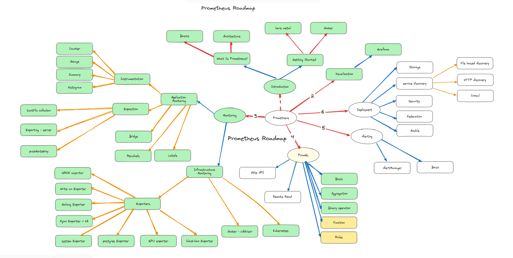

# Document for Learning Prometheus Monitoring

This document provides a structured guide to learning **Prometheus**, a powerful open-source monitoring and alerting toolkit, based on a video lecture series. The goal is to help you understand the core concepts, set up Prometheus, and integrate it into your systems for effective monitoring.

see this video in Farsi --> [Prometheus Learning_Farsi]([https://prometheus.io/download/](https://www.aparat.com/v/psc074x)). 

#### قسمت ۱ معرفی مقدماتی
در این قسمت با دنیای مانیتورینگ و ابزار قدرتمند Prometheus آشنا می‌شویم.

ابتدا مفهوم مانیتورینگ و نیاز آن در سیستم‌های مدرن توضیح داده می‌شود، سپس با اجزای اصلی Prometheus شامل Server، Exporter، Alertmanager و Pushgateway آشنا خواهیم شد.

در ادامه ساختار داده‌ها، مدل متریک‌ها (Counter، Gauge، Histogram و Summary) و زبان PromQL به‌صورت مفهومی معرفی می‌شود.

هدف از این قسمت، درک پایه‌ای از معماری و نحوه کار Prometheus است تا در قسمت‌های بعد وارد پیکربندی و مثال‌های عملی شویم.

-----------------

#### قسمت ۲- در این ثسمت، به‌صورت گام‌به‌گام با **معماری درونی Prometheus** و نحوه‌ی کار اجزای مختلف آن آشنا می‌شویم.  

در ابتدا مفهوم **Pull-based Architecture** را بررسی می‌کنیم و می‌بینیم چرا Prometheus برخلاف بسیاری از ابزارهای مانیتورینگ، داده‌ها را _از هدف‌ها (Targets)_ واکشی می‌کند، نه اینکه آن‌ها داده‌ها را برایش ارسال کنند.

سپس ساختار کلی سیستم را تحلیل می‌کنیم:

‏- ‏**Prometheus Server**: قلب سیستم که مسئول جمع‌آوری (scrape) و ذخیره‌ی داده‌هاست.
    
‏- ‏**Time Series Database (TSDB)**: موتور ذخیره‌سازی که داده‌ها را به‌صورت سری زمانی نگه‌داری می‌کند.
    
‏- ‏**Service Discovery**: مکانیزمی برای شناسایی خودکار سرویس‌ها و هدف‌ها در محیط‌های پویا مثل Docker و Kubernetes.
    
‏- ‏**Exporters**: ابزارهایی که داده‌های متریک را از سرویس‌ها و سیستم‌ها به فرمت قابل فهم برای Prometheus تبدیل می‌کنند.
    
‏- ‏**Alertmanager**: مؤلفه‌ای برای مدیریت هشدارها، گروه‌بندی و ارسال آن‌ها به کانال‌هایی مثل Email، Slack یا PagerDuty.
    
‏- ‏**Pushgateway**: ابزاری برای ارسال متریک از سرویس‌های کوتاه‌عمر (مثل Jobها یا Cronها) به Prometheus.

----------

### قسمت ۳ - نصب Prometheus روی سرور (Bare Metal) و راه‌اندازی اولیه

در این قسمت، وارد بخش عملی دوره می‌شویم و یاد می‌گیریم چگونه Prometheus را روی یک سرور واقعی نصب و اجرا کنیم.  
ابتدا پیش‌نیازهای نصب مانند نسخه‌ی سیستم‌عامل، دسترسی کاربر، پورت‌ها و ساختار فایل‌های Prometheus را مرور می‌کنیم.  
سپس به‌صورت گام‌به‌گام مراحل زیر را انجام می‌دهیم:

‏۱. **دانلود و نصب Prometheus** روی سیستم‌عامل لینوکس (Bare Metal).
    
‏۲. **آشنایی با فایل پیکربندی `prometheus.yml`** و ساختار آن.
    
‏۳. **اضافه کردن Targetهای اولیه** برای مانیتور کردن خود Prometheus (self-monitoring).
    
‏۴. **اجرای سرویس Prometheus** به‌صورت دستی و سپس تنظیم آن به‌عنوان یک سرویس سیستم (systemd).
    
‏۵. **بررسی رابط وب (Web UI)** و مشاهده‌ی اولین متریک‌ها.
    

در طول این بخش یاد می‌گیریم چطور فایل پیکربندی را ویرایش کنیم، وظیفه‌ی هر بخش را درک کنیم، و در صورت بروز خطا، لاگ‌ها را بررسی و رفع مشکل کنیم.

در پایان این قسمت، شما یک سرور Prometheus فعال خواهید داشت که آماده‌ی جمع‌آوری داده از سرویس‌ها و Exporterها است.

--------

**قسمت ۴: نصب و راه‌اندازی Prometheus با Docker**

در این قسمت یاد می‌گیریم چطور Prometheus را به‌صورت **کانتینری** اجرا کنیم و مزایای استفاده از Docker را در فرآیند مانیتورینگ بررسی می‌کنیم.

در ابتدا توضیح می‌دهیم چرا استفاده از Docker می‌تواند نصب و به‌روزرسانی Prometheus را ساده‌تر، سریع‌تر و قابل‌انتقال‌تر کند.  
سپس به‌صورت عملی مراحل زیر را انجام می‌دهیم:

‏۱. **آشنایی با Image رسمی Prometheus** در Docker Hub.
    
‏۲. **دانلود و اجرای کانتینر Prometheus** با استفاده از دستور `docker run`.
    
‏۳. **نحوه‌ی Mount کردن فایل پیکربندی `prometheus.yml`** از روی سیستم میزبان داخل کانتینر.
    
‏۴. **تنظیم Volume برای ذخیره‌ی داده‌ها (Persistent Storage)** تا پس از ری‌استارت اطلاعات از بین نرود.
    
‏۵. **بررسی پورت‌ها، Network Mode و دسترسی رابط وب** از طریق مرورگر.
    
‏۶. در نهایت، **نحوه‌ی توقف، حذف و به‌روزرسانی کانتینر** را مرور می‌کنیم.
    

در طول این قسمت، یاد می‌گیریم چطور با چند دستور ساده، محیطی مشابه نصب Bare Metal ایجاد کنیم اما با انعطاف بالاتر، مخصوصاً برای محیط‌های تست، توسعه یا حتی Production.

 در پایان این بخش، شما خواهید توانست Prometheus را با Docker روی هر سیستم لینوکس، ویندوز یا مک اجرا کرده و داده‌ها را به‌صورت پایدار نگهداری کنید.

-------

**قسمت پنجم: اتصال Grafana به Prometheus و ساخت داشبورد**

در این قسمت یاد می‌گیریم چگونه ابزار **Grafana** را به Prometheus متصل کنیم تا داده‌های جمع‌آوری‌شده را در قالب **داشبوردهای زیبا و قابل‌درک** مشاهده کنیم.

در ابتدا، مراحل نصب و راه‌اندازی اولیه‌ی Grafana را مرور می‌کنیم و وارد محیط مدیریتی آن می‌شویم.  
سپس به‌صورت گام‌به‌گام مراحل زیر را انجام می‌دهیم:

‏۱. **افزودن Prometheus به‌عنوان Data Source** در Grafana.
    
‏۲. بررسی نحوه‌ی تست ارتباط بین Grafana و Prometheus.
    
‏۳. **ایجاد داشبورد جدید** و اضافه کردن **Panelها** برای نمایش متریک‌ها.
    
‏۴. کار با **PromQL Queryها** در بخش Query Editor برای فیلتر و تحلیل داده‌ها.
    
‏۵. استفاده از **داشبوردهای آماده (Prebuilt Dashboards)** از سایت Grafana Labs برای نمایش متریک‌های عمومی مثل Node Exporter و Docker Metrics.
    
‏۶. تنظیمات ظاهری و شخصی‌سازی داشبورد (مانند واحدها، رنگ‌ها و refresh interval).
    

در پایان این قسمت، شما یاد خواهید گرفت چطور داده‌های خام Prometheus را به گراف‌ها و داشبوردهای قابل‌تحلیل تبدیل کنید و از Grafana برای **مانیتورینگ زنده و حرفه‌ای سیستم‌ها** استفاده نمایید.

هدف این بخش، آشنایی کامل با نحوه‌ی اتصال Prometheus و Grafana و ایجاد اولین داشبورد مانیتورینگ کاربردی است.

-------------

 **قسمت ششم: بررسی و استفاده از Textfile Exporter در Prometheus**

در این قسمت یاد می‌گیریم چطور می‌توان با استفاده از **Textfile Exporter** متریک‌های دلخواه خودمان را به Prometheus اضافه کنیم.  
این روش مخصوص مواقعی است که می‌خواهیم اطلاعاتی را مانیتور کنیم که توسط Exporterهای آماده در دسترس نیست — مثلاً نتایج یک اسکریپت، وضعیت خاص سیستم، یا خروجی یک سرویس سفارشی.

در ابتدا توضیح می‌دهیم که **Textfile Exporter** چیست و چگونه در کنار **Node Exporter** عمل می‌کند.  
سپس به‌صورت عملی مراحل زیر را انجام می‌دهیم:

‏۱. فعال‌سازی **Textfile Collector** در Node Exporter.
    
‏۲. بررسی مسیر پیش‌فرض فایل‌های متریک (`/var/lib/node_exporter/textfile_collector`).
    
‏۳. ایجاد یک فایل متریک ساده با فرمت استاندارد Prometheus (مثلاً `custom_metrics.prom`).
    
‏۴. بررسی ساختار خطوط متریک‌ها شامل `metric_name`, `labels` و `value`.
    
‏۵. مشاهده‌ی داده‌ها در رابط وب Prometheus و اطمینان از دریافت متریک سفارشی.
    
‏۶. در نهایت، مثال‌هایی از **متریک‌های سفارشی واقعی** مثل اندازه فایل، نتیجه پینگ یا وضعیت سرویس‌ها را بررسی می‌کنیم.
    

در پایان این قسمت، شما خواهید توانست **هر نوع داده‌ی دلخواه** را با نوشتن یک فایل ساده‌ی متنی، در Prometheus ذخیره و در Grafana نمایش دهید.

 هدف این بخش، یادگیری نحوه‌ی افزودن متریک‌های سفارشی به Prometheus با استفاده از مکانیزم ساده و انعطاف‌پذیر Textfile Exporter است.

-------------

🎬 **قسمت هفتم: ساخت HTTP Server Exporter برای Expose کردن متریک‌ها**

در این قسمت یاد می‌گیریم چطور متریک‌های سفارشی خودمان را از طریق یک **HTTP Server Exporter** در دسترس Prometheus قرار دهیم.  
این روش زمانی کاربرد دارد که بخواهیم برنامه‌ی خودمان (مثلاً سرویس داخلی یا اسکریپت خاص) بتواند داده‌های عملکردی را مستقیماً به Prometheus ارائه کند.

در ابتدا با مفهوم **Expose کردن متریک‌ها از طریق HTTP endpoint** آشنا می‌شویم و توضیح می‌دهیم چرا Prometheus از این روش برای جمع‌آوری داده استفاده می‌کند.  
سپس به‌صورت عملی مراحل زیر را انجام می‌دهیم:

۱. ایجاد یک **HTTP Server ساده** (مثلاً با Python یا Go) که روی یک پورت خاص در حال اجراست.
    
۲. استفاده از **کتابخانه رسمی Prometheus client** برای تولید و مدیریت متریک‌ها (Counter، Gauge، Histogram و Summary).
    
۳. افزودن endpoint `/metrics` و نمایش خروجی در فرمت متنی استاندارد Prometheus.
    
۴. اجرای سرور و تست متریک‌ها از طریق مرورگر یا `curl`.
    
۵. افزودن این HTTP Exporter به فایل پیکربندی `prometheus.yml` به‌عنوان target جدید.
    
۶. بررسی دریافت داده‌ها در Prometheus و نمایش آن‌ها در Grafana.
    

در طول این قسمت، یاد می‌گیریم چطور با چند خط کد ساده، یک **Exporter اختصاصی** بسازیم تا بتوانیم هر داده‌ی دلخواهی — مثل وضعیت برنامه، تعداد درخواست‌ها یا خطاها — را برای مانیتورینگ در Prometheus قابل دسترسی کنیم.

 هدف این بخش، یادگیری نحوه‌ی **Expose کردن متریک‌ها از طریق HTTP Server** و ساخت Exporter سفارشی برای کاربردهای خاص است.

---------------

🎬 **قسمت هشتم: بررسی و استفاده از Pushgateway در Prometheus**

در این قسمت با **Pushgateway** آشنا می‌شویم — مؤلفه‌ای که به ما اجازه می‌دهد داده‌ها را به‌صورت مستقیم از برنامه‌ها و اسکریپت‌ها به Prometheus ارسال کنیم.  
این روش مخصوص سناریوهایی است که سرویس‌ها کوتاه‌عمر هستند و Prometheus نمی‌تواند آن‌ها را به روش معمول (Pull) مانیتور کند.

در ابتدا توضیح می‌دهیم که Pushgateway چیست، چه زمانی باید از آن استفاده کنیم و در چه شرایطی نباید.  
سپس به‌صورت عملی مراحل زیر را انجام می‌دهیم:

۱. **نصب و اجرای Pushgateway** .
    
۲. **ارسال متریک‌ها از طریق HTTP POST یا با استفاده از کتابخانه‌های رسمی Prometheus client** (مثل Python، Go یا Bash script).
    
۳. بررسی ساختار آدرس‌ها در Pushgateway و مفهوم `job` و `instance`.
    
۴. مشاهده‌ی داده‌ها در رابط وب Pushgateway و اطمینان از دریافت موفق متریک‌ها.
    
۵. افزودن Pushgateway به فایل پیکربندی `prometheus.yml` برای جمع‌آوری داده‌ها.
    
۶. نمایش متریک‌های ارسال‌شده در Prometheus و ایجاد داشبورد در Grafana.
    
۷. بررسی نکات مهم مدیریتی مثل پاک‌سازی داده‌های قدیمی و تفاوت بین push موقت و دائم.
    

در پایان این قسمت، شما یاد خواهید گرفت چطور از Pushgateway برای ارسال متریک‌های مربوط به **Jobها، Cronها و سرویس‌های کوتاه‌عمر** استفاده کنید تا هیچ داده‌ای از چشم Prometheus دور نماند.

 هدف این بخش، درک کامل مفهوم **Push-based metrics** و نحوه‌ی کار عملی Pushgateway در کنار معماری Pull Prometheus است.

----------

🎬 **قسمت نهم: بررسی Prometheus Bridge**

در این قسمت، با مفهوم **Prometheus Bridge** آشنا می‌شویم و یاد می‌گیریم چگونه می‌توانیم داده‌های متریک را از سایر سیستم‌ها به Prometheus منتقل کنیم. این فرآیند به ما امکان می‌دهد تا داده‌های متریک از منابع مختلف را در یک مکان مرکزی جمع‌آوری و تحلیل کنیم.

در پایان این قسمت، شما با مفهوم **Prometheus Bridge** آشنا خواهید شد و یاد خواهید گرفت چگونه می‌توانید داده‌های متریک را از منابع مختلف به Prometheus منتقل کرده و یک سیستم نظارتی جامع ایجاد کنید.

🎯 هدف این بخش، درک کامل مفهوم **Prometheus Bridge** و نحوه‌ی استفاده از آن برای انتقال داده‌های متریک به Prometheus است.

--------

🎬 **قسمت دهم: بررسی Relabeling در Prometheus**

در این قسمت، با مفهوم **Relabeling** آشنا می‌شویم و یاد می‌گیریم چگونه می‌توانیم **Labelها و داده‌های جمع‌آوری‌شده توسط Prometheus را پردازش، فیلتر و تغییر دهیم**.  
‏Relabeling در موارد زیر کاربرد دارد:

- تغییر نام یا اضافه کردن Labelها به هدف‌ها (Targets)
    
- فیلتر کردن Targetها و Metricها قبل از ذخیره‌سازی
    
- آماده‌سازی داده‌ها برای Alerting یا Dashboards
    
- تبدیل داده‌های جمع‌آوری‌شده از Exporterها به فرمت دلخواه
    

مراحل و مباحث اصلی قسمت شامل موارد زیر است:

۱. **مفهوم Label و کاربرد آن در Prometheus**
    
۲. ‏**Relabeling Targetها**: تغییر، اضافه یا حذف Labelها قبل از Scraping
    
۳. ‏**Relabeling Metricها**: تغییر Labelها بعد از دریافت Metric
    
۴. **استفاده از Regular Expression و Templateها** برای فیلتر و تغییر Labelها
    
۵. ‏**Examples عملی**:
    
    - فیلتر کردن Targetهای خاص بر اساس نام یا آدرس IP
        
    - تغییر Label برای همسان‌سازی نام سرویس‌ها
        
    - گروه‌بندی داده‌ها برای داشبورد یا Alertهای پیشرفته
        

در پایان این قسمت، شما خواهید توانست **داده‌های خود را قبل از ذخیره یا Alerting سفارشی‌سازی کنید** و کنترل کامل روی Labelها و ساختار متریک‌ها داشته باشید.

-----------

🎬 **قسمت یازدهم: بررسی عمیق Label در Prometheus**

در این قسمت، به صورت مقسمت با مفهوم **Label** و نقش آن در Prometheus آشنا می‌شویم.  
‏Labelها بخش کلیدی **مدل داده سری زمانی (Time Series)** هستند و به ما امکان می‌دهند داده‌ها را بر اساس ویژگی‌های مختلف دسته‌بندی، فیلتر و تحلیل کنیم.

مباحث اصلی قسمت شامل موارد زیر است:

۱. **معرفی Label و کاربرد آن در سری‌های زمانی**
    
    - نقش Label در شناسایی و تفکیک Metricها
        
    - تفاوت بین Target Labels و Metric Labels
        
۲. **بهینه‌سازی Labelها**
    
    - انتخاب Label مناسب برای جلوگیری از انفجار تعداد سری‌ها (High Cardinality)
        
    - ‏Labelهایی که نباید اضافه کرد و دلایل آن
        
۳. ‏**Labelها و Queryها**
    
    - استفاده از Labelها در PromQL برای فیلتر و گروه‌بندی
        
    - نمونه‌های عملی از `sum`, `avg`, `max`, `count` با Labelها
        
۴. ‏**Labelها و Alerting**
    
    - استفاده از Labelها برای Alertهای دقیق و قابل فهم
        
    - نحوه گروه‌بندی Alerts بر اساس Labelهای خاص
        
۵. ‏**Best Practices برای طراحی Labelها**
    
    - استانداردسازی نام Labelها
        
    - حفظ یکپارچگی داده‌ها در محیط‌های بزرگ و چند سرویس
        

در پایان این قسمت، شما خواهید توانست **Labelها را به‌صورت حرفه‌ای مدیریت و بهینه کنید** و کنترل کامل روی داده‌ها، Queryها و Alertها در Prometheus داشته باشید.

🎯 هدف این بخش، یادگیری **عمق مفهوم Label، کاربرد آن در داده‌ها و Alertها، و بهینه‌سازی ساختار مانیتورینگ** برای محیط‌های حرفه‌ای است.

-----

🎬 **قسمت دوازدهم: بررسی Blackbox Exporter در Prometheus**

در این قسمت با **Blackbox Exporter** آشنا می‌شویم، ابزاری که Prometheus از آن برای **پایش سرویس‌ها و endpointهای HTTP، HTTPS، TCP، ICMP و DNS** استفاده می‌کند.  
‏Blackbox Exporter به ما اجازه می‌دهد وضعیت سرویس‌ها را به‌صورت خارجی بررسی کنیم و از دسترس‌پذیری و زمان پاسخ‌دهی آن‌ها مطمئن شویم.

مباحث اصلی قسمت شامل موارد زیر است:

۱. **آشنایی با Blackbox Exporter و کاربرد آن**
    
    - تفاوت با Node Exporter و سایر Exporterها
        
    - چرا برای سناریوهای خارجی و کوتاه‌مدت مناسب است
        
۲. **نصب و راه‌اندازی Blackbox Exporter**
    
    - روش نصب با Docker یا به‌صورت مستقل
        
    - آشنایی با فایل پیکربندی `blackbox.yml`
        
۳. **تعریف probeها (endpointها)**
    
    - نمونه probe برای HTTP، HTTPS، TCP و ICMP
        
    - تنظیم پارامترهایی مثل timeout، follow_redirects و valid_http_versions
        
۴. **اضافه کردن Blackbox Exporter به Prometheus**
    
    - نحوه تعریف targetها در `prometheus.yml`
        
    - جمع‌آوری داده‌ها و مشاهده متریک‌ها در رابط وب Prometheus
        
۵. **نمایش داده‌ها در Grafana**
    
    - ایجاد داشبورد برای نمایش دسترس‌پذیری و زمان پاسخ سرویس‌ها
        
    - نمونه Alert برای Notify کردن در صورت Down شدن سرویس
        

در پایان این قسمت، شما خواهید توانست **سرویس‌ها و endpointهای داخلی و خارجی را به‌صورت خودکار مانیتور کنید** و با Prometheus و Grafana، وضعیت آن‌ها را به شکل گرافیکی و قابل تحلیل مشاهده نمایید.

هدف این بخش، یادگیری کاربرد **Blackbox Exporter** برای پایش سرویس‌ها و endpointهای شبکه بدون نیاز به نصب نرم‌افزار روی آن‌ها است.

---------

🎬 **قسمت سیزدهم: بررسی GPU Exporter در Prometheus**

در این قسمت با **GPU Exporter** آشنا می‌شویم، ابزاری برای جمع‌آوری متریک‌های مربوط به GPU از سیستم‌های مختلف و ارائه آن‌ها به Prometheus.  
این متریک‌ها شامل **استفاده از GPU، مصرف حافظه، دما و فرکانس کاری** هستند و امکان پایش دقیق سیستم‌های GPU محور را فراهم می‌کنند.

مباحث اصلی قسمت شامل موارد زیر است:

۱. **آشنایی با GPU Exporter و کاربرد آن**
    
    - چرا پایش GPU مهم است
        
    - تفاوت GPU Exporter با Node Exporter و سایر Exporterها
        
۲. **نصب و راه‌اندازی GPU Exporter**
    
    - نصب با Docker یا به‌صورت مستقل
        
    - بررسی پیش‌نیازها مثل درایورهای NVIDIA و ابزار nvidia-smi
        
۳. **بررسی متریک‌های مهم GPU**
    
    - ‏`gpu_utilization` برای میزان استفاده از GPU
        
    - ‏`memory_usage` و `memory_total` برای مصرف حافظه GPU
        
    - ‏`temperature` و `fan_speed` برای پایش دما و سرعت فن
        
۴. **اضافه کردن GPU Exporter به Prometheus**
    
    - تعریف Targetها در `prometheus.yml`
        
    - جمع‌آوری و مشاهده داده‌ها در رابط وب Prometheus
        
۵. **نمایش داده‌ها در Grafana**
    
    - ایجاد داشبورد برای GPUها
        
    - نمونه Alert برای هشدار در صورت مصرف بالا یا دمای بحرانی
        

در پایان این قسمت، شما خواهید توانست **GPUهای سیستم خود را به‌صورت کامل مانیتور کنید** و از Prometheus و Grafana برای پایش، تحلیل و هشداردهی استفاده نمایید.

 هدف این بخش، یادگیری **پایش GPU و متریک‌های حیاتی آن** برای مدیریت بهتر سیستم‌های GPU محور و جلوگیری از مشکلات عملکردی یا سخت‌افزاری است.

---------

 **قسمت چهاردهم: بررسی Postgres Exporter در Prometheus**

در این قسمت با **Postgres Exporter** آشنا می‌شویم، ابزاری برای جمع‌آوری متریک‌های مهم از پایگاه داده PostgreSQL و ارائه آن‌ها به Prometheus.  
این متریک‌ها شامل **تعداد اتصالات، وضعیت تراکنش‌ها، عملکرد کوئری‌ها، مصرف منابع و سلامت دیتابیس** هستند.

مباحث اصلی قسمت شامل موارد زیر است:

۱. **آشنایی با Postgres Exporter و کاربرد آن**
    
    - چرا پایش پایگاه داده مهم است
        
    - تفاوت Postgres Exporter با سایر Exporterهای عمومی
        
۲. **نصب و راه‌اندازی Postgres Exporter**
    
    - نصب با Docker یا به‌صورت مستقل
        
    - تنظیم دسترسی‌های لازم در دیتابیس برای جمع‌آوری داده‌ها
        
۳. **بررسی متریک‌های کلیدی PostgreSQL**
    
    - ‏`pg_stat_activity` برای مشاهده اتصالات فعال
        
    - ‏`pg_stat_database` برای عملکرد و تعداد تراکنش‌ها
        
    - ‏`pg_locks` برای وضعیت Lockها
        
    - مصرف منابع مانند CPU و حافظه مرتبط با PostgreSQL
        
۴. **اضافه کردن Postgres Exporter به Prometheus**
    
    - تعریف Targetها در `prometheus.yml`
        
    - جمع‌آوری داده‌ها و مشاهده آن‌ها در رابط وب Prometheus
        
۵. **نمایش داده‌ها در Grafana**
    
    - ایجاد داشبورد برای پایش دیتابیس
        
    - نمونه Alert برای Notify کردن در صورت بروز مشکل یا Load بالا
        

در پایان این قسمت، شما خواهید توانست **سلامت و عملکرد دیتابیس PostgreSQL خود را به‌صورت کامل مانیتور کنید** و از Prometheus و Grafana برای پایش، تحلیل و هشداردهی استفاده نمایید.

 هدف این بخش، یادگیری **پایش PostgreSQL با Prometheus** و استفاده از متریک‌ها برای بهبود عملکرد و مدیریت بهتر دیتابیس است.

-----------

🎬 **قسمت پانزدهم: بررسی عمیق Node Exporter در Prometheus**

در این قسمت، با **Node Exporter** به صورت کامل و عملی آشنا می‌شویم و یاد می‌گیریم چگونه می‌توان **متریک‌های سیستمی و سخت‌افزاری** را برای Prometheus جمع‌آوری و مدیریت کرد.  
این قسمت برای درک عمیق از **عملکرد سیستم و مانیتورینگ دقیق** حیاتی است.

مباحث اصلی قسمت شامل موارد زیر است:

‏۱. **آشنایی با Node Exporter و کاربرد آن**
    
    - نقش Node Exporter در جمع‌آوری متریک‌های سیستم
        
    - تفاوت آن با سایر Exporterها و استفاده از آن در محیط‌های Production
        
‏۲. **نصب و راه‌اندازی Node Exporter**
    
    - نصب با Docker یا به‌صورت مستقل
        
    - تنظیم سرویس و دسترسی‌ها
        
‏۳. **بررسی متریک‌های کلیدی سیستم**
    
    - ‏CPU: `node_cpu_seconds_total`
        
    - حافظه: `node_memory_MemAvailable_bytes` و `node_memory_MemTotal_bytes`
        
    - دیسک: `node_filesystem_*` و I/O
        
    - شبکه: `node_network_receive_bytes_total` و `node_network_transmit_bytes_total`
        
    - پروسس‌ها: تعداد، وضعیت و منابع مصرفی
        
‏۴. **تنظیم Exporter برای محیط‌های بزرگ**
    
    - بهینه‌سازی scrape interval
        
    - فیلتر کردن متریک‌های غیرضروری
        
    - مدیریت Labelها برای محیط‌های چند سروری
        
‏۵. **نمایش داده‌ها در Grafana**
    
    - ایجاد داشبوردهای آماده و سفارشی
        
    - نمونه Alert برای هشدار در صورت مشکل سخت‌افزاری یا مصرف بالا
        

در پایان این قسمت، شما خواهید توانست **Node Exporter را به‌صورت حرفه‌ای پیکربندی و استفاده کنید** و مانیتورینگ جامع و دقیقی از منابع سیستم‌های خود داشته باشید.

 هدف این بخش، یادگیری **کاربرد کامل Node Exporter** و جمع‌آوری، تحلیل و نمایش متریک‌های سیستمی به‌صورت عملی و بهینه است.

---------

🎬 **قسمت شانزدهم: بررسی عمیق Grok Exporter در Prometheus**

در این قسمت، با **Grok Exporter** آشنا می‌شویم و یاد می‌گیریم چگونه می‌توان **متریک‌ها را از لاگ‌ها استخراج و به Prometheus ارسال کرد**.  
این روش مخصوص مواقعی است که داده‌های مهم در لاگ‌ها هستند و ما می‌خواهیم آن‌ها را به شکل **Metricهای سری زمانی** تبدیل کنیم.

مباحث اصلی قسمت شامل موارد زیر است:

‏۱. **آشنایی با Grok Exporter و کاربرد آن**
    
    - تبدیل لاگ‌ها به Metricهای Prometheus
        
    - تفاوت Grok Exporter با سایر Exporterها
        
‏۲. **نصب و راه‌اندازی Grok Exporter**
    
    - نصب با Docker یا به‌صورت مستقل
        
    - تنظیم فایل پیکربندی `grok_exporter.yml`
        
‏۳. **تعریف و استفاده از الگوهای Grok**
    
    - استخراج اطلاعات دلخواه از لاگ‌ها
        
    - ایجاد Metricهای Counter، Gauge و Histogram از داده‌های لاگ
        
‏۴. **اضافه کردن Grok Exporter به Prometheus**
    
    - تعریف Target در `prometheus.yml`
        
    - جمع‌آوری داده‌ها و مشاهده Metricها در رابط وب Prometheus
        
‏۵. **نمایش داده‌ها در Grafana**
    
    - ساخت داشبورد برای متریک‌های استخراج‌شده
        
    - نمونه Alert برای اطلاع از رخدادهای خاص لاگ‌ها
        

در پایان این قسمت، شما خواهید توانست **متریک‌های مهم را از لاگ‌ها استخراج و آن‌ها را در Prometheus مانیتور کنید** و داشبوردهای دقیق و هشدارهای کاربردی ایجاد نمایید.

 هدف این بخش، یادگیری **استخراج متریک از لاگ‌ها با Grok Exporter** و تبدیل داده‌های متنی به Metricهای قابل پایش در Prometheus است.

-----------

 **قسمت هفدهم: بررسی Nginx Exporter به همراه k6**

در این قسمت، با **Nginx Exporter** آشنا می‌شویم و یاد می‌گیریم چگونه می‌توان متریک‌های سرور Nginx را به Prometheus منتقل کرد و آن‌ها را برای **تحلیل عملکرد و پایش زنده** استفاده نمود.  
همچنین از ابزار **k6** برای شبیه‌سازی بار و تست عملکرد سرور استفاده می‌کنیم تا متریک‌ها در شرایط واقعی مشاهده شوند.

مباحث اصلی قسمت شامل موارد زیر است:

‏۱. **آشنایی با Nginx Exporter و کاربرد آن**
    
    - جمع‌آوری متریک‌های کلیدی Nginx مثل تعداد درخواست‌ها، زمان پاسخ و وضعیت سرور
        
    - تفاوت Nginx Exporter با Node Exporter
        
‏۲. **نصب و راه‌اندازی Nginx Exporter**
    
    - نصب با Docker یا به‌صورت مستقل
        
    - تنظیم Target در Prometheus
        
‏۳. **معرفی k6 برای تست بار**
    
    - نصب k6
        
    - نوشتن اسکریپت ساده برای شبیه‌سازی تعداد درخواست‌ها و concurrency
        
‏۴. **تست عملکرد Nginx و جمع‌آوری متریک‌ها**
    
    - اجرای k6 و مشاهده متریک‌ها در Prometheus
        
    - تحلیل تغییرات CPU، memory و latency در سرور
        
‏۵. **نمایش داده‌ها در Grafana**
    
    - ساخت داشبورد برای متریک‌های Nginx
        
    - نمونه Alert برای زمان پاسخ طولانی یا خطاهای HTTP
        

در پایان این قسمت، شما خواهید توانست **Nginx را با Prometheus پایش کنید، بارگذاری واقعی را با k6 شبیه‌سازی کنید و متریک‌ها را در Grafana تحلیل نمایید**.

 هدف این بخش، یادگیری **پایش عملکرد سرور وب با Nginx Exporter و تست بار با k6** برای مدیریت بهتر سرویس‌ها و افزایش کارایی است.

------

 **قسمت هجدهم: مانیتورینگ اپلیکیشن Golang با Prometheus**

در این قسمت، یاد می‌گیریم چگونه می‌توان **اپلیکیشن‌های Golang را برای Prometheus مانیتور کرد** و داده‌های متریک داخلی برنامه را جمع‌آوری نمود.  
این کار به ما امکان می‌دهد **عملکرد، سلامت و رفتار اپلیکیشن را در زمان واقعی بررسی کنیم**.

مباحث اصلی قسمت شامل موارد زیر است:

‏۱. **آشنایی با Prometheus Client برای Golang**
    
    - نصب و استفاده از کتابخانه رسمی `prometheus/client_golang`
        
    - انواع Metricها: Counter، Gauge، Histogram و Summary
        
‏۲. **ایجاد متریک‌های سفارشی در اپلیکیشن**
    
    - نمونه‌های عملی: تعداد درخواست‌ها، زمان پاسخ‌دهی، خطاها و وضعیت سرویس‌ها
        
    - ثبت متریک‌ها در endpoint `/metrics`
        
‏۳. **اضافه کردن اپلیکیشن به Prometheus**
    
    - تعریف Target در فایل `prometheus.yml`
        
    - تست Scrape و اطمینان از دریافت متریک‌ها
        
‏۴. **تحلیل داده‌ها در Grafana**
    
    - ایجاد داشبورد برای نمایش درخواست‌ها، latency و خطاها
        
    - نمونه Alert برای Notify کردن در صورت افزایش خطا یا زمان پاسخ
        
‏۵. **بهینه‌سازی و Best Practices**
    
    - جلوگیری از انفجار سری‌های متریک
        
    - انتخاب Labelهای مناسب
        
    - محدود کردن scrape interval و کاهش بار روی اپلیکیشن
        

در پایان این قسمت، شما خواهید توانست **هر اپلیکیشن Golang را به Prometheus متصل کنید، متریک‌های مهم را جمع‌آوری و در Grafana تحلیل کنید**.

 هدف این بخش، یادگیری **مانیتورینگ داخلی اپلیکیشن‌های Golang با Prometheus** و ایجاد داشبوردها و Alertهای کاربردی برای مدیریت عملکرد برنامه است.

------------

🎬 **قسمت نوزدهم: بررسی cAdvisor در Prometheus**

در این قسمت، با **cAdvisor (Container Advisor)** آشنا می‌شویم و یاد می‌گیریم چگونه می‌توان **متریک‌های کانتینرهای Docker را جمع‌آوری و در Prometheus مانیتور کرد**.  
این ابزار اطلاعات دقیق از **استفاده CPU، حافظه، I/O و شبکه کانتینرها** ارائه می‌دهد و برای مدیریت کانتینرها حیاتی است.

مباحث اصلی قسمت شامل موارد زیر است:

‏۱. **آشنایی با cAdvisor و کاربرد آن**
    
    - جمع‌آوری متریک‌های کانتینرها
        
    - تفاوت cAdvisor با Node Exporter و سایر Exporterها
        
‏۲. **نصب و راه‌اندازی cAdvisor**
    
    - نصب با Docker
        
    - اجرای cAdvisor به‌صورت standalone و اتصال به Docker Engine
        
‏۳. **بررسی متریک‌های کلیدی کانتینرها**
    
    - ‏CPU: `container_cpu_usage_seconds_total`
        
    - حافظه: `container_memory_usage_bytes` و `container_memory_limit_bytes`
        
    - دیسک: `container_fs_*`
        
    - شبکه: `container_network_receive_bytes_total` و `container_network_transmit_bytes_total`
        
‏۴. **اضافه کردن cAdvisor به Prometheus**
    
    - تعریف Target در `prometheus.yml`
        
    - جمع‌آوری داده‌ها و مشاهده متریک‌ها در رابط وب Prometheus
        
‏۵. **نمایش داده‌ها در Grafana**
    
    - ایجاد داشبورد برای تحلیل مصرف منابع کانتینرها
        
    - نمونه Alert برای هشدار در صورت مصرف بیش از حد منابع
        

در پایان این قسمت، شما خواهید توانست **تمام کانتینرهای Docker خود را به صورت دقیق مانیتور کنید و داده‌ها را در Prometheus و Grafana تحلیل نمایید**.

 هدف این بخش، یادگیری **مانیتورینگ منابع کانتینرها با cAdvisor** و تحلیل داده‌ها برای مدیریت بهینه محیط کانتینری است.

---------

🎬 **قسمت بیستم: نوشتن برنامه یک Exporter دلخواه برای Prometheus**

در این قسمت، یاد می‌گیریم چگونه می‌توان **یک Exporter اختصاصی بسازیم** تا داده‌ها و متریک‌های دلخواه را برای Prometheus قابل دسترس کنیم.  
این روش مخصوص مواقعی است که داده‌ها یا متریک‌ها از منابع خاص یا اپلیکیشن‌های سفارشی هستند و Exporter آماده برای آن‌ها وجود ندارد.

مباحث اصلی قسمت شامل موارد زیر است:

‏۱. **معرفی Exporter دلخواه و کاربرد آن**
    
    - چه زمانی به Exporter اختصاصی نیاز داریم
        
    - مروری بر ساختار استاندارد متریک‌ها در Prometheus
        
‏۲. **ایجاد برنامه Exporter**
    
    - انتخاب زبان برنامه‌نویسی (Python، Go یا دیگر زبان‌ها)
        
    - استفاده از کتابخانه رسمی Prometheus Client برای تولید متریک‌ها
        
‏۳. **تعریف متریک‌های سفارشی**
    
    - انواع Metricها: Counter، Gauge، Histogram و Summary
        
    - مثال‌های عملی: وضعیت سرویس، تعداد پردازش‌ها، خطاها، زمان پاسخ
        
‏۴. **راه‌اندازی HTTP Endpoint**
    
    - ساخت endpoint `/metrics` برای ارائه داده‌ها
        
    - تست دستی داده‌ها با `curl` یا مرورگر
        
‏۵. **اضافه کردن Exporter به Prometheus**
    
    - تعریف Target در فایل `prometheus.yml`
        
    - جمع‌آوری داده‌ها و مشاهده Metricها در Prometheus
        
‏۶. **نمایش داده‌ها در Grafana**
    
    - ایجاد داشبورد برای متریک‌های اختصاصی
        
    - نمونه Alert برای Notify کردن در صورت رخدادهای مهم
        

در پایان این قسمت، شما خواهید توانست **هر نوع داده و متریک دلخواه را به Prometheus صادر کنید، داشبوردهای سفارشی بسازید و هشداردهی پیشرفته ایجاد نمایید**.

 هدف این بخش، یادگیری **ساخت Exporter اختصاصی و ارائه متریک‌های سفارشی به Prometheus** برای پیاده‌سازی مانیتورینگ کامل و حرفه‌ای.

----------

 **قسمت بیست‌ویکم: نصب Prometheus با Helm و مانیتورینگ Kubernetes**

در این قسمت، یاد می‌گیریم چگونه می‌توان **Prometheus را با استفاده از Helm Chart در Kubernetes نصب و راه‌اندازی کرد** و منابع کلاستر و پادها را به صورت دقیق مانیتور نمود.  
این روش مخصوص محیط‌های Cloud Native و پروژه‌های بزرگ است که نیاز به مانیتورینگ خودکار و مقیاس‌پذیر دارند.

مباحث اصلی قسمت شامل موارد زیر است:

‏۱. **معرفی Helm و Helm Chart برای Prometheus**
    
    - چرا استفاده از Helm ساده‌تر و استانداردتر است
        
    - آشنایی با Helm Chart رسمی `kube-prometheus-stack`
        
‏۲. **نصب Prometheus در Kubernetes با Helm**
    
    - اضافه کردن Repository Helm
        
    - نصب Chart و سفارشی‌سازی values.yaml
        
    - بررسی پادها و سرویس‌های ایجاد شده
        
‏۳. **مانیتورینگ کلاستر و پادها**
    
    - جمع‌آوری متریک‌های Kubernetes: Node، Pod، Deployment و Namespace
        
    - استفاده از kube-state-metrics برای اطلاعات وضعیت منابع
        
    - بررسی متریک‌های CPU، حافظه، شبکه و دیسک پادها
        
‏۴. **تنظیم Scrape Targetها و ServiceMonitor**
    
    - استفاده از ServiceMonitor برای جمع‌آوری متریک‌ها
        
    - اضافه کردن Annotationها برای Scrape متریک‌های اپلیکیشن‌ها
        
‏۵. **نمایش داده‌ها در Grafana**
    
    - استفاده از داشبوردهای پیش‌فرض Helm Chart
        
    - ساخت داشبوردهای سفارشی برای کلاستر و پادها
        
    - نمونه Alert برای مصرف منابع یا وضعیت Podهای بحرانی
        

در پایان این قسمت، شما خواهید توانست **Prometheus را در Kubernetes نصب، کانفیگ و به صورت جامع برای مانیتورینگ کلاستر و پادها استفاده کنید**.

 هدف این بخش، یادگیری **مانیتورینگ محیط Kubernetes با Prometheus و Helm** و تحلیل عملکرد منابع کلاستر و اپلیکیشن‌ها است.

---------------

🎬 **قسمت بیست‌ودوم: بررسی مقدماتی PromQL**

در این قسمت، با **PromQL (Prometheus Query Language)** آشنا می‌شویم و یاد می‌گیریم چگونه **داده‌های جمع‌آوری‌شده توسط Prometheus را پرس‌وجو و تحلیل کنیم**.  
این قسمت برای درک بهتر Dashboards، Alerting و گزارش‌گیری ضروری است.

مباحث اصلی قسمت شامل موارد زیر است:

‏۱. **معرفی PromQL و کاربرد آن**
    
    - چرا PromQL زبان استاندارد Query در Prometheus است
        
    - تفاوت بین Instant Vector و Range Vector
        
‏۲. **مفاهیم پایه PromQL**
    
    - ‏Selectors: انتخاب Metricها بر اساس Labelها
        
    - ‏Operators: محاسبات ریاضی روی Metricها
        
    - ‏Functions: استفاده از توابع از پیش تعریف‌شده
        
‏۳. **مثال‌های عملی مقدماتی**
    
    - مشاهده مقدار فعلی یک Metric (`instant query`)
        
    - جمع‌آوری میانگین، مجموع یا بیشینه مقدار یک Metric در بازه زمانی مشخص (`range query`)
        
‏۴. **استفاده از Labelها در Queryها**
    
    - فیلتر کردن Metricها بر اساس Label
        
    - گروه‌بندی و aggregation بر اساس Label
        
‏۵. **نمایش نتایج در Grafana**
    
    - ایجاد نمودارهای ساده برای Metricهای منتخب
        
    - تحلیل داده‌ها و بررسی تغییرات در بازه‌های زمانی مختلف
        

در پایان این قسمت، شما خواهید توانست **Queryهای ساده PromQL را بنویسید، داده‌ها را فیلتر و گروه‌بندی کنید و آن‌ها را در Grafana مشاهده کنید**.

 هدف این بخش، یادگیری **مفاهیم پایه PromQL و توانایی نوشتن Queryهای ابتدایی برای تحلیل Metricها** است.

------------

 **قسمت بیست‌وسوم: بررسی Aggregation در PromQL**

در این قسمت، با **Aggregation در PromQL** آشنا می‌شویم و یاد می‌گیریم چگونه **داده‌های جمع‌آوری‌شده توسط Prometheus را بر اساس Labelها و Metricها تجمیع کنیم**.  
این قسمت برای ایجاد Dashboards تحلیلی و Alertهای پیشرفته حیاتی است.

مباحث اصلی قسمت شامل موارد زیر است:

‏۱. **مفهوم Aggregation در PromQL**
    
    - چرا Aggregation مهم است و کاربرد آن در تحلیل داده‌ها
        
    - تفاوت بین aggregation ساده و aggregation با group_by بر اساس Label
        
‏۲. **توابع Aggregation رایج**
    
    - ‏`sum`، `avg`، `min`، `max`، `count`
        
    - ‏`count_values` و `stddev`، `stdvar`
        
    - نمونه‌های عملی روی Metricهای واقعی
        
‏۳. **استفاده از Labelها در Aggregation**
    
    - گروه‌بندی داده‌ها بر اساس Labelها (`by` و `without`)
        
    - مثال عملی: جمع‌آوری CPU استفاده‌شده به تفکیک Node یا Pod
        
‏۴. **ترکیب Aggregation با دیگر توابع PromQL**
    
    - استفاده از `rate`, `irate`, `increase` در کنار aggregation
        
    - تحلیل روند داده‌ها در بازه‌های زمانی مختلف
        
‏۵. **نمایش نتایج در Grafana**
    
    - ایجاد نمودارهای تحلیلی با Aggregation
        
    - نمونه Alert برای مقادیر تجمعی یا میانگین‌های بحرانی
        

در پایان این قسمت، شما خواهید توانست **Metricها را بر اساس Labelها و توابع مختلف تجمیع کنید، تحلیل‌های پیچیده بسازید و داشبوردهای حرفه‌ای طراحی کنید**.

 هدف این بخش، یادگیری **استفاده کامل از Aggregation در PromQL برای تحلیل و مانیتورینگ حرفه‌ای داده‌ها** است.

--------

🎬 **قسمت بیست‌وچهارم: بررسی Binary Operation در PromQL**

در این قسمت، با **Binary Operation در PromQL** آشنا می‌شویم و یاد می‌گیریم چگونه می‌توان **دو Metric را با یکدیگر مقایسه، جمع، تفریق یا عملیات دیگر ریاضی انجام داد**.  
این قابلیت برای تحلیل پیشرفته، بررسی کارایی سیستم‌ها و ایجاد Alertهای دقیق بسیار حیاتی است.

مباحث اصلی قسمت شامل موارد زیر است:

‏۱. **معرفی Binary Operation در PromQL**
    
    - تعریف و کاربرد Binary Operation
    - انواع عملیات: `+`, `-`, `*`, `/`, `%`, `==`, `!=`, `<`, `>` و غیره
        
‏ ۲. **کار با Metricهای مشابه و متفاوت**
    
    - انجام عملیات روی Metricهای با Labelهای مشابه
    - استفاده از `on` و `ignoring` برای تطبیق Labelها
        
‏ ۳. **نمونه‌های عملی Binary Operation**
    
    - محاسبه درصد استفاده CPU نسبت به کل CPU
    - بررسی اختلاف بین تعداد درخواست‌های موفق و خطا
    - ترکیب داده‌های شبکه یا دیسک برای تحلیل بار
        
‏ ۴. ‏**Binary Operation با توابع PromQL دیگر**
    
    - ترکیب با `rate`, `increase`, `sum` و `avg`
    - تحلیل روند و مقایسه Metricها در طول زمان
        
‏ ۵. **نمایش داده‌ها در Grafana**

    - ایجاد نمودارهای پیشرفته با Binary Operation
    - نمونه Alert بر اساس مقایسه Metricها
        

در پایان این قسمت، شما خواهید توانست **دو Metric را با هم ترکیب یا مقایسه کنید و تحلیل‌های پیشرفته برای Dashboards و Alertها ایجاد کنید**.

 هدف این بخش، یادگیری **استفاده از Binary Operation در PromQL برای تحلیل دقیق و پیشرفته Metricها** است.

